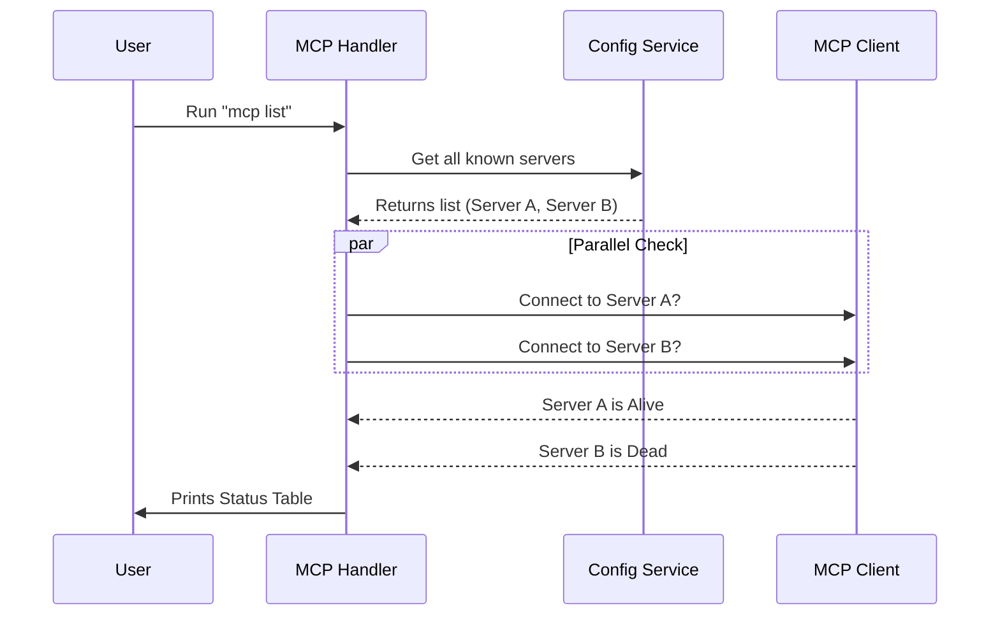
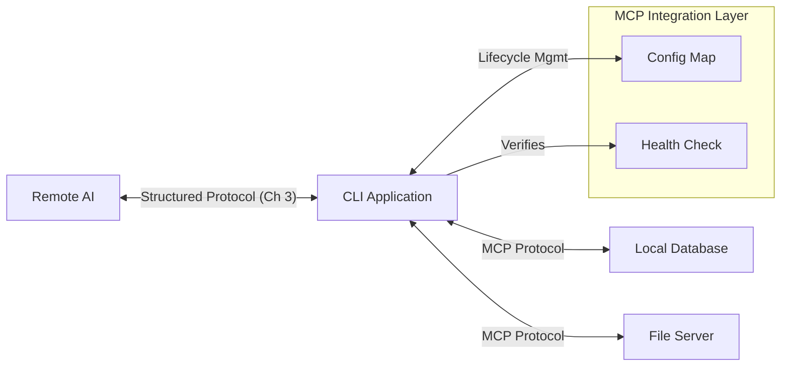

# Chapter 7: MCP Integration

In the previous chapter, [Plugin Management](06_plugin_management.md), we learned how to install "apps" (plugins) to extend the CLI's functionality.

However, installing a plugin is only half the battle. Many plugins act as gateways to external systems—like a local database, a file server, or a browser automation tool. These systems speak the **Model Context Protocol (MCP)**.

This chapter explains how the CLI integrates with these MCP servers, acting as a "Universal Adapter" that plugs external tools into the AI's brain.

## Motivation: The Universal USB Hub

Imagine you have a laptop (the AI) and you want to connect a printer, a mouse, and a hard drive. You don't want to wire each one directly into the motherboard. You use a standard USB port.

**MCP** is that USB standard for AI.

1.  **The Tool (MCP Server):** "I am a database tool. I can run SQL queries."
2.  **The AI (Remote Brain):** "I need to query a database."
3.  **The CLI (Integration):** Acts as the **USB Hub**. It manages the cables, ensures the connection is live, and routes the data between the AI and the Tool.

Without this integration layer, the AI is smart but isolated—it can think, but it cannot touch your data.

## Key Concept: The Configuration Map

The CLI doesn't inherently know which tools you have on your computer. It needs a "phonebook" or configuration map to know where the MCP servers are located.

This configuration is managed by `handlers/mcp.tsx`.

### Adding a Server

When you run a command to add an MCP server, the handler receives the configuration (usually JSON) and saves it.

```typescript
// handlers/mcp.tsx (Simplified)

export async function mcpAddJsonHandler(name: string, json: string, options: any) {
  // 1. Parse the incoming JSON configuration
  const parsedJson = safeParseJSON(json);

  // 2. Save it to the configuration file (User or Project scope)
  await addMcpConfig(name, parsedJson, options.scope);

  // 3. Tell the user it worked
  cliOk(`Added MCP server ${name} to config`);
}
```
*Explanation:* This function takes a name (e.g., "my-database") and a JSON string defining how to connect to it. It saves this safely to disk so the CLI remembers it next time.

## Key Concept: Health Checks

Just because a server is in the phonebook doesn't mean it's answering the phone. Before the AI tries to use a tool, the CLI must verify the connection.

This is the **Health Check**.

```typescript
// handlers/mcp.tsx (Simplified)

async function checkMcpServerHealth(name: string, server: Config): Promise<string> {
  try {
    // Attempt to dial the server
    const result = await connectToServer(name, server);
    
    // Return a simple status symbol
    if (result.type === 'connected') {
      return '✓ Connected';
    }
    return '✗ Failed to connect';
  } catch (error) {
    return '✗ Connection error';
  }
}
```
*Explanation:* This helper function tries to establish a real connection. It translates complex network states into a simple "Checkmark" or "X" for the user.

## Internal Implementation: The `list` Command

To understand how the pieces fit together, let's look at what happens when you run `claude mcp list`. This command effectively performs a "system diagnostic."

### The Workflow



### The Code Implementation

The `mcpListHandler` uses parallel processing (`p-map`) to check all servers at once, making the command fast even if you have 20 tools.

```typescript
// handlers/mcp.tsx (Simplified)

export async function mcpListHandler(): Promise<void> {
  // 1. Get the list of servers from config
  const { servers: configs } = await getAllMcpConfigs();

  // 2. Check health of all servers in parallel
  const results = await pMap(
    Object.entries(configs),
    async ([name, server]) => ({
      name,
      status: await checkMcpServerHealth(name, server) // Run the check
    }),
    { concurrency: 5 } // Check 5 at a time
  );

  // 3. Print the results
  for (const { name, status } of results) {
    console.log(`${name}: ${status}`);
  }
}
```
*Explanation:*
1.  **Load:** It reads the configuration file.
2.  **Check:** It loops through every server and runs `checkMcpServerHealth`.
3.  **Report:** It prints the status to your terminal.

## Key Concept: Scoping and Removal

Just like we saw in [Plugin Management](06_plugin_management.md), MCP servers can be scoped.
*   **Project Scope:** A database tool only relevant to the current project folder.
*   **User Scope:** A calculator tool relevant everywhere.

When removing a server, we must be careful to remove it from the correct scope.

```typescript
// handlers/mcp.tsx (Simplified)

export async function mcpRemoveHandler(name: string, options: any) {
  // 1. Identify which scope (Project vs User) to look in
  const scope = ensureConfigScope(options.scope);

  // 2. Remove the configuration entry
  await removeMcpConfig(name, scope);

  // 3. Clean up any saved security tokens (like passwords)
  cleanupSecureStorage(name);

  process.stdout.write(`Removed MCP server ${name}\n`);
}
```
*Explanation:* The handler ensures that when you delete a tool connection, it also wipes any saved passwords (`cleanupSecureStorage`) related to that tool for security.

## Visualizing the Architecture

This is how the MCP Integration fits into the overall CLI architecture we have built so far.



## Conclusion

The **MCP Integration** layer is the "Switchboard Operator" of the application.
1.  It **Configures** connections (Add/Remove).
2.  It **Verifies** connectivity (Health Checks).
3.  It **Exposes** these connections to the remote AI, allowing the brain in the cloud to control tools on your machine.

We have now covered the entire operational stack: Connection, Auth, Protocol, Transport, State, Plugins, and Tools.

The final piece of the puzzle is managing the application itself. How does it start up cleanly? How does it shut down without leaving zombie processes?

[Next Chapter: Application Lifecycle](08_application_lifecycle.md)

---

Generated by [Code IQ](https://github.com/adityasoni99/Code-IQ)