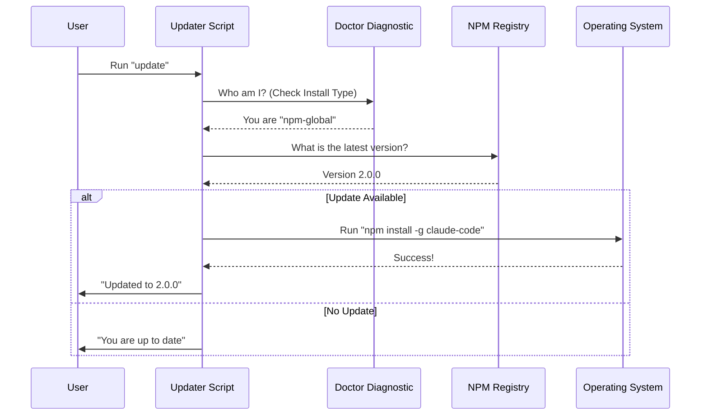

# Chapter 8: Application Lifecycle

Welcome to the final chapter of the **CLI** project tutorial!

In the previous chapter, [MCP Integration](07_mcp_integration.md), we expanded the capabilities of our AI by connecting it to external tools and data sources.

We now have a fully functional application. It connects to the cloud, authenticates users, speaks a structured language, manages state, and uses plugins. But there is one final piece of the puzzle: **Maintenance.**

How does the application keep itself up-to-date with new features? And when the user is done, how does it shut down safely without leaving a mess?

## Motivation: The Renovator and The Janitor

Building software is like running a restaurant.
1.  **Opening/Updates (The Renovator):** occasionally, you need to renovate the kitchen or change the menu (update the code). You don't want to force customers to build the new kitchen themselves; you want it to happen automatically.
2.  **Closing/Exit (The Janitor):** When you close for the night, you don't just cut the power. You need to turn off the ovens, sweep the floor, and lock the doors. If you just pull the plug, the building might catch fire (corrupted files or zombie processes).

This chapter covers **Application Lifecycle**: the mechanisms for **Self-Updating** (`update.ts`) and **Graceful Exiting** (`exit.ts`).

## Key Concept 1: The Centralized Exit Strategy

In a large application, you might be tempted to type `process.exit(1)` (force quit with error) whenever something goes wrong.

**The Problem:**
If you force quit from random places in your code:
*   Logs might not finish writing to disk.
*   Loading spinners might get stuck on the screen.
*   Database connections might remain open.

**The Solution:**
We use a centralized file, `exit.ts`, to handle all terminations. It acts as the single "Exit Door" for the application.

### The Helpers: `cliOk` and `cliError`

Instead of exiting manually, every command uses these two helper functions.

```typescript
// exit.ts

// Use this when everything went well
export function cliOk(msg?: string): never {
  if (msg) process.stdout.write(msg + '\n');
  
  // Cleanly exit with code 0 (Success)
  process.exit(0);
  
  // Tell TypeScript: "Trust me, the code stops here"
  return undefined as never;
}
```
*Explanation:* When a command finishes successfully, we print a message and exit with code `0`. The `: never` type helps the code editor understand that no code will run after this line.

```typescript
// exit.ts

// Use this when something exploded
export function cliError(msg?: string): never {
  // Print to "Standard Error" stream
  if (msg) console.error(msg);
  
  // Exit with code 1 (Error)
  process.exit(1);
  return undefined as never;
}
```
*Explanation:* If an error occurs, we print to `stderr` (so error logs can be separated from normal output) and exit with code `1`, telling the operating system that something went wrong.

## Key Concept 2: The Self-Updating Mechanism

Users rarely go to a website to download the latest version of a CLI tool manually. They expect the tool to say, "Hey, I have a new version!" and install it.

This logic lives in `update.ts`.

### The Challenge: "How was I installed?"

The hardest part of updating isn't downloading files; it's knowing **how** the user installed the app.
*   Did they use `npm install`?
*   Did they use Homebrew (`brew install`)?
*   Did they download a binary file?

If we try to run `npm update` on a Homebrew installation, it will crash.

### The Doctor Diagnostic

Before updating, the code runs a diagnostic to figure out its own identity.

```typescript
// update.ts (Simplified Logic)

const diagnostic = await getDoctorDiagnostic();

// diagnostic.installationType tells us if we are 
// 'npm-global', 'brew', 'native', etc.
```

## Internal Implementation: The Update Flow

Let's visualize the decision tree the CLI follows when you run `claude update`.



Now, let's look at the actual code handling this logic.

### 1. The Safety Check

First, we check if the environment is weird (e.g., multiple versions installed at once) or if we are in "Development Mode" (where we shouldn't auto-update).

```typescript
// update.ts

// Check for developer mode
if (diagnostic.installationType === 'development') {
  writeToStdout(chalk.yellow('Warning: Cannot update development build') + '\n');
  
  // Exit gracefully using our helper
  await gracefulShutdown(1);
}
```
*Explanation:* If a developer is working on the code, we don't want the updater to overwrite their work with the public version.

### 2. Handling Package Managers

If the user installed via Homebrew or another package manager, the CLI *cannot* update itself directly due to permission rules. It must tell the user what command to run.

```typescript
// update.ts

if (diagnostic.installationType === 'package-manager') {
  const manager = await getPackageManager(); // e.g., 'homebrew'

  if (manager === 'homebrew') {
    writeToStdout('To update, run:\n');
    writeToStdout(chalk.bold('  brew upgrade claude-code') + '\n');
  }
  
  // We stop here because we can't do it automatically
  await gracefulShutdown(0);
}
```
*Explanation:* The application is polite. Instead of failing, it detects the specific tool the user uses (Homebrew, Winget, APK) and gives them the exact command they need.

### 3. The Native Update

For "Native" installations (standalone binaries), the CLI can replace its own file.

```typescript
// update.ts

if (diagnostic.installationType === 'native') {
  try {
    // Attempt to download and swap the binary
    const result = await installLatestNative(channel, true);

    if (result.latestVersion === MACRO.VERSION) {
      writeToStdout(chalk.green(`Up to date (${MACRO.VERSION})`));
    }
    // ... handle success
  } catch (error) {
    // ... handle file permission errors
  }
}
```
*Explanation:* This uses a specialized `installLatestNative` function that handles the complex task of downloading a new executable and swapping it with the running one.

### 4. The NPM Update (Fallback)

Finally, if it's a standard JavaScript installation, we use `npm`.

```typescript
// update.ts

// Decide between local (folder) or global (system-wide) update
const useLocalUpdate = diagnostic.installationType === 'npm-local';
let status: InstallStatus;

if (useLocalUpdate) {
  // Update just this folder
  status = await installOrUpdateClaudePackage(channel);
} else {
  // Update the whole system
  status = await installGlobalPackage();
}
```
*Explanation:* The code differentiates between a user who installed the tool globally (`-g`) and one who installed it in a local project folder, ensuring the update goes to the right place.

## Putting it Together: The User Experience

Because of this Lifecycle logic, the user experience is seamless:

1.  **User:** types `claude update`.
2.  **Lifecycle:** Checks if it's Homebrew. It's not.
3.  **Lifecycle:** Checks if it's Native. It is.
4.  **Lifecycle:** Downloads the new binary.
5.  **Lifecycle:** Replaces the old file.
6.  **Lifecycle:** Calls `cliOk("Updated successfully")` from `exit.ts`.
7.  **Result:** The process cleans up and terminates.

## Conclusion

The **Application Lifecycle** is the unsung hero of the CLI.
1.  **Updates:** It ensures the user always has the latest features and bug fixes by intelligently detecting how the app was installed.
2.  **Exits:** It ensures that when the app closes, it does so safely and predictably, keeping the user's terminal clean.

### Series Wrap-Up

Congratulations! You have navigated the entire architecture of the **CLI** project.

*   You built the bridge to the internet in [Remote I/O Bridge](01_remote_i_o_bridge.md).
*   You secured it in [Authentication Flow](02_authentication_flow.md).
*   You defined a language in [Structured Message Protocol](03_structured_message_protocol.md).
*   You optimized shipping in [Transport Strategies](04_transport_strategies.md).
*   You synchronized data in [CCR State Synchronization](05_ccr_state_synchronization.md).
*   You expanded features in [Plugin Management](06_plugin_management.md).
*   You connected external tools in [MCP Integration](07_mcp_integration.md).
*   And finally, you learned how to maintain the app in **Application Lifecycle**.

You now possess a complete mental map of how a modern, cloud-connected AI terminal application is architected. Happy coding!

---

Generated by [Code IQ](https://github.com/adityasoni99/Code-IQ)