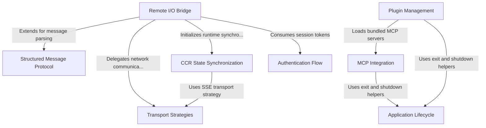

# Tutorial: cli

The project is a robust Command Line Interface (CLI) designed to connect a local terminal environment with a remote AI session, likely powered by **Claude**. It features a **Remote I/O Bridge** that securely transmits standard input/output over various **Transport Strategies** (like WebSockets or SSE) using a strict **Structured Message Protocol**. The system includes advanced capabilities for **CCR State Synchronization** to reliably mirror the "worker" state, integrates external tools via the **Model Context Protocol (MCP)**, manages extensibility through **Plugins**, and handles secure **Authentication** and the **Application Lifecycle**.

## Chapters

1. [Remote I/O Bridge](01_remote_i_o_bridge.md)
2. [Authentication Flow](02_authentication_flow.md)
3. [Structured Message Protocol](03_structured_message_protocol.md)
4. [Transport Strategies](04_transport_strategies.md)
5. [CCR State Synchronization](05_ccr_state_synchronization.md)
6. [Plugin Management](06_plugin_management.md)
7. [MCP Integration](07_mcp_integration.md)
8. [Application Lifecycle](08_application_lifecycle.md)

---

Generated by [Code IQ](https://github.com/adityasoni99/Code-IQ)