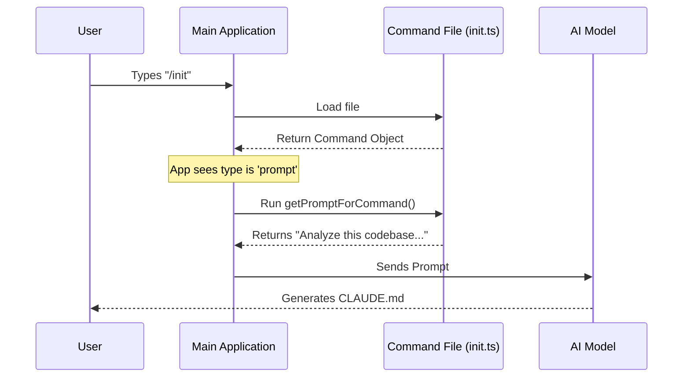

# Chapter 1: Command Architecture

Welcome to the **Commands** project! 

Imagine you are building a digital assistant. You want this assistant to learn new skills easily—like organizing files, writing emails, or checking the weather. In software architecture, we call this a **Plugin System**.

In this project, every feature is a distinct file. If you want the app to know how to "login", you create a `login` file. If you want it to "commit" code, you create a `commit` file. This is the **Command Architecture**.

### Why do we do this?
Instead of writing one giant file with thousands of lines of code (which is hard to read and break), we break the application into tiny, self-contained pieces. Each piece does exactly one thing.

---

## Use Case: The "Clear" Command

Let's start with the simplest command possible: clearing the screen. 

When a user types `/clear`, we want the application to wipe the chat history. We don't need Artificial Intelligence for this; it's a simple, mechanical action.

### The `call` Function
For simple actions, a command file exports a specific function called `call`.

Here is the simplified code for `clear.ts`.

```typescript
// File: clear/clear.ts
import { clearConversation } from './conversation.js'

// This function runs when the user types /clear
export const call = async (_, context) => {
  
  // 1. Perform the action
  await clearConversation(context)
  
  // 2. Return an empty result
  return { type: 'text', value: '' }
}
```

**What just happened?**
1.  **Export:** We use `export const call`. This tells the main application, "Hey, I can be executed!"
2.  **Context:** The function receives `context`. This contains the app's memory (like the current chat history).
3.  **Action:** We call `clearConversation(context)` to actually wipe the data.

---

## Use Case: The "Init" Command (AI Powered)

Now, let's look at something smarter. The `/init` command analyzes your project and writes documentation. This is too complex for a simple script; we need the AI's help.

For AI commands, we don't just export a function. We export a **Command Object** that describes *how* to talk to the AI.

Here is a simplified version of `init.ts`:

```typescript
// File: init.ts
import { feature } from 'bun:bundle'

// 1. Define the prompt instructions for the AI
const INIT_PROMPT = `Please analyze this codebase and create a CLAUDE.md file...`

// 2. Define the command object
const command = {
  type: 'prompt',          // Type: Sends instructions to AI
  name: 'init',            // Keyword: User types /init
  description: 'Initialize a new CLAUDE.md file',
  
  // 3. The function that generates the prompt
  async getPromptForCommand() {
    return [
      { type: 'text', text: INIT_PROMPT }
    ]
  },
}

export default command
```

**Key Differences:**
*   **`type: 'prompt'`**: This tells the system, "Don't run this logic locally. Send this text to the AI model."
*   **`getPromptForCommand`**: Instead of doing the work, this function *prepares* the instructions (the Prompt) that the AI will read.

---

## How It Works Under the Hood

When a user types a command, the system acts like a traffic controller. It doesn't know what every command does; it just knows where to find them.

### The Flow
1.  User types `/init`.
2.  System looks for a file named `init.ts`.
3.  System loads the file.
4.  System checks: "Is this a `call` function or a `prompt` object?"



### Passing Context
Notice that in the `clear.ts` example, we used `context`. This is how commands share memory.

```typescript
// simplified usage
export const call = async (args, context) => {
   // context.getAppState() lets us see the current state
   const appState = context.getAppState();
}
```
If you need to know who the user is, or what operating system they are on, you ask the **Context**. We will cover how this memory works in detail in [Context & Memory Management](04_context___memory_management.md).

---

## Advanced: Interactive UI Commands

Sometimes, you need more than just text. You need buttons, login forms, or interactive dialogues. 

The architecture supports this by allowing commands to return **React Components**. This is used in the `login.tsx` command.

```tsx
// File: login/login.tsx (Simplified)
import * as React from 'react';
import { Dialog } from '../../components/Dialog.js';

export async function call(onDone, context) {
  // Returns a visual component to be rendered in the terminal
  return (
    <Dialog title="Login">
       <LoginForm onSuccess={() => onDone('Success!')} />
    </Dialog>
  );
}
```

This specific capability allows us to build rich user interfaces inside the terminal! We will explore how to build these interfaces in the very next chapter.

---

## Summary

In the **Command Architecture**, the application is just a shell that loads capabilities on demand.

1.  **Direct Commands (`export call`)**: Good for utilities like `clear`.
2.  **Prompt Commands (`export default command`)**: Good for AI tasks like `init` or `commit`.
3.  **UI Commands (`.tsx`)**: Good for user interaction like `login`.

Now that you understand how commands are structured, let's learn how to make them look beautiful in the terminal.

[Next Chapter: Interactive TUI (Text User Interface)](02_interactive_tui__text_user_interface_.md)

---

Generated by [Code IQ](https://github.com/adityasoni99/Code-IQ)