# Chapter 2: Interactive TUI (Text User Interface)

In the previous chapter, [Command Architecture](01_command_architecture.md), we learned how to create commands that output simple text.

But what if you need to ask the user a question? Or show a loading spinner while downloading a file? Or display a menu where the user can select an option using their arrow keys?

Simple text output (`console.log`) isn't enough. We need an **Interactive TUI (Text User Interface)**.

## The Big Idea: React in the Terminal

If you have built websites before, you likely know **React**. It’s a tool for building user interfaces using "Components."
Usually, React renders to a web browser (HTML).

In this project, we use React to render **text** directly to your terminal window.

### Why do we do this?
1.  **State Management:** We can easily handle complex states (like `Loading` -> `Success` -> `Error`).
2.  **Interactivity:** We can capture keystrokes (arrows, enter) to create menus.
3.  **Cleanliness:** instead of printing thousands of lines of logs, we update the screen in place.

---

## Core Components

Instead of HTML tags like `<div>` or `<span>`, we use special components designed for the terminal:

*   **`<Box>`**: Think of this as a `<div>`. It's a container for layout (rows and columns).
*   **`<Text>`**: Think of this as a `<span>` or `<p>`. It holds the actual text to display.
*   **`<Dialog>`**: A pre-made window for asking questions.

---

## Use Case 1: The Theme Picker

Let's look at the `theme` command. When a user types `/theme`, we don't want to just list colors; we want a menu where they can pick one.

Here is how the command file (`theme.tsx`) uses a UI component.

### The Command Wrapper

```tsx
// File: theme/theme.tsx
import * as React from 'react';
import { ThemePicker } from '../../components/ThemePicker.js';

// The command returns a Component, not just text!
export const call = async (onDone, context) => {
  return <ThemePickerCommand onDone={onDone} />;
};
```

**Explanation:**
The `call` function here is special. Instead of doing the work immediately, it returns a **React Component** (`<ThemePickerCommand />`). The application detects this and "mounts" the component in the terminal.

### The Interactive Component

Now let's look at the component itself (simplified):

```tsx
function ThemePickerCommand({ onDone }) {
  // We use a pre-built picker component
  return (
    <Pane color="permission">
      <ThemePicker 
        onThemeSelect={(setting) => {
           // When user presses Enter on a theme:
           onDone(`Theme set to ${setting}`); 
        }}
      />
    </Pane>
  );
}
```

**What happens here?**
1.  **`<Pane>`**: Creates a colored box around our content.
2.  **`<ThemePicker>`**: This component listens for arrow keys to highlight options.
3.  **`onDone`**: When the user selects a theme, we call `onDone`. This tells the main app, "We are finished, you can close this UI now."

---

## Use Case 2: The Install Command (State Management)

The `/install` command is more complex. It needs to show progress: "Checking...", then "Installing...", then "Success!".

We use React **Hooks** (`useState`, `useEffect`) to manage this.

### Step 1: Define the State
We define the different "modes" our UI can be in.

```tsx
// File: install.tsx (Simplified)
function Install({ onDone }) {
  // Start in the 'checking' state
  const [state, setState] = useState({ type: 'checking' });

  // ... logic continues ...
```

### Step 2: visual Rendering
We decide what to show based on the current state.

```tsx
  return (
    <Box flexDirection="column">
      {/* If checking, show this text */}
      {state.type === 'checking' && (
        <Text color="blue">Checking installation status...</Text>
      )}

      {/* If installing, show this text with the version */}
      {state.type === 'installing' && (
        <Text color="yellow">Installing version {state.version}...</Text>
      )}

      {/* If success, show the green icon */}
      {state.type === 'success' && (
        <Text color="green">Installation Complete!</Text>
      )}
    </Box>
  );
}
```

### Step 3: Performing the Action
We use `useEffect` to trigger the actual installation logic when the component loads.

```tsx
  useEffect(() => {
    async function run() {
      // 1. Switch state to installing
      setState({ type: 'installing', version: '1.0.0' });
      
      // 2. Do the heavy lifting (downloading files)
      await downloadFiles();

      // 3. Switch state to success
      setState({ type: 'success' });
      
      // 4. Tell the app we are done after a short delay
      setTimeout(() => onDone('Success'), 2000);
    }
    run();
  }, []);
```

---

## How It Works Under the Hood

When you return a React element from a command, the system hands it over to a renderer (specifically, a library called `ink`).

### The Render Loop

```mermaid
sequenceDiagram
    participant App as Main App
    participant Cmd as Install Command
    participant React as React/Ink
    participant Term as User Terminal

    App->>Cmd: Execute call()
    Cmd->>React: Returns <Install /> Component
    
    rect rgb(20, 20, 20)
        Note over React, Term: The Render Loop
        React->>Term: Renders "Checking..."
        Note over React: State changes to 'installing'
        React-->>Term: Clears previous text
        React->>Term: Renders "Installing..."
        Note over React: State changes to 'success'
        React-->>Term: Clears previous text
        React->>Term: Renders "Success!"
    end

    React->>App: onDone() called
    App->>Term: UI Unmounts (Returns to normal prompt)
```



1.  **Mounting:** The app reserves space at the bottom of the terminal.
2.  **Diffing:** When state changes, React calculates the difference between the old text and the new text.
3.  **Painting:** It sends special ANSI codes to the terminal to erase specific lines and write new ones, creating the illusion of animation.

---

## Advanced: Accessing Global Data

Sometimes your UI needs to know global information, like "Is the user logged in?" or "What is their API Key?".

In the `login.tsx` command, we see this passed in via **Context**.

```tsx
// File: login/login.tsx
export async function call(onDone, context) {
  return <Login onDone={async (success) => {
      if (success) {
         // We can update global app state here
         context.setAppState(prev => ({ ...prev, authVersion: 2 }));
      }
      onDone('Logged in');
  }} />;
}
```

Components are powerful, but they are temporary. When the component unmounts, its internal state is lost. To store data permanently (like a session token), we must save it to the **App State**.

We will explore how this global memory works in the next chapter.

---

## Summary

1.  **React in Terminal:** We use React components to build rich interfaces (`<Box>`, `<Text>`).
2.  **`call` returns JSX:** Interactive commands return a component instead of a string.
3.  **State Machines:** We use `useState` to switch between Loading, Success, and Error views.
4.  **`onDone`:** The component must manually tell the app when interaction is finished.

Now that we can build interfaces, we need to handle the most critical part of a user-facing application: knowing who the user is.

[Next Chapter: Authentication & Session State](03_authentication___session_state.md)

---

Generated by [Code IQ](https://github.com/adityasoni99/Code-IQ)