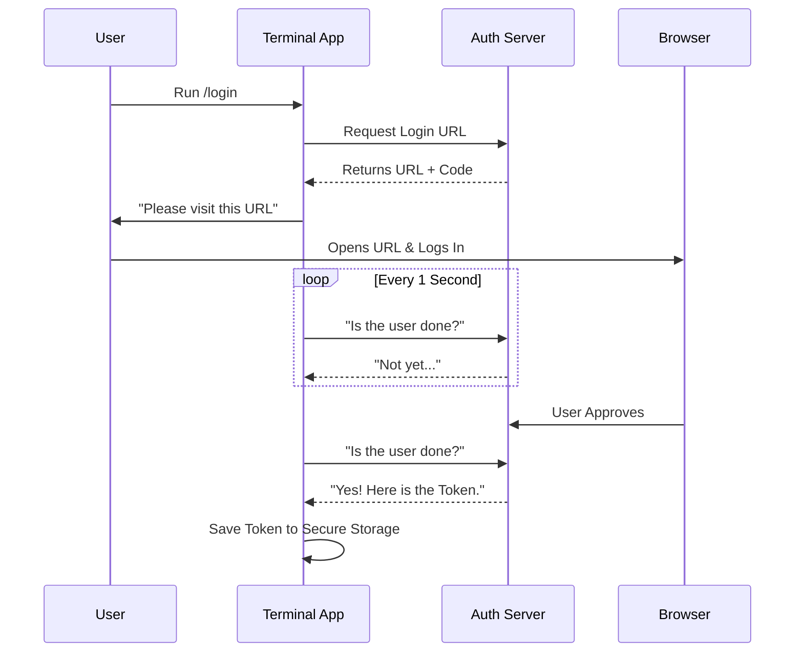

# Chapter 3: Authentication & Session State

In the previous chapter, [Interactive TUI (Text User Interface)](02_interactive_tui__text_user_interface_.md), we learned how to build beautiful menus and loading screens in the terminal.

But a beautiful interface is useless if the application doesn't know *who* you are. To use powerful AI models (like Claude) or access remote files (like on GitHub), the application needs to verify your identity.

This brings us to **Authentication (Auth)** and **Session State**.

## The Concept: The Digital Bouncer

Think of this application as a secure building.
1.  **Authentication:** This is the Bouncer at the door checking your ID.
2.  **Session State:** This is the ID Badge they give you so you don't have to show your passport at every single room you enter.
3.  **Secure Storage:** This is the hotel safe where you store your ID Badge when you go to sleep (close the app), so you have it ready for tomorrow.

---

## Use Case: The Login Command

The most fundamental command in this system is `/login`. It allows the user to authenticate with Anthropic to use the AI services.

This command is unique because the terminal cannot see your password. Instead, we use a process called **OAuth** (Open Authorization).

### How OAuth Works (The Handshake)
Since we can't type passwords securely in the terminal, we ask the **Browser** to do it for us.

1.  The App gives you a URL.
2.  You open that URL in Chrome/Safari and log in there.
3.  The Browser gives you a "Token" (a long string of random characters).
4.  The App saves that Token.

---

## The Login Implementation

Let's look at `login/login.tsx`. It combines the **Command Architecture** (Chapter 1) with the **TUI** (Chapter 2) to handle this handshake.

### The Logic Wrapper

The `call` function sets up the logic. Notice how it interacts with `context`.

```tsx
// File: login/login.tsx (Simplified)
export async function call(onDone, context) {
  // Render the Login Component
  return <Login onDone={async (success) => {
    
    if (success) {
      // 1. Tell the app to refresh data
      resetUserCache();
      
      // 2. Update the global "Version" of auth
      // This forces other parts of the app to notice we are logged in
      context.setAppState(prev => ({
        ...prev,
        authVersion: prev.authVersion + 1
      }));
    }
    
    onDone(success ? 'Login successful' : 'Failed');
  }} />;
}
```

**Key Takeaway:**
When login succeeds, we update `context.setAppState`. This is like announcing over a loudspeaker: "User is now logged in! Update your displays!" We will cover this global memory in [Context & Memory Management](04_context___memory_management.md).

### The UI Component

The `<Login>` component manages the visual flow. It uses a specialized component called `<ConsoleOAuthFlow>`.

```tsx
// File: login/login.tsx (Simplified UI)
export function Login(props) {
  const mainLoopModel = useMainLoopModel();

  return (
    <Dialog title="Login" color="permission">
      {/* This component handles the complex polling logic */}
      <ConsoleOAuthFlow 
        onDone={() => props.onDone(true, mainLoopModel)} 
      />
    </Dialog>
  );
}
```

---

## Under the Hood: The Polling Loop

How does the terminal know when you clicked "Allow" in your browser? It asks the server repeatedly: "Are they done yet? Are they done yet?"

This is handled in helper files like `OAuthFlowStep.tsx`.

### The Sequence



### The Polling Code

Here is a simplified look at how the app waits for the user (`install-github-app/OAuthFlowStep.tsx`).

```tsx
// File: install-github-app/OAuthFlowStep.tsx (Simplified)
useEffect(() => {
  // 1. Check if we are in the 'waiting' state
  if (oauthStatus.state === 'waiting_for_login') {
    
    // 2. Poll the server periodically
    const timer = setInterval(async () => {
       const token = await checkServerForToken();
       
       if (token) {
         // 3. We got it! Update state to success
         setOAuthStatus({ state: 'success', token: token });
         saveOAuthTokensIfNeeded(token);
       }
    }, 1000); // Check every second
    
    return () => clearInterval(timer);
  }
}, [oauthStatus]);
```

**Why this matters:**
This creates a seamless experience. The user interacts with the browser, and the terminal *magically* updates itself without the user typing anything back into it.

---

## Managing Session State (Logout)

Authentication isn't just about getting in; it's about cleaning up when you leave. If a user types `/logout`, we must destroy the "ID Badge" (Token) and clear the "Memory" (Cache).

If we don't clear the cache, the next user might see the previous user's name!

```typescript
// File: logout/logout.tsx (Simplified)
export async function performLogout() {
  // 1. Remove the physical token from the hard drive
  await removeApiKey();

  // 2. Wipe the secure storage "Safe"
  const secureStorage = getSecureStorage();
  secureStorage.delete();

  // 3. Clear the application memory (Cache)
  await clearAuthRelatedCaches();
  resetUserCache();
}
```

**Security Note:**
Notice the order. We remove the key *first*, then wipe the storage, then clear the memory. This ensures that even if the app crashes halfway through, the most sensitive data is gone.

---

## Summary

In **Authentication & Session State**, we learned:

1.  **OAuth Handshake:** We use the browser to authenticate, while the terminal polls for the result.
2.  **State Updates:** When login finishes, we use `context.setAppState` to notify the rest of the application.
3.  **Secure Cleanup:** Logging out involves physically deleting tokens and clearing memory caches to prevent data leaks.

Now that our user is authenticated and we have their "ID Badge," we need a place to store this badge alongside other data (like chat history and preferences) while the app is running.

[Next Chapter: Context & Memory Management](04_context___memory_management.md)

---

Generated by [Code IQ](https://github.com/adityasoni99/Code-IQ)