# Chapter 4: Context & Memory Management

In the previous chapter, [Authentication & Session State](03_authentication___session_state.md), we gave our user an identity ("The ID Badge").

Now, we need to give our AI a **Brain**.

When you talk to an AI, it doesn't automatically know everything about your project. You have to feed it information. However, AI models have a limit on how much they can read at once (called the **Context Window**), and reading text costs money (Tokens).

This chapter explains how we manage the AI's "Brain" efficiently using **Context** (Short-term memory) and **Memory** (Long-term knowledge).

---

## The Big Analogy: RAM vs. Hard Drive

To understand how this system works, think of a computer:

1.  **Context (RAM):** This is the immediate conversation.
    *   *Pros:* Very fast, contains "What did I just say?".
    *   *Cons:* Temporary. If you close the app, it's gone. It has a limited size (e.g., 200k tokens).
2.  **Memory (Hard Drive):** This is the `CLAUDE.md` file.
    *   *Pros:* Persistent. It remembers project rules forever.
    *   *Cons:* You have to manually write it.

---

## Concept 1: Context (The Conversation History)

Every time you send a message to the AI, we actually send the **entire conversation history** along with it. This allows the AI to answer follow-up questions.

Eventually, this history gets too big. The `/context` command allows the user to see how "full" the AI's brain is.

### The Context Command

Let's look at `context/context.tsx`. It calculates usage and draws a graph.

```typescript
// File: context/context.tsx (Simplified)
import { microcompactMessages } from '../../services/compact/microCompact.js';

export async function call(onDone, context) {
  const { messages } = context;

  // 1. Compress the messages to see what the AI actually reads
  // We remove whitespace and unnecessary JSON to save tokens
  const compactedData = await microcompactMessages(messages);

  // 2. Analyze how many tokens are used
  const usageData = await analyzeContextUsage(compactedData);

  // 3. Draw the visualization (The graph you see in terminal)
  const output = renderContextGraph(usageData);
  
  onDone(output);
}
```

**What is Micro-compacting?**
To save space, the application "squeezes" the text before sending it to the AI. It might turn a verbose JSON object into a smaller string. The user doesn't see this, but the `/context` command reveals exactly what the AI sees.

---

## Concept 2: Memory (Persistent Knowledge)

If you tell the AI: *"Always use TypeScript in this project,"* it will remember it for *this* session. But tomorrow, it will forget.

To fix this, we use **Memory files**, specifically `CLAUDE.md`. This is a markdown file where you write instructions that the AI reads *every single time* it starts.

### The Memory Command

The `/memory` command is a shortcut to create or edit this file using your computer's text editor (like VS Code, Vim, or Nano).

```typescript
// File: memory/memory.tsx (Simplified)
import { editFileInEditor } from '../../utils/promptEditor.js';

const handleSelectMemoryFile = async (memoryPath) => {
    // 1. Create the file if it doesn't exist yet
    await ensureFileExists(memoryPath);

    // 2. Open the user's default text editor
    // This pauses the terminal until the user closes the editor
    await editFileInEditor(memoryPath);

    // 3. Notify the user
    onDone(`Opened memory file at ${memoryPath}`);
};
```

**Why is this powerful?**
By abstracting this into a command, the user doesn't need to know *where* the file is hidden. They just type `/memory`, write their rules ("Always use 2 spaces indentation"), save, and the AI becomes smarter instantly.

---

## Use Case: Exporting the Brain

Sometimes you want to save a conversation to share with a coworker. This is effectively "dumping the RAM to disk."

The `/export` command handles this. It takes the context (RAM) and writes it to a `.txt` file.

```typescript
// File: export/export.tsx (Simplified)
export async function call(onDone, context, args) {
  // 1. Convert the rich message objects into plain text
  const textContent = await renderMessagesToPlainText(context.messages);

  // 2. Generate a filename (e.g., conversation-2023-10-27.txt)
  const filename = args || `conversation-${Date.now()}.txt`;

  // 3. Save to disk
  writeFileSync(filename, textContent);
  
  onDone(`Saved conversation to ${filename}`);
}
```

---

## How It Works Under the Hood

When you chat, the system combines **Memory** and **Context** into one giant prompt for the AI.

### The Data Flow

```mermaid
sequenceDiagram
    participant User
    participant App
    participant Disk as Hard Drive (CLAUDE.md)
    participant AI as AI Model

    User->>App: Types "Hello"
    
    rect rgb(20, 20, 20)
        Note over App: Preparation Phase
        App->>Disk: Read CLAUDE.md (Memory)
        App->>App: Load Chat History (Context)
        App->>App: Compact/Compress Data
    end
    
    App->>AI: Send (Memory + Context + "Hello")
    AI-->>App: Response
    App-->>User: Display Response
```



### Context "Sliding Window"
If the conversation gets too long (exceeds the Token Limit), the system acts like a conveyor belt. It drops the oldest messages to make room for new ones.

This is why `context.tsx` is so important—it helps the user see when they are about to "forget" the beginning of the conversation.

### Visualizing Context
The `context.tsx` command uses a helper called `ContextVisualization`. This is a pure UI component (like we learned in [Chapter 2](02_interactive_tui__text_user_interface_.md)).

```typescript
// File: components/ContextVisualization.tsx (Conceptual)
export function ContextVisualization({ data }) {
  // Shows a progress bar: [########....] 60%
  const percent = data.usedTokens / data.totalLimit;
  
  return (
    <Box flexDirection="column">
      <Text>Brain Capacity: {percent}% full</Text>
      <ProgressBar value={percent} />
      <Text dimColor>Old messages will be forgotten soon.</Text>
    </Box>
  );
}
```

---

## Summary

1.  **Context (RAM):** The immediate chat history. We monitor it with `/context` to ensure we aren't running out of space.
2.  **Memory (Hard Drive):** The `CLAUDE.md` file. We edit it with `/memory` to give the AI permanent instructions.
3.  **Compacting:** We minimize data behind the scenes to save money and space.

Now that our AI has a **Identity** (Auth) and a **Brain** (Memory), we need to teach it how to understand the specific project it is working on.

[Next Chapter: Project Setup & Intelligence](05_project_setup___intelligence.md)

---

Generated by [Code IQ](https://github.com/adityasoni99/Code-IQ)