# Chapter 5: Project Setup & Intelligence

In the previous chapter, [Context & Memory Management](04_context___memory_management.md), we gave our AI a "Brain." It can remember conversation history and read files.

However, dropping an AI into a new codebase is like hiring a new developer. Even if they are a genius, they don't know *your* specific rules.
*   "Do we use tabs or spaces?"
*   "How do I run the tests?"
*   "Where do we keep the API keys?"

This chapter covers **Project Setup & Intelligence**. We will build the logic that allows the AI to "onboard" itself, scan your project, and configure its own instructions.

---

## The Big Idea: The "Briefing Packet"

To make the AI useful immediately, we need to generate a "Briefing Packet"—a set of instructions that describes how to work in *this specific* repository.

In this project, that packet is a file named **`CLAUDE.md`**.

Instead of writing this file manually (which is boring), we use the `/init` command. This command uses the AI to scan your code and write its own instruction manual.

---

## Use Case: The `/init` Command

When a user runs `/init`, the application performs a **Phased Analysis** of the current folder. It looks at `package.json`, `Makefile`, and existing documentation to understand the project structure.

### The Command Structure
Let's look at `init.ts`. It follows the **Prompt Command** pattern we learned in Chapter 1, but with a twist: it changes its behavior based on the user type.

```typescript
// File: init.ts (Simplified)
import { feature } from 'bun:bundle'

const command = {
  type: 'prompt',
  name: 'init',
  description: 'Initialize a new CLAUDE.md file',
  
  // The magic happens here:
  async getPromptForCommand() {
    // 1. Decide which instructions to send to the AI
    const promptText = shouldUseNewInit() 
        ? NEW_INIT_PROMPT 
        : OLD_INIT_PROMPT;

    // 2. Return the prompt to be sent to the model
    return [{ type: 'text', text: promptText }];
  },
}
export default command
```

**What is happening?**
1.  **`getPromptForCommand`**: This function calculates what to tell the AI *before* the AI does anything.
2.  **`NEW_INIT_PROMPT`**: This is a massive block of text (hidden in the variable) that tells the AI: *"Look at the file structure, detect languages, find test commands, and write a CLAUDE.md file."*

---

## How "Intelligence" Works (The Phased Prompt)

The "Intelligence" isn't magic; it's a very carefully written set of instructions. The `NEW_INIT_PROMPT` inside `init.ts` guides the AI through a strict workflow.

Here is a breakdown of the instructions we send to the AI:

1.  **Phase 1 (Interview):** "Ask the user what they want. Do they want shared project rules or private personal rules?"
2.  **Phase 2 (Exploration):** "Read `package.json`, `Cargo.toml`, or `requirements.txt`. Figure out how to build and test this code."
3.  **Phase 3 (Proposal):** "Propose a `CLAUDE.md` file content and ask the user if it looks good."
4.  **Phase 4 (Execution):** "Write the file to disk."

### Visualizing the Logic
The application facilitates a conversation between the User and the AI to build this knowledge.

```mermaid
sequenceDiagram
    participant User
    participant App
    participant AI

    User->>App: Types /init
    App->>AI: Sends "Phased Analysis Prompt"
    
    rect rgb(20, 20, 20)
        Note over AI: Phase 1 & 2
        AI->>App: Reads Manifest Files (package.json)
        AI->>App: Reads Directory Structure
        AI-->>User: "I see this is a TypeScript project. Shall I create CLAUDE.md?"
    end

    User->>AI: "Yes, proceed."
    
    rect rgb(20, 20, 20)
        Note over AI: Phase 3 & 4
        AI->>AI: Generates Rules based on findings
        AI-->>App: Writes CLAUDE.md
    end
    
    App-->>User: "Initialization Complete"
```



---

## Setting Up Integrations (GitHub Actions)

Once the AI understands the code, we might want it to help *review* code automatically. This requires setting up **GitHub Actions**.

This is complex because it requires permissions. We need to:
1.  Check if the user has the GitHub CLI (`gh`) installed.
2.  Authenticate with GitHub.
3.  Create a secret API Key in the repo.
4.  Push a `.github/workflows/claude.yml` file.

We handle this in `install-github-app/setupGitHubActions.ts`.

### Checking the Environment
Before we try to install anything, we ensure the user has the right tools.

```typescript
// File: install-github-app/install-github-app.tsx (Simplified)
const checkGitHubCLI = useCallback(async () => {
    // 1. Run "gh --version" in the background
    const result = await execa('gh --version', { reject: false });
    
    if (result.exitCode !== 0) {
      // 2. If it fails, add a warning to the UI state
      warnings.push({
        title: 'GitHub CLI not found',
        message: 'Please install gh to continue.'
      });
    }
    
    // 3. Update the TUI state
    setState(prev => ({ ...prev, warnings }));
}, []);
```

### Pushing the Workflow
If the checks pass, we programmatically create the workflow file using the `gh` CLI tool. This saves the user from manually creating folders, copying YAML, and committing.

```typescript
// File: install-github-app/setupGitHubActions.ts (Simplified)
async function createWorkflowFile(repoName, content) {
  // We use the GitHub CLI API to push a file directly
  // This avoids needing to clone/commit/push locally
  
  const apiParams = [
    'api',
    '--method', 'PUT',
    `repos/${repoName}/contents/.github/workflows/claude.yml`,
    '-f', `content=${Buffer.from(content).toString('base64')}`,
    '-f', `message="Add Claude workflow"`
  ];

  await execFileNoThrow('gh', apiParams);
}
```

**Why do we use the API?**
By using `gh api`, we can inject the file directly into the repository on GitHub.com, even if the user's local git folder is messy or on a different branch.

---

## The UI for Setup

To make this complex setup process friendly, we use the **Interactive TUI** concepts from [Chapter 2](02_interactive_tui__text_user_interface_.md).

The `InstallGitHubApp` component manages a state machine that guides the user step-by-step.

```typescript
// File: install-github-app/install-github-app.tsx (Simplified Concept)
function InstallGitHubApp() {
  const [step, setStep] = useState('check-gh');

  switch (step) {
    case 'check-gh':
      return <CheckGitHubStep />; // Shows spinner
    case 'choose-repo':
      return <ChooseRepoStep />;  // Asks "Which repo?"
    case 'api-key':
      return <ApiKeyStep />;      // Asks "What is your key?"
    case 'success':
      return <SuccessStep />;     // Shows green checkmark
  }
}
```

This turns a complicated DevOps task (configuring CI/CD secrets and workflows) into a simple "Next -> Next -> Done" wizard in the terminal.

---

## Summary

In **Project Setup & Intelligence**, we learned how to onboard the AI to a new environment:

1.  **Intelligence (`/init`):** We use a prompt command to tell the AI to scan the project files and generate its own documentation.
2.  **Briefing Packet (`CLAUDE.md`):** The result of `/init`. A file that serves as the project-specific memory for the AI.
3.  **Integrations:** We use the `gh` CLI and React TUI components to automate setting up GitHub Actions, giving the AI permission to run inside Pull Requests.

Now the AI knows *who* you are (Auth), *what* you are saying (Context), and *how* your project works (Setup).

The final piece of the puzzle is giving the AI **Tools**—the ability to run commands, edit files, and search the web.

[Next Chapter: Plugin & MCP Integration](06_plugin___mcp_integration.md)

---

Generated by [Code IQ](https://github.com/adityasoni99/Code-IQ)