# Chapter 6: Plugin & MCP Integration

In the previous chapter, [Project Setup & Intelligence](05_project_setup___intelligence.md), we taught the AI how to understand your specific codebase.

However, modern development involves more than just local files. You use **GitHub** for issues, **PostgreSQL** for data, **Slack** for communication, and **Browsers** for research.

By default, the AI is "trapped in a box." It cannot see your database or access the internet.

This chapter introduces **Plugin & MCP Integration**. This is the "App Store" for your AI, allowing you to install external tools so the AI can interact with the outside world.

---

## The Big Idea: The "USB Port" for AI

In the past, if you wanted an AI to talk to a database, you had to write complex custom code.

Now, we use a standard called **MCP (Model Context Protocol)**. Think of MCP like a **USB port**.
*   **Before USB:** You needed a specific port for a mouse, a different one for a printer, and another for a keyboard.
*   **With USB:** You just plug it in, and it works.

**MCP** allows us to "plug in" any tool—whether it's Google Drive, Linear, or a local file server—and the AI instantly knows how to use it.

---

## Use Case: The "App Store" Interface

We don't want users to manually edit configuration files to install these tools. We want a friendly graphical interface in the terminal.

We will focus on the `/marketplace` command, specifically the **Add Marketplace** flow, where a user can install a new plugin simply by pasting a GitHub link.

---

## Component 1: Adding a Plugin

Let's look at `plugin/AddMarketplace.tsx`. This component handles the user input when they want to install a new tool.

### Handling User Input
First, we need to capture what the user types (e.g., `owner/repo`) and validate it.

```tsx
// File: plugin/AddMarketplace.tsx (Simplified Logic)
const handleAdd = async () => {
  const input = inputValue.trim();

  // 1. Validate the input format
  const parsed = await parseMarketplaceInput(input);
  if (!parsed) {
    setError('Invalid format. Try: owner/repo');
    return;
  }

  // 2. Start the loading spinner
  setLoading(true);
  
  // 3. Add the source
  await installPlugin(parsed);
};
```

**Explanation:**
This is standard React logic. We grab the text, check if it looks like a valid plugin source, and then trigger the installation.

### The Visual Feedback
While the plugin installs, we don't want the screen to freeze. We use the `<Spinner>` component we learned about in [Chapter 2](02_interactive_tui__text_user_interface_.md).

```tsx
// File: plugin/AddMarketplace.tsx (Simplified UI)
return (
  <Box flexDirection="column">
    <Text>Enter marketplace source:</Text>
    
    {/* The Input Field */}
    <TextInput 
       value={inputValue} 
       onChange={setInputValue} 
       onSubmit={handleAdd} 
    />

    {/* The Loading State */}
    {isLoading && (
      <Box marginTop={1}>
        <Spinner />
        <Text>Installing plugin...</Text>
      </Box>
    )}
  </Box>
);
```

---

## Component 2: Configuration Wizard

Installing a plugin is only half the battle. If you install a **GitHub** plugin, the AI needs your **API Key** to actually read your issues.

We can't just crash if the key is missing. We need a "Wizard" that walks the user through the setup.

This is handled in `plugin/PluginOptionsFlow.tsx`. It looks at the plugin's "Manifest" (a file describing what settings it needs) and generates a form.

### Detecting Missing Configs
The code loops through required settings and checks if they are saved on your computer.

```typescript
// File: plugin/PluginOptionsFlow.tsx (Simplified)
const [steps] = React.useState(() => {
  const result = [];

  // 1. Check what options the plugin needs
  const unconfigured = getUnconfiguredOptions(plugin);

  // 2. If options are missing, add a "Step" to the wizard
  if (Object.keys(unconfigured).length > 0) {
    result.push({
      title: `Configure ${plugin.name}`,
      schema: unconfigured,
      save: (values) => saveOptions(plugin.id, values)
    });
  }

  return result;
});
```

### The Wizard Loop
The component acts like a slideshow. It shows one configuration screen. When the user saves, it moves to the next screen.

```tsx
// File: plugin/PluginOptionsFlow.tsx (Simplified Render)
const currentStep = steps[index];

return (
  <PluginOptionsDialog 
    title={currentStep.title}
    configSchema={currentStep.schema}
    onSave={(values) => {
       // Save data and move to next step
       currentStep.save(values);
       setIndex(index + 1);
    }} 
  />
);
```

**Why is this cool?**
This code is **generic**. It doesn't know about "GitHub" or "Linear." It just reads a schema (like "I need a username and a token") and automatically builds the UI forms for them.

---

## Component 3: Managing Connections (MCP)

Once a plugin is installed and configured, it becomes an **MCP Server**. The AI connects to this server to ask questions.

The `mcp/mcp.tsx` file handles turning these connections on and off.

### The Toggle Logic
Sometimes you want to disable a tool temporarily.

```typescript
// File: mcp/mcp.tsx (Simplified)
function MCPToggle({ action, target }) {
  const toggleMcpServer = useMcpToggleEnabled();

  useEffect(() => {
    // 1. Find the requested server (or 'all')
    const toToggle = target === 'all' 
      ? allClients 
      : allClients.filter(c => c.name === target);

    // 2. Flip the switch
    for (const server of toToggle) {
      toggleMcpServer(server.name);
    }
  }, []); // Run once
  
  return null; // This is a logic-only component
}
```

**Note:** This uses the **App State** we discussed in [Chapter 3](03_authentication___session_state.md) to persist your preferences. If you disable a tool, it stays disabled even after you restart the app.

---

## How It Works Under the Hood

When you type `/mcp install owner/repo`, a complex sequence of events occurs to connect the AI to the new tool.

```mermaid
sequenceDiagram
    participant User
    participant App
    participant GitHub as GitHub/Internet
    participant Config as Local Config
    participant AI

    User->>App: "Install plugin X"
    App->>GitHub: Download Plugin Manifest
    GitHub-->>App: Returns JSON (Capabilities)
    
    App->>App: Check for required API Keys
    
    rect rgb(20, 20, 20)
        Note over App: Configuration Wizard
        App-->>User: "Please enter API Key"
        User->>App: Enters Key
        App->>Config: Save Key Securely
    end
    
    App->>App: Start MCP Server
    App->>AI: "New Tool Available: X"
    
    Note over AI: AI can now use Tool X
```



1.  **Discovery:** The app downloads the definition of the tool.
2.  **Configuration:** The app ensures it has the secrets needed to run the tool.
3.  **Registration:** The app tells the AI, "Hey, I have a new skill. Here is how you use it."

---

## Advanced: The "Tool Use" Concept

You might wonder: *How does the AI actually click the buttons?*

It doesn't. When the AI wants to use a plugin, it sends a special text message:
`{ "tool": "github", "action": "create_issue", "title": "Fix bug" }`

The **MCP Layer** intercepts this message, runs the actual Javascript code to talk to GitHub, and then sends the result back to the AI:
`{ "status": "success", "issue_url": "..." }`

This abstraction allows the AI to control software without running code directly on your machine, making it safer and more structured.

---

## Summary

In this final chapter, we unlocked the full potential of our digital assistant.

1.  **Marketplace (`AddMarketplace.tsx`):** We built a UI to find and install new skills.
2.  **Configuration (`PluginOptionsFlow.tsx`):** We created a dynamic wizard to handle API keys and settings without editing JSON files.
3.  **MCP Integration (`mcp.tsx`):** We used the Model Context Protocol to standardize how the AI connects to these external tools.

### Conclusion of the Tutorial

Congratulations! You have explored the entire architecture of the **Commands** project.

*   You started with the **Architecture** of splitting features into files.
*   You built beautiful **TUI** interfaces.
*   You secured the app with **Authentication**.
*   You gave the AI a **Memory** and **Project Intelligence**.
*   And finally, you connected it to the world with **Plugins**.

You now have a deep understanding of how to build a modern, extensible, AI-powered terminal application. Happy coding!

---

Generated by [Code IQ](https://github.com/adityasoni99/Code-IQ)