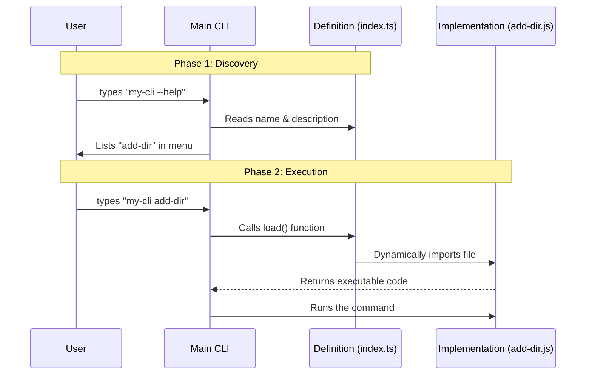

# Chapter 1: Command Definition

Welcome to the first chapter of the `add-dir` project tutorial! 

In this series, we will build a command-line tool that helps users add and manage directories. Before we can build fancy interactive screens or validate user input, we need to establish the foundation.

## Motivation: The "Restaurant Menu"

Imagine you are running a restaurant. You have a brilliant chef in the kitchen ready to cook a specific dish (the implementation), and hungry customers outside (the users). 

However, if that dish isn't written on the **Menu**, nobody knows they can order it!

The **Command Definition** is exactly like that menu entry. It solves a specific problem: **Discoverability**. It tells the main CLI program:
1.  "I exist."
2.  "My name is `add-dir`."
3.  "Here is a short description of what I do."
4.  "If someone orders me, here is where you can find the code to run."

### The Use Case

We want a user to be able to open their terminal and see our command listed in the help menu, and then be able to run it like this:

```bash
my-cli add-dir ./new-folder
```

In this chapter, we will create the entry point that makes this possible.

## Concept: Defining the Command

We need to export a lightweight object that defines the "metadata" of our command. This file is usually `index.ts`.

Let's look at the implementation in two small parts.

### Part 1: The Metadata

First, we define how the command looks to the user.

```typescript
// --- File: index.ts ---

const addDir = {
  name: 'add-dir', // The command the user types
  description: 'Add a new working directory', // Shown in help
  argumentHint: '<path>', // Hints that a path is required
  // ... more properties below
}
```

**Explanation:**
*   **name**: This is the keyword the user types to trigger the command.
*   **description**: When the user runs the CLI with the `--help` flag, this text explains what the command does.
*   **argumentHint**: This is a visual cue shown in the usage guide, indicating that the command accepts a path argument (e.g., `./src`).

### Part 2: Lazy Loading & Type Safety

Next, we tell the CLI *how* to run the command and ensure our code follows the rules.

```typescript
import type { Command } from '../../commands.js'

const addDir = {
  // ... properties from Part 1
  type: 'local-jsx',
  load: () => import('./add-dir.js'),
} satisfies Command

export default addDir
```

**Explanation:**
*   **type: 'local-jsx'**: This tells the CLI that when this command runs, it will use a visual, interactive interface (we will cover this in [Interactive Command UI](02_interactive_command_ui.md)).
*   **load**: This is a function that uses `import()`. This is called **Lazy Loading**. The heavy code inside `add-dir.js` is *not* loaded when the CLI starts. It is only loaded if the user actually selects this specific command. This makes the CLI start up much faster.
*   **satisfies Command**: This is a TypeScript feature. It ensures our object has all the required fields (like `name` and `description`) so we don't make mistakes.

## Under the Hood: How it Works

What actually happens when you run the CLI? Let's trace the flow from the moment the user types a command.

1.  **Boot**: The CLI starts and reads `index.ts`. It sees the "Menu" (name and description) but **does not** enter the "Kitchen" (load the implementation) yet.
2.  **Match**: The CLI checks if the user typed `add-dir`.
3.  **Load**: If there is a match, the CLI executes the `load()` function defined in our object.
4.  **Run**: The actual code file (`add-dir.js`) is imported and executed.

### Visual Flow

Here is a sequence diagram showing this interaction:



## Internal Implementation Details

The beauty of this abstraction is that it keeps the main entry point (`index.ts`) extremely small. It acts as a router.

This pattern prevents "bloat." If you had 50 commands in your CLI tool, you wouldn't want to load the code for all 50 of them just to print the help menu. By using the `load` function with a dynamic import, we ensure that resources are only used when absolutely necessary.

```typescript
// The 'load' function returns a Promise
// This Promise resolves to the module containing the real logic
load: () => import('./add-dir.js'),
```

Once `load` is finished, the CLI hands over control to the code inside `./add-dir.js`, which will handle the visual elements and logic.

## Conclusion

In this chapter, we created the "Menu Entry" for our command. We learned:
1.  How to define **Metadata** (name, description) so users can find the command.
2.  How to use **Lazy Loading** to keep the CLI fast.
3.  How to use TypeScript (`satisfies Command`) to ensure our definition is valid.

Now that the CLI knows our command exists and knows how to load it, we need to define what the user actually *sees* when the command runs.

In the next chapter, we will build the visual interface for this command.

[Next Chapter: Interactive Command UI](02_interactive_command_ui.md)

---

Generated by [Code IQ](https://github.com/adityasoni99/Code-IQ)