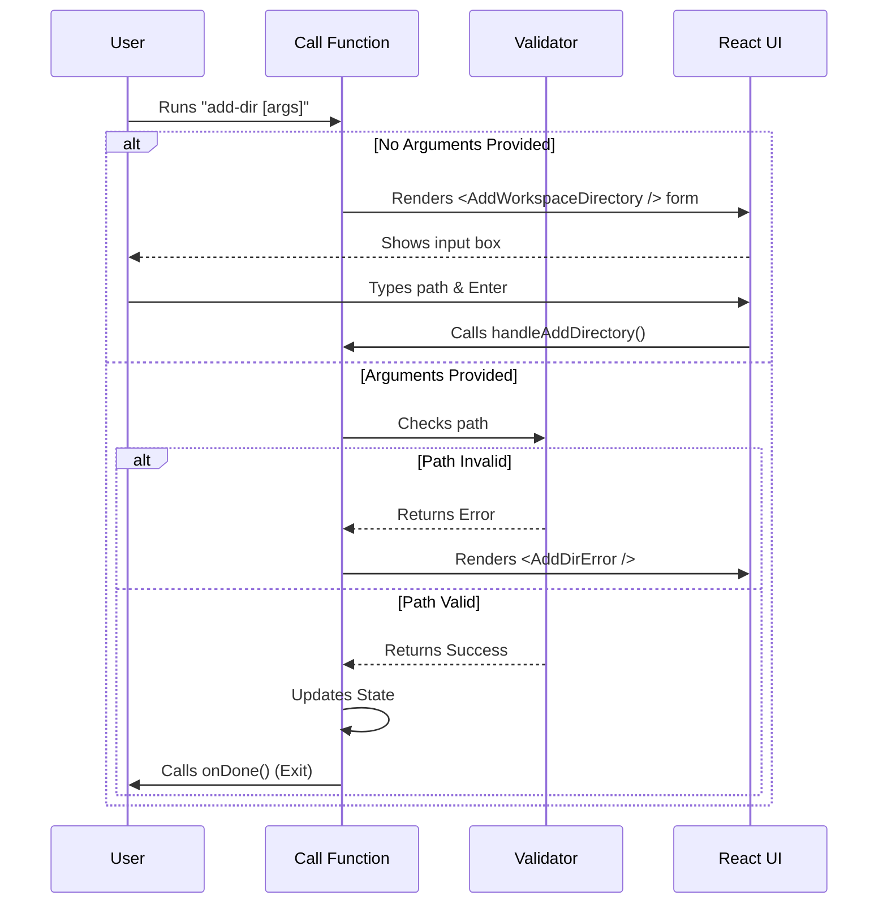

# Chapter 2: Interactive Command UI

Welcome back! In [Chapter 1: Command Definition](01_command_definition.md), we wrote the "Menu" entry for our command. The CLI knows `add-dir` exists.

Now, we need to decide what happens when the customer actually *orders* that item.

## Motivation: The "Waiter"

If Chapter 1 was the **Menu**, Chapter 2 is the **Waiter**.

When a user runs a command, two things can happen:
1.  **The "Fast Lane":** They know exactly what they want: `add-dir ./src`. The waiter takes the order and runs to the kitchen immediately.
2.  **The "Conversation":** They just say `add-dir`. The waiter has to ask: "Which directory would you like to add?"

The **Interactive Command UI** is the code responsible for having this conversation. It acts as a **Controller**: it looks at the user's input, decides which screen to show, and handles the flow until the job is done.

### The Use Case

We want to support two specific user behaviors with a single file:

1.  **Interactive Mode:**
    ```bash
    my-cli add-dir
    # Output: A visual form asks "Enter directory path:"
    ```
2.  **Direct Mode:**
    ```bash
    my-cli add-dir ./src
    # Output: Validates ./src and adds it immediately.
    ```

## Concept: The `call` Function

In our architecture, every command exports a specific function named `call`. This is the entry point. It receives the user's input and returns what should be displayed on the screen.

Since we are using **React (Ink)**, we don't just print text strings; we return **UI Components**.

### 1. The Entry Point

Let's look at the basic structure of our controller file (`add-dir.tsx`).

```typescript
// --- File: add-dir.tsx ---

export async function call(
  onDone: LocalJSXCommandOnDone, // Function to call when we finish
  context: LocalJSXCommandContext, // The app's memory (state)
  args?: string // What the user typed (e.g., "./src")
): Promise<React.ReactNode> {
  
  // 1. Clean up the input
  const directoryPath = (args ?? '').trim();
  
  // ... logic continues below
}
```

**Explanation:**
*   **args**: This contains the text typed after the command name. If the user typed `add-dir ./src`, then `args` is `"./src"`.
*   **onDone**: Think of this as the "Exit Button." When our command finishes successfully (or gets cancelled), we call this function to tell the CLI we are finished.

### 2. The Fork in the Road

The most important job of the UI Controller is to direct traffic.

```typescript
  // Inside the call() function...

  // Scenario 1: The user did NOT provide a path
  if (!directoryPath) {
    // Return a Visual Component (The Form)
    return <AddWorkspaceDirectory 
      permissionContext={appState.toolPermissionContext}
      onAddDirectory={handleAddDirectory} 
      onCancel={() => onDone('Cancelled')} 
    />;
  }

  // Scenario 2: The user DID provide a path
  // ... (Validation logic goes here)
```

**Explanation:**
*   If `directoryPath` is empty, we return a React component called `<AddWorkspaceDirectory />`.
*   This renders an interactive text input in the terminal.
*   We pass it a "callback" (`onAddDirectory`) so the form knows what to do when the user hits Enter.

### 3. Visual Feedback (The "Fast Lane")

If the user *did* provide a path (Scenario 2), we shouldn't show a form. We should try to add it immediately. But what if they made a mistake?

```typescript
  // Scenario 2 continued...
  
  // Validate the path (We cover this in Chapter 3)
  const result = await validateDirectoryForWorkspace(directoryPath, ...);

  // If there is an error, Render the Error UI
  if (result.resultType !== 'success') {
    return <AddDirError 
      message={result.message} 
      args={args ?? ''} 
      onDone={() => onDone(result.message)} 
    />;
  }

  // If success, we add the directory (Logic hidden for brevity)
```

**Explanation:**
*   Instead of `console.error`, we return a custom component `<AddDirError />`.
*   This ensures errors look consistent and pretty (e.g., red text, nice icons) across the entire application.

## Under the Hood: The Flow

How does the CLI switch between these modes? Let's visualize the decision process.



## Internal Implementation Details

Let's look closely at how the logic inside `add-dir.tsx` connects the visuals to the logic.

### 1. Handling the "Success" Action

We need a helper function to actually perform the work. This function is shared by both the "Interactive Form" and the "Direct Argument" flows.

```typescript
  // The shared logic for adding a directory
  const handleAddDirectory = async (path: string, remember = false) => {
    
    // 1. Create the update object
    const permissionUpdate = {
      type: 'addDirectories',
      directories: [path],
      destination: remember ? 'localSettings' : 'session'
    };

    // 2. Update the Application State
    // (We will cover state specifically in Chapter 4)
    applyPermissionUpdate(..., permissionUpdate);

    // 3. Tell the CLI we are finished
    onDone(`Added ${path} as a working directory.`);
  };
```

**Explanation:**
*   This function is the "Engine" behind the UI.
*   Whether the path came from the typed argument OR the interactive form, they both end up calling this function.
*   It prepares the data and calls `onDone` to print the success message and exit.

### 2. The Error Component

Why do we need a special component just for errors? In React (Ink), if you unmount a component too fast, sometimes the text disappears.

```typescript
function AddDirError({ message, onDone }) {
  // Use a timeout to ensure the error renders before we exit
  useEffect(() => {
    const timer = setTimeout(onDone, 0);
    return () => clearTimeout(timer);
  }, [onDone]);

  return (
    <Box flexDirection="column">
      <Text color="red">Error: {message}</Text>
    </Box>
  );
}
```

**Explanation:**
*   **useEffect**: This is a React hook. It runs after the component appears on screen.
*   **setTimeout(onDone, 0)**: This is a tiny hack. It waits for *one frame* of rendering to finish before telling the CLI "Okay, we are done now." This ensures the user actually sees the error message.

## Conclusion

In this chapter, we built the **Interactive Command UI**. We learned:

1.  How the `call` function acts as a **Controller** for the command.
2.  How to branch logic based on user input (Interactive Form vs. Direct Argument).
3.  How to return **React Components** (like `<AddWorkspaceDirectory>` or `<AddDirError>`) to render the interface.

However, simply asking for a directory isn't enough. What if the user types a path that doesn't exist? What if they try to add a system folder they shouldn't access?

We need to check the input before we accept it.

[Next Chapter: Directory Validation](03_directory_validation.md)

---

Generated by [Code IQ](https://github.com/adityasoni99/Code-IQ)