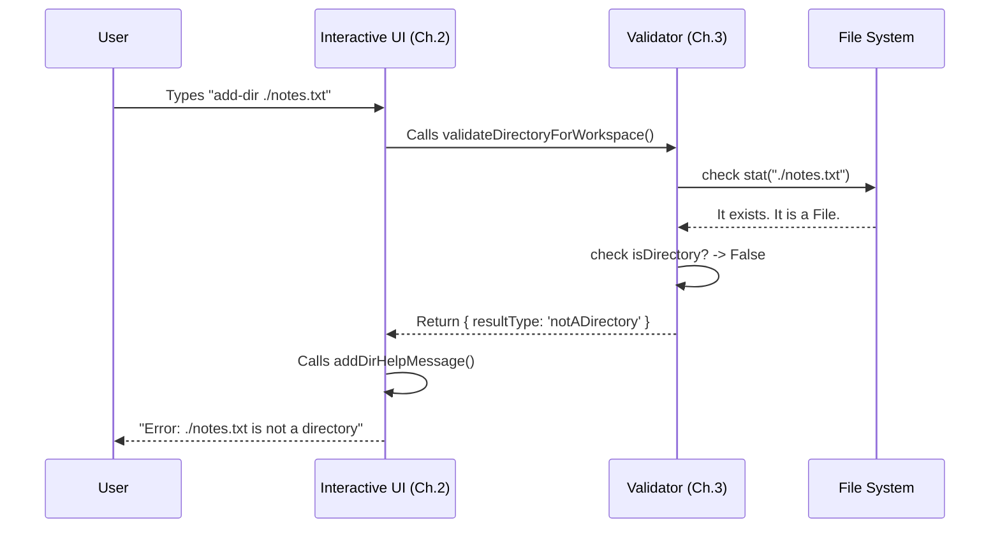

# Chapter 3: Directory Validation

Welcome back! In [Chapter 2: Interactive Command UI](02_interactive_command_ui.md), we built the interface that accepts user input.

However, right now, our "Waiter" (the UI) is very gullible. If the user orders a dish that doesn't exist (like `add-dir ./ghost-folder`) or tries to order a fork instead of food (adding a file instead of a directory), our code crashes or behaves unexpectedly.

We need a **Gatekeeper**.

## Motivation: The "Club Bouncer"

Imagine a nightclub. Before you can enter, a bouncer checks your ID.
1.  **Identity Check:** Are you a real person? (Does the path exist?)
2.  **Age Check:** Are you old enough? (Is it a directory, not a file?)
3.  **Membership Check:** Are you already inside? (Is this path already in the workspace?)

**Directory Validation** is that bouncer. It ensures that only valid, useful data enters our system.

### The Use Case

We want to handle this scenario safely:

```bash
my-cli add-dir ./my-file.txt
```

**Desired Outcome:**
Instead of crashing, the system should gently reply: *"./my-file.txt is not a directory. Did you mean to add the parent directory?"*

## Concept: The "Report Card" (Result Types)

In programming, a simple `true` or `false` is often not enough. If validation fails, we need to know *why* so we can tell the user.

We use a pattern called a **Discriminated Union**. Think of it as a "Report Card" that always has a `resultType`.

```typescript
// The possible outcomes of our validation
export type AddDirectoryResult =
  | { resultType: 'success'; absolutePath: string }
  | { resultType: 'pathNotFound'; absolutePath: string }
  | { resultType: 'notADirectory'; absolutePath: string }
  | { resultType: 'alreadyInWorkingDirectory'; workingDir: string };
```

**Explanation:**
*   **success**: The path is good! We also return the cleaned-up `absolutePath`.
*   **pathNotFound**: The folder doesn't exist on the computer.
*   **notADirectory**: The path exists, but it's a file.
*   **alreadyInWorkingDirectory**: You already have permission for this folder (or its parent).

## Step-by-Step Implementation

We will write a function called `validateDirectoryForWorkspace`. It takes the raw input string and runs it through our "Bouncer" checks.

### Step 1: Cleaning the Input

First, we need to convert the user's text (which might include `~` or `..`) into a real system path.

```typescript
// Inside validation.ts

import { resolve } from 'path';
import { expandPath } from '../../utils/path.js';

// Convert "~/docs" -> "/Users/alice/docs"
const absolutePath = resolve(expandPath(directoryPath));
```

**Explanation:**
*   `expandPath`: Handles shortcuts like `~` (Home directory).
*   `resolve`: Turns relative paths (`./src`) into full absolute paths (`/project/src`).

### Step 2: The Filesystem Check

Now we ask the operating system: "What is this thing?"

```typescript
import { stat } from 'fs/promises';

try {
  const stats = await stat(absolutePath); // Ask OS for info
  
  if (!stats.isDirectory()) {
    // It exists, but it is NOT a directory
    return { resultType: 'notADirectory', absolutePath, directoryPath };
  }
} catch (error) {
  // If stat throws an error, the path likely doesn't exist
  return { resultType: 'pathNotFound', absolutePath, directoryPath };
}
```

**Explanation:**
*   `stat`: A Node.js function that gets file details.
*   `isDirectory()`: Returns true if it's a folder.
*   **try/catch**: If the path doesn't exist, `stat` crashes (throws an error). We catch that crash and return a formatted `pathNotFound` result instead.

### Step 3: The Redundancy Check

This is the smartest part of our Bouncer. If you already have access to `/Projects`, you implicitly have access to `/Projects/Startups`. We shouldn't add the sub-folder again.

```typescript
// Get list of folders we already have
const currentWorkingDirs = allWorkingDirectories(permissionContext);

for (const workingDir of currentWorkingDirs) {
  // Check if our new path is inside an existing one
  if (pathInWorkingPath(absolutePath, workingDir)) {
    return {
      resultType: 'alreadyInWorkingDirectory',
      directoryPath,
      workingDir, // Tell them which parent folder owns it
    };
  }
}
```

**Explanation:**
*   We loop through every directory currently in the workspace.
*   `pathInWorkingPath`: A helper that checks if Child is inside Parent.
*   If found, we reject the request to keep our workspace clean.

### Step 4: Converting Data to Human Text

Finally, the UI needs to print a message. We use a helper function to translate the `resultType` into English.

```typescript
export function addDirHelpMessage(result: AddDirectoryResult): string {
  switch (result.resultType) {
    case 'pathNotFound':
      return `Path ${result.absolutePath} was not found.`;
      
    case 'notADirectory':
      return `${result.directoryPath} is not a directory.`;

    case 'alreadyInWorkingDirectory':
      return `Already accessible via ${result.workingDir}.`;

    case 'success':
      return `Success! Added ${result.absolutePath}.`;
  }
}
```

**Explanation:**
*   This keeps our logic pure. The validation logic doesn't care about colors or text formatting; it just deals with data. This helper handles the "presentation."

## Under the Hood: How it Works

Let's visualize the flow when a user tries to add a file instead of a folder.



## Internal Implementation Details

One tricky part of validation is handling different types of "Missing" errors.

In Node.js, checking a file can fail for multiple reasons:
1.  It's missing (`ENOENT`).
2.  It's a broken link (`ENOTDIR`).
3.  You don't have permission to look at it (`EACCES`).

Our implementation groups these together carefully:

```typescript
// Inside the catch block
const code = getErrnoCode(e);

// We treat permission errors (EACCES) similar to "Not Found".
// This prevents the CLI from crashing just because 
// we touched a system folder.
if (code === 'ENOENT' || code === 'EACCES') {
  return {
    resultType: 'pathNotFound', 
    // ... details
  };
}
throw e; // Unknown error? Re-throw it (Crash safely).
```

This makes the tool feel robust. It doesn't panic; it just informs the user that the path isn't usable.

## Conclusion

In this chapter, we created the **Directory Validation** logic. We learned:
1.  How to use **Discriminated Unions** (`resultType`) to return detailed status reports.
2.  How to check the **Filesystem** using `stat`.
3.  How to prevent **Redundancy** by checking if a path is already inside the workspace.

Now we have a valid path! The Bouncer has let the user in. The next step is to actually store this permission in the application's memory so other tools can use it.

[Next Chapter: State & Permission Management](04_state___permission_management.md)

---

Generated by [Code IQ](https://github.com/adityasoni99/Code-IQ)