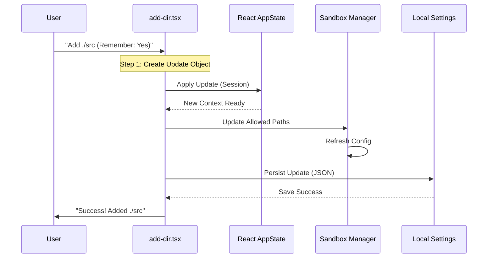

# Chapter 4: State & Permission Management

Welcome back! In [Chapter 3: Directory Validation](03_directory_validation.md), we acted as the "Bouncer." We checked the user's ID and confirmed that the directory `./src` is valid and safe to add.

But simply knowing the directory is valid doesn't actually **give** the user access to it.

## Motivation: Issuing the Key Card

Imagine a new employee joins your company. They pass the interview (Validation), but on their first day, they can't open the front door. Why? Because nobody entered their details into the security system to activate their badge.

**State & Permission Management** is the process of issuing that active key card.

### The Use Case

We want to achieve two levels of memory:

1.  **Session Memory:** "I can use this folder right now."
2.  **Persisted Memory:** "If I restart the CLI tomorrow, I can still use this folder."

In this chapter, we will write the code that updates the application's brain to say: *"Yes, the user is allowed to touch `./src`."*

## Concept: The Permission Update

In complex applications, we don't just randomly change variables. We create a formal "Instruction" describing what we want to change.

We call this a **Permission Update**.

### Step 1: Drafting the Instruction

Inside our command logic (`add-dir.tsx`), we first define *what* we want to do.

```typescript
// Inside handleAddDirectory function...

// 1. Decide where to save it (RAM or Disk?)
const destination = remember ? 'localSettings' : 'session';

// 2. Create the instruction object
const permissionUpdate = {
  type: 'addDirectories', // The Action
  directories: [path],    // The Data
  destination             // The Scope
};
```

**Explanation:**
*   **type**: Tells the system we are *adding* directories (not removing them).
*   **directories**: The path we validated in the previous chapter.
*   **destination**: If `remember` is true, we save to the hard drive (`localSettings`). Otherwise, it's just for now (`session`).

## Updating the Systems

Once we have our instruction object, we need to send it to three different systems.

### System 1: The React State (The UI)

The "Context" is the application's short-term memory. Updating this ensures the UI knows about the new directory immediately.

```typescript
// Get the current memory
const latestAppState = context.getAppState();

// Calculate the new state
const updatedContext = applyPermissionUpdate(
  latestAppState.toolPermissionContext,
  permissionUpdate
);

// Save it back to React
context.setAppState(prev => ({
  ...prev,
  toolPermissionContext: updatedContext
}));
```

**Explanation:**
*   `context.getAppState()`: "What do we know right now?"
*   `applyPermissionUpdate`: A helper that takes the *Old State* + *New Instruction* and returns the *New State*.
*   `setAppState`: Tells React to update.

### System 2: The Sandbox (The Enforcer)

This is a critical step often missed by beginners. Even if the React UI knows about the folder, the underlying Shell (Bash/Zsh) running the commands might not!

We need to tell the **Sandbox** to punch a hole in its security wall for this specific path.

```typescript
import { SandboxManager } from '../../utils/sandbox/sandbox-adapter.js';

// ... inside handleAddDirectory

// Update the list of allowed paths
if (!currentDirs.includes(path)) {
   setAdditionalDirectoriesForClaudeMd([...currentDirs, path]);
}

// FORCE the sandbox to reload its configuration
SandboxManager.refreshConfig();
```

**Explanation:**
*   **SandboxManager**: The bodyguard that stops tools from deleting your whole hard drive.
*   **refreshConfig()**: "Hey Bodyguard, check your list again. This path is now safe."

### System 3: Persistence (Long-Term Memory)

Finally, if the user asked us to "remember" this directory, we save it to a settings file.

```typescript
import { persistPermissionUpdate } from '../../utils/permissions/PermissionUpdate.js';

if (remember) {
  try {
    // Write to the settings file on disk
    persistPermissionUpdate(permissionUpdate);
    
    message = `Added ${path} and saved to settings`;
  } catch (error) {
    // Ideally, we handle errors gracefully (See Chapter 5)
    message = `Failed to save settings: ${error.message}`;
  }
}
```

**Explanation:**
*   `persistPermissionUpdate`: Handles the messy work of reading a JSON file, adding the path, and writing it back to disk.

## Under the Hood: The Flow

Let's visualize how a single button press triggers updates across the entire system.



## Internal Implementation Details

Let's look at how we combine all these steps into the `handleAddDirectory` helper function within `add-dir.tsx`.

This function serves as the **Transaction Manager**. It ensures all systems stay in sync.

```typescript
// --- File: add-dir.tsx ---

const handleAddDirectory = async (path: string, remember = false) => {
  // 1. Prepare the Data
  const destination = remember ? 'localSettings' : 'session';
  const permissionUpdate = { 
    type: 'addDirectories' as const, 
    directories: [path], 
    destination 
  };

  // 2. Update React State (UI)
  const newState = applyPermissionUpdate(
    context.getAppState().toolPermissionContext, 
    permissionUpdate
  );
  context.setAppState(p => ({ ...p, toolPermissionContext: newState }));

  // 3. Update Sandbox (Shell Access)
  SandboxManager.refreshConfig();

  // 4. Update Disk (Persistence)
  if (remember) {
     persistPermissionUpdate(permissionUpdate);
  }

  // 5. Finish
  onDone(`Added ${path} successfully.`);
};
```

### Why separating these steps matters

You might ask: *Why not just have one list?*

By separating **UI State** (React) from **Execution State** (Sandbox), the application feels snappy. The UI updates instantly, while the Sandbox might take a few milliseconds to reconfigure the shell environment.

Also, strictly defining the `permissionUpdate` object (Concept 1) makes our code "Type Safe." TypeScript will yell at us if we try to add a directory but forget to provide the path!

## Conclusion

In this chapter, we learned how to manage **State & Permissions**. We built the logic to:
1.  Create a formal `PermissionUpdate` instruction.
2.  Update the **Session** so the UI reacts instantly.
3.  Update the **Sandbox** so shell commands work.
4.  Update **Local Settings** so the permission survives a restart.

Our command is fully functional now! It works, it's safe, and it remembers.

But... what if the hard drive is full when we try to save? What if the Sandbox crashes? Currently, our error handling is a bit basic. We need a way to tell the user exactly what went wrong without breaking the immersion.

[Next Chapter: Error Feedback System](05_error_feedback_system.md)

---

Generated by [Code IQ](https://github.com/adityasoni99/Code-IQ)