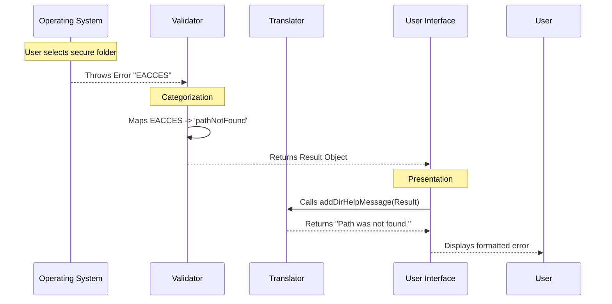

# Chapter 5: Error Feedback System

Welcome to the final chapter! In [Chapter 4: State & Permission Management](04_state___permission_management.md), we successfully updated the application's memory to grant access to directories.

But we left one big question unanswered: **What happens when things go wrong?**

## Motivation: The "Grumpy Robot"

By default, computers are terrible at communicating problems. If a user tries to access a folder they aren't allowed to see, the computer usually spits out something like this:

```text
Error: EACCES: permission denied, stat '/etc/shadow'
    at Object.statSync (fs.js:1086:3)
    at ...
```

This is the "Grumpy Robot" response. It scares beginners and frustrates experts.

The **Error Feedback System** is designed to act as a translator. It catches these scary technical codes and turns them into helpful advice.

### The Use Case

Imagine the user makes a typo or tries to add a file instead of a folder:

```bash
my-cli add-dir ./my-photo.png
```

**Our Goal:**
Instead of crashing with a stack trace, we want to display:
> **./my-photo.png is not a directory. Did you mean to add the parent directory?**

In this chapter, we will build the logic to catch these errors and format them beautifully.

## Concept: Error Grouping

Operating systems have hundreds of different error codes (`ENOENT`, `ENOTDIR`, `EPERM`, etc.).

We don't want to write a unique error message for every single one. Instead, we group them into **Logical Categories**.

1.  **"I can't see it"**: The file is missing (`ENOENT`) OR I'm not allowed to look at it (`EACCES`).
2.  **"Wrong Type"**: I see it, but it's a file, not a folder (`ENOTDIR`).
3.  **"Unknown"**: Something weird happened (Crash).

## Step-by-Step Implementation

We handle errors in two places: the **Validator** (logic) and the **UI** (presentation).

### Step 1: Catching the Crash

In [Chapter 3: Directory Validation](03_directory_validation.md), we used `stat()` to check a file. If `stat()` fails, it throws an error. We need to catch that error immediately.

```typescript
// --- File: validation.ts ---
import { getErrnoCode } from '../../utils/errors.js';

try {
  const stats = await stat(absolutePath);
  // ... check if directory ...
} catch (e: unknown) {
  // 1. Extract the cryptic error code (e.g., "ENOENT")
  const code = getErrnoCode(e);
  
  // Logic continues below...
}
```

**Explanation:**
*   **try/catch**: This prevents the whole CLI from crashing.
*   **getErrnoCode**: A helper that safely pulls the code string (like `'ENOENT'`) out of the error object.

### Step 2: Categorizing the Error

Now that we have the code, we map it to our "Report Card" result types.

```typescript
  // Inside the catch block...
  
  // 2. Check if it's a "Missing" or "Permission" error
  if (
    code === 'ENOENT' || // File not found
    code === 'EACCES'    // Permission denied
  ) {
    // 3. Return a safe failure result
    return {
      resultType: 'pathNotFound',
      directoryPath,
      absolutePath,
    };
  }

  // 4. If it's a weird error we don't know, let it crash.
  throw e;
```

**Explanation:**
*   We treat `EACCES` (Permission Denied) the same as `ENOENT` (Not Found). Why? Because from the user's perspective, the result is the same: the tool cannot use that path.
*   We return an object (`resultType: 'pathNotFound'`) instead of throwing an error. This allows the UI to decide how to show it.

### Step 3: The "Translator" Function

Now we have a clean result object. We need a function to turn that object into human-readable text.

```typescript
// --- File: validation.ts ---
import chalk from 'chalk';

export function addDirHelpMessage(result: AddDirectoryResult): string {
  switch (result.resultType) {
    case 'pathNotFound':
      return `Path ${chalk.bold(result.absolutePath)} was not found.`;
      
    case 'notADirectory':
      // We can be extra helpful here!
      const parent = dirname(result.absolutePath);
      return `${chalk.bold(result.directoryPath)} is not a directory. ` +
             `Did you mean ${chalk.bold(parent)}?`;
             
    // ... handle other cases
  }
}
```

**Explanation:**
*   **Context Awareness**: Notice specifically for `notADirectory`, we calculate the *parent* folder and suggest that instead. This turns an error into a helpful tip.
*   **Chalk**: We use `chalk.bold` to highlight the important parts of the path so the user spots the typo easily.

## Under the Hood: The Flow

How does a raw system error become a helpful message? Let's trace the path of a "Permission Denied" error.



## Internal Implementation Details

### The Error UI Component

In [Chapter 2: Interactive Command UI](02_interactive_command_ui.md), we briefly mentioned `<AddDirError />`. Now let's see why it's special.

React (Ink) renders frames. If we print an error and immediately exit the process, the user might never see the text because the process dies too fast.

```typescript
// --- File: add-dir.tsx ---

function AddDirError({ message, onDone }) {
  // 1. Wait for the UI to paint the error
  useEffect(() => {
    const timer = setTimeout(onDone, 0); // Brief delay
    return () => clearTimeout(timer);
  }, [onDone]);

  // 2. Render the message nicely
  return (
    <Box flexDirection="column">
      <MessageResponse>
        <Text>{message}</Text>
      </MessageResponse>
    </Box>
  );
}
```

**Explanation:**
*   **setTimeout(..., 0)**: This queues the "Exit" command (`onDone`) to run *after* the current render cycle is finished. This guarantees the error text is painted to the terminal before the prompt returns.

### Handling "Save" Failures

Sometimes validation passes, but saving to the hard drive fails (e.g., disk full). We handle this in the main command logic.

```typescript
// --- File: add-dir.tsx ---

try {
  persistPermissionUpdate(permissionUpdate);
  message = `Added ${path} and saved to settings`;
} catch (error) {
  // Graceful degradation
  message = `Added ${path}, but failed to save settings: ${error.message}`;
}
```

**Explanation:**
*   **Graceful Degradation**: If we can't save to the hard drive, we *don't* fail the whole command. We still add the directory for the **current session**, and we just warn the user that it won't be remembered next time. This is a much better user experience than a crash.

## Conclusion

Congratulations! You have completed the `add-dir` project tutorial.

In this final chapter, we built an **Error Feedback System**. We learned:
1.  How to **catch and group** technical error codes (`ENOENT`, `EACCES`) into logical categories.
2.  How to **translate** those categories into helpful, human-readable suggestions.
3.  How to ensure error messages are actually **rendered** before the CLI exits.

### Project Summary

You have built a robust CLI command from scratch:
1.  **[Command Definition](01_command_definition.md)**: You registered the command in the menu.
2.  **[Interactive Command UI](02_interactive_command_ui.md)**: You built a flexible controller for user input.
3.  **[Directory Validation](03_directory_validation.md)**: You built a "Bouncer" to secure the input.
4.  **[State & Permission Management](04_state___permission_management.md)**: You wired up the internal logic to grant access.
5.  **Error Feedback System**: You ensured the user is guided gently when things go wrong.

You now have a fully functional tool that safely manages workspace directories! Happy coding!

---

Generated by [Code IQ](https://github.com/adityasoni99/Code-IQ)