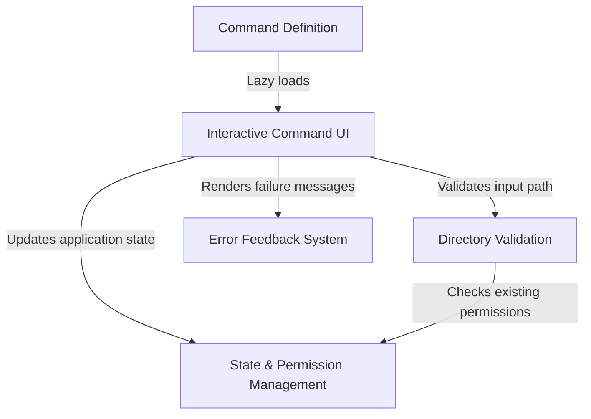

# Tutorial: add-dir

The `add-dir` project implements a CLI command that safely grants the application access to new folders on your computer. It acts as a **security gatekeeper**, validating that the path exists and isn't already accessible, before updating the **internal permission state** to remember the new access rights for current and future sessions.

## Chapters

1. [Command Definition](01_command_definition.md)
2. [Interactive Command UI](02_interactive_command_ui.md)
3. [Directory Validation](03_directory_validation.md)
4. [State & Permission Management](04_state___permission_management.md)
5. [Error Feedback System](05_error_feedback_system.md)

---

Generated by [Code IQ](https://github.com/adityasoni99/Code-IQ)