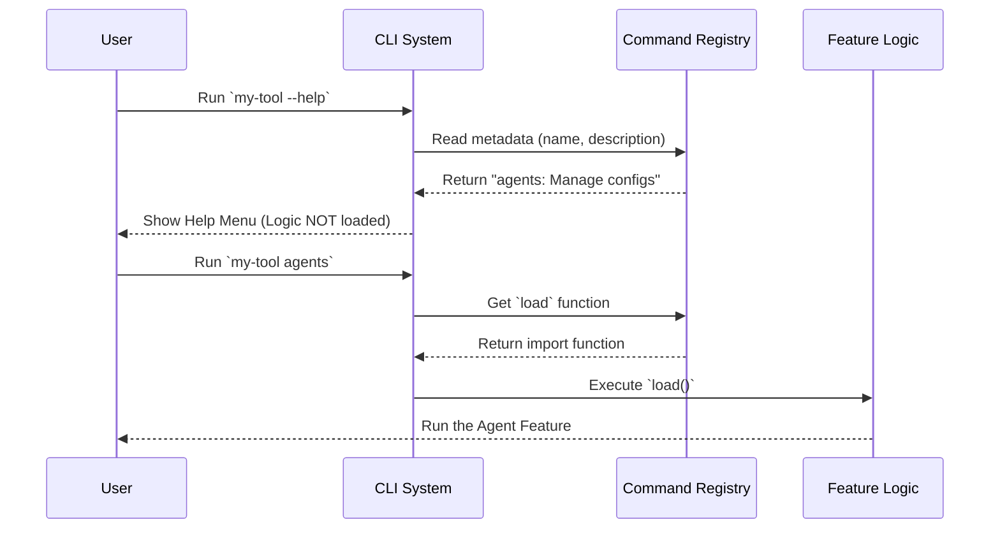

# Chapter 1: Command Registry Definition

Welcome to the **Agents** project tutorial! In this series, we will build a powerful command-line interface (CLI) tool.

Every great journey begins with a single step. In the world of CLI tools, that step is defining the command itself. Before our system can do anything complex, it simply needs to know that a command exists, what it is called, and what it is supposed to do.

## The Problem: The "Restaurant Menu"

Imagine walking into a restaurant. You sit down, but there is no menu. You have no idea what the kitchen can cook, and the waiter doesn't know what to tell the chef to prepare.

In software, your main CLI program is the restaurant. The specific features (like our "agents" tool) are the dishes.

The **Command Registry Definition** is the entry in the menu. It solves a specific problem: **Discoverability**.

It provides the system with three key pieces of information:
1.  **Name:** What does the user type? (e.g., `agents`)
2.  **Description:** What does this do? (e.g., "Manage agent configurations")
3.  **Recipe Location:** Where is the actual code to run this?

## The Use Case

We want to create a new command called `agents`. When a user runs our tool and asks for help (e.g., `my-tool --help`), they should see `agents` listed with a description. When they type `my-tool agents`, the system should know exactly which file to load.

Let's look at how we define this using the **Command Registry**.

## Step-by-Step Implementation

We will define our command in a file called `index.ts`. This file acts as the "front door" for our feature.

### 1. Defining the Metadata

First, we define the basic identity of our command. This is lightweight data that helps the system list the command without doing any heavy lifting yet.

```typescript
// index.ts
import type { Command } from '../../commands.js'

const agents = {
  name: 'agents',
  description: 'Manage agent configurations',
  // ... logic comes next
}
```
**Explanation:**
Here, we give our command a `name` ("agents"). If a user types this name, our code runs. We also provide a `description`. This string appears in the help menu so users know what this command is for.

### 2. The Execution Strategy

Next, we tell the system *how* to run this command.

```typescript
// index.ts (continued)
const agents = {
  // ... previous properties
  type: 'local-jsx',
}
```
**Explanation:**
The `type` property tells the system which "engine" to use. Here we use `'local-jsx'`. This means our command will render a user interface right in the terminal using React-like components. We will cover exactly how this engine works in [Chapter 3: Local JSX Execution Handler](03_local_jsx_execution_handler.md).

### 3. The Entry Point (The "Recipe Card")

Finally, we tell the system where to find the actual logic (the code that does the work).

```typescript
// index.ts (continued)
const agents = {
  // ... previous properties
  load: () => import('./agents.js'),
} satisfies Command

export default agents
```
**Explanation:**
The `load` function is crucial. Notice we are using `import()`. This points to a file named `./agents.js` which contains the heavy code.

By wrapping the import in a function `() => ...`, we ensure the heavy code isn't loaded until the user actually asks for it. This concept is so important it has its own chapter: [Chapter 2: Lazy Module Loading](02_lazy_module_loading.md).

## Putting It All Together

Here is the complete Command Registry Definition. It’s short, simple, and tells the system everything it needs to know to list the command on the "menu".

```typescript
import type { Command } from '../../commands.js'

const agents = {
  type: 'local-jsx',
  name: 'agents',
  description: 'Manage agent configurations',
  load: () => import('./agents.js'),
} satisfies Command

export default agents
```

## Under the Hood: How it Works

What happens when the user runs the program? Let's visualize the flow. The system reads this registry definition *before* doing anything else.



### The Flow Explained

1.  **Registration:** When the CLI starts up, it looks at our `index.ts`. It reads the `name` and `description` to build its internal list of available commands.
2.  **Waiting:** At this point, the actual code for the agents feature (`./agents.js`) is **not** loaded. This keeps the application start-up time very fast.
3.  **Action:** Only when the user types `agents` does the system look at the `load` property and execute that import function.

## Conclusion

Congratulations! You've created the entry point for your new feature. You've learned that the **Command Registry Definition** acts like a menu entry:

*   It gives the command a **Name**.
*   It describes what it does (**Description**).
*   It tells the kitchen where to find the recipe (**Load**).

But wait—how exactly does that `load` function work, and why did we wrap it inside a function? To keep our application fast and responsive, we use a technique called Lazy Loading.

Let's dive into that in the next chapter.

[Next Chapter: Lazy Module Loading](02_lazy_module_loading.md)

---

Generated by [Code IQ](https://github.com/adityasoni99/Code-IQ)