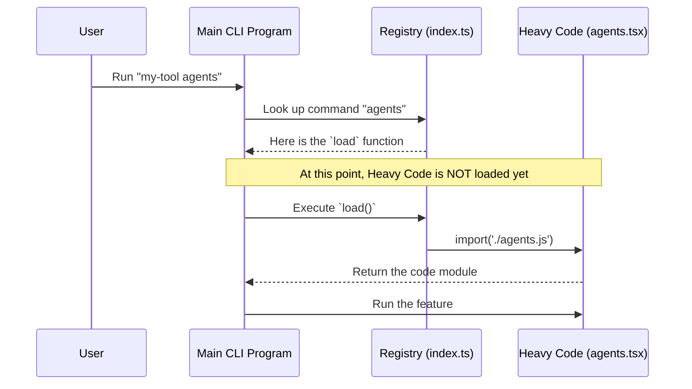

# Chapter 2: Lazy Module Loading

Welcome back! In the previous chapter, [Chapter 1: Command Registry Definition](01_command_registry_definition.md), we created the "menu entry" for our new command. We gave it a name (`agents`) and a description.

Now, we need to talk about efficiency.

Imagine you are going for a hike in the middle of summer. Would you pack a heavy winter coat, snow boots, and a scarf in your backpack?

No! You would leave them in the attic. You only go get them when it starts snowing.

This is exactly what **Lazy Module Loading** does for your code.

## The Problem: The Heavy Backpack

In a large CLI tool, you might have 50 different commands. Some handle database migrations, some generate images, and some (like ours) manage agents.

If we loaded the code for **all 50 commands** every time you ran the tool, the application would take several seconds just to start up. That is the software equivalent of carrying a winter coat in July—it slows you down for no reason.

## The Solution: Fetch It When You Need It

**Lazy Module Loading** ensures that we only "fetch the coat" (load the code) when the user specifically asks for it.

If the user runs `my-tool --help`, we don't load the `agents` code.
If the user runs `my-tool database`, we don't load the `agents` code.
Only when the user runs `my-tool agents` do we go to the "attic" and get the file.

## How to Implement Lazy Loading

We implement this inside our registry file (`index.ts`) using a special JavaScript feature called **Dynamic Imports**.

Let's look at how we write the code.

### 1. The Heavy File
First, imagine we have our "heavy" file. This is the code that takes time to load.

```typescript
// agents.tsx (The Heavy File)
console.log("I am being loaded! This takes memory.");

export default function runAgents() {
  console.log("Running the agents logic...");
}
```
*Explanation:* This file represents the "winter coat." We want to avoid touching this file until absolutely necessary.

### 2. The Lazy Trigger
Now, back in our registry definition, we define the trigger.

```typescript
// index.ts
const agents = {
  name: 'agents',
  // ... other properties
  
  // The Magic Line:
  load: () => import('./agents.js'),
}
```
*Explanation:* 
*   `import(...)` is a function that returns a Promise. It tells the system: "Go find this file and load it now."
*   **Crucially**, we wrap it in an arrow function `() => ...`.
*   This means the import **does not happen yet**. It only happens when someone actually calls `load()`.

## Under the Hood: The Flow

What happens inside the computer when we use this pattern? Let's trace the steps.

1.  **Start Up:** The CLI starts. It sees your `index.ts`. It reads the `name`, but it **ignores** the file inside the `load` function.
2.  **User Input:** The user types `agents`.
3.  **Trigger:** The CLI calls your `load()` function.
4.  **Fetching:** The JavaScript engine pauses briefly to read `./agents.js` from the hard drive.
5.  **Execution:** The heavy code is now available to run.

### Visualizing the Process



## Internal Implementation: How the CLI Uses It

To understand this better, let's pretend we are writing the main CLI engine that consumes your command.

Here is a simplified version of what the core system does when a user types a command.

### Finding the Command
First, the system looks at the registry to find a match.

```typescript
// core-system.ts (Simplified)
import agentCommand from './commands/agents/index.js';

// User typed 'agents'
const userCommand = 'agents';

if (agentCommand.name === userCommand) {
  executeCommand(agentCommand);
}
```
*Explanation:* At this stage, `agentCommand` is just the lightweight metadata (name, description). The heavy code is still safe in the attic.

### Triggering the Load
Once the match is found, the system executes the load function.

```typescript
// core-system.ts (continued)
async function executeCommand(cmd) {
  console.log("Loading module...");
  
  // This is where the magic happens!
  // We call the function you wrote: () => import(...)
  const module = await cmd.load();
  
  console.log("Module loaded. Running logic.");
}
```
*Explanation:*
1.  We use `await cmd.load()`.
2.  This triggers the `import('./agents.js')` inside your `index.ts`.
3.  The variable `module` now holds the actual contents of the heavy file.

## Why This Matters for the Agents Project

In the **Agents** project, our main feature file (`agents.tsx`) will eventually contain complex logic, including:
1.  React-like UI components.
2.  State management logic.
3.  Configuration parsers.

If we didn't use Lazy Module Loading, every time you just wanted to check the version of the CLI (`--version`), you would have to wait for all that UI logic to load into memory.

## Conclusion

You have successfully learned the "Winter Coat" pattern!

*   **Lazy Module Loading** keeps your application fast.
*   We use `() => import('./file')` to defer loading.
*   The code is only loaded when the user runs the specific command.

Now that we have loaded the code, what format is that code in? In our project, we are using a special engine that lets us write terminal interfaces using **JSX** (similar to React).

It's time to see how the code actually renders to the screen.

[Next Chapter: Local JSX Execution Handler](03_local_jsx_execution_handler.md)

---

Generated by [Code IQ](https://github.com/adityasoni99/Code-IQ)