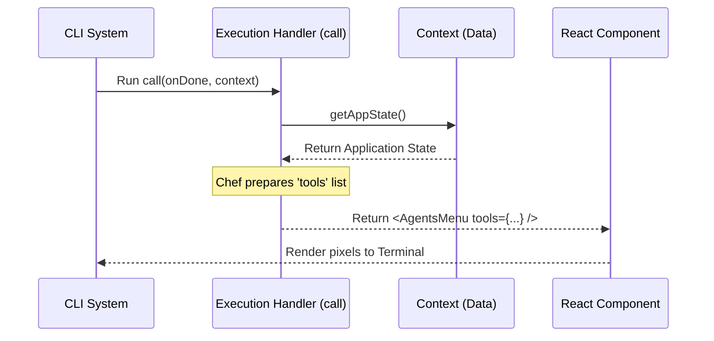

# Chapter 3: Local JSX Execution Handler

Welcome to Chapter 3!

In the previous chapter, [Chapter 2: Lazy Module Loading](02_lazy_module_loading.md), we learned how to be efficient. We taught our CLI to keep the "heavy winter coat" (the code) in the attic until the user actually asks for it.

Now, imagine the user *has* asked for the command. We have fetched the file. But a file is just a list of instructions. Someone needs to actually read those instructions and start working.

That "Someone" is the **Local JSX Execution Handler**.

## The Problem: Who runs the kitchen?

Think of your command file (`agents.tsx`) as a **recipe**.
Think of the CLI System as the **Restaurant Manager**.

The Manager (CLI) has handed the Recipe (File) to the kitchen. But a recipe cannot cook itself. You need a **Head Chef** to:
1.  Read the recipe.
2.  Gather the ingredients from the pantry.
3.  Cook the specific dish.
4.  Plate it and hand it to the waiter.

In our project, the **Local JSX Execution Handler** is that Head Chef.

## The Solution: The `call` Function

In every command file we write, we must export a specific function named `call`. This function is the entry point—the moment the command actually starts running.

Its job is simple but critical: **Receive Context (Ingredients) -> Return UI (The Dish).**

## Implementing the Chef

Let's look at the file `agents.tsx`. This is the file we "lazy loaded" in the last chapter.

### 1. The Setup (Imports)
First, the chef needs to know what tools are available in the kitchen.

```typescript
// agents.tsx
import * as React from 'react';
// We import the UI component (The Dish)
import { AgentsMenu } from '../../components/agents/AgentsMenu.js';
// We import helpers to get ingredients
import { getTools } from '../../tools.js';
```
*Explanation:* We import React (to build the UI), the specific menu component we want to show (`AgentsMenu`), and a helper to get tools.

### 2. The Chef's Signature
Now we define the Head Chef function. In our code, this is named `call`.

```typescript
// agents.tsx
export async function call(onDone, context) {
  // Logic goes here...
}
```
*Explanation:*
*   `export`: Makes this function available to the CLI system.
*   `async`: Tells the system "I might need a moment to fetch data, please wait."
*   `onDone`: A special button we give the UI to say "I'm finished, close the app."
*   `context`: The "Pantry." It contains all the data about the app (permissions, state, etc.).

### 3. Gathering Ingredients (The Logic)
Before we can serve the food, we need to prep the ingredients.

```typescript
// Inside the call function...
  const appState = context.getAppState();
  
  // We need to know what tools (functions) we are allowed to use
  const permissionContext = appState.toolPermissionContext;
  
  // Fetch the actual list of tools based on permissions
  const tools = getTools(permissionContext);
```
*Explanation:*
1.  We open the `context` (Pantry) to get the current state of the application.
2.  We look at permissions (safety checks).
3.  We run `getTools` to prepare the list of actions the agent can perform.

### 4. Plating the Dish (The Return)
Finally, the chef serves the result. In our case, the result is a **React Component**.

```typescript
// Inside the call function...
  return (
    <AgentsMenu 
      tools={tools} 
      onExit={onDone} 
    />
  );
```
*Explanation:*
*   We return `<AgentsMenu />`. This is JSX (JavaSript XML).
*   We pass the `tools` we just gathered as a "prop" (property).
*   We pass `onDone` so the menu knows how to close itself when the user selects "Exit."

## Putting It All Together

Here is the complete code for our handler. It is short, clean, and does exactly one job: **Coordination**.

```typescript
// agents.tsx
export async function call(onDone, context) {
  const appState = context.getAppState();
  const tools = getTools(appState.toolPermissionContext);

  // Serve the UI
  return <AgentsMenu tools={tools} onExit={onDone} />;
}
```

## Under the Hood: The Sequence

What happens in the split second when you run the command?

1.  **System** calls the `load()` function (from Chapter 2).
2.  **System** finds the `call` export in the loaded file.
3.  **System** executes `call()`, passing in the global `context`.
4.  **Handler** (The Chef) grabs data from context.
5.  **Handler** returns the `<AgentsMenu />`.
6.  **System** renders that component to your terminal screen.



## Why is this abstraction useful?

You might ask: *"Why didn't we just put all this logic in the Registry file from Chapter 1?"*

Separation of concerns!

1.  **Registry (Chapter 1):** Defines *what* exists.
2.  **Lazy Loader (Chapter 2):** Defines *when* to load it.
3.  **Execution Handler (Chapter 3):** Defines *how* to prepare data.
4.  **React Component (Chapter 5):** Defines *how* it looks.

This handler allows us to do complex data fetching (like checking database connections or API keys) *before* we ever show a pixel on the screen.

## Conclusion

You have successfully implemented the "Head Chef" logic!

You learned that the **Local JSX Execution Handler**:
*   Is a function named `call`.
*   Receives `context` (the pantry) and `onDone` (the exit strategy).
*   Prepares data (ingredients).
*   Returns a React Element (the dish).

However, we glazed over a very important part. We kept saying "Context is the Pantry" and "get ingredients from Context." But what exactly *is* inside that Context, and how does it get there?

To understand how our Chef gets the ingredients, we need to explore **Context-Aware State Injection**.

[Next Chapter: Context-Aware State Injection](04_context_aware_state_injection.md)

---

Generated by [Code IQ](https://github.com/adityasoni99/Code-IQ)