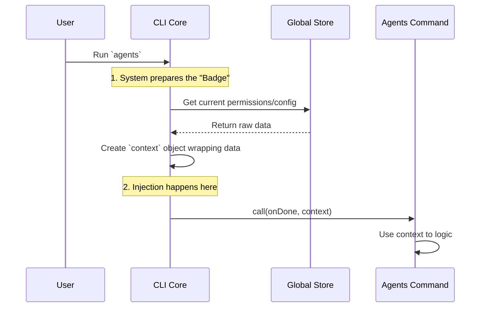

# Chapter 4: Context-Aware State Injection

Welcome to Chapter 4!

In the previous chapter, [Chapter 3: Local JSX Execution Handler](03_local_jsx_execution_handler.md), we met the "Head Chef" (the `call` function). We learned that this chef is responsible for cooking our application's logic.

But there was a small mystery we left unsolved. We saw the chef reach into a "Pantry" to get ingredients like permissions and tools. We called this pantry `context`.

In this chapter, we are going to look inside that pantry. We will learn about **Context-Aware State Injection**—the mechanism that securely gives your command exactly what it needs to survive, without giving it too much.

## The Problem: The "Keys to the Building"

Imagine you are running a very secure office building (your Application). You hire a new specialized contractor (your Command) to fix the plumbing in the basement.

You have two bad options:
1.  **Give them nothing:** They can't get into the basement to do their job.
2.  **Give them the Master Key:** They can fix the basement, but they can also open the CEO's office, the safe, and the server room. This is dangerous!

In software, this is the problem of **Global State**. If every command has full access to every variable in the entire application, it becomes a mess. It's hard to test, and it's easy to break things.

## The Solution: The "ID Badge"

**Context-Aware State Injection** is like creating a temporary ID Badge for that specific contractor.

When the system runs your command, it creates a specific `context` object. This object acts like an ID Badge or a specific keyring. It allows the command to:
1.  **Read State:** "Am I allowed to use the internet?" (Permissions)
2.  **Access Config:** "What acts as the database today?"
3.  **Remain Independent:** The command doesn't need to know *how* the building works; it just checks its badge.

## The Use Case

In our `agents` command, we need to display a list of tools (like "Calculator" or "WeatherSearch"). However, some users might not have permission to use "WeatherSearch."

Our command needs to ask: *"Based on the current application state, which tools are allowed?"*

It does this via the injected `context`.

## How to Use It

Let's look at our `agents.tsx` file again. We will focus specifically on the second argument of the function.

### 1. Receiving the Badge
The system automatically passes the context as the second argument when it calls your function.

```typescript
// agents.tsx
import type { ToolUseContext } from '../../Tool.js';

// The system injects 'context' here automatically
export async function call(onDone, context: ToolUseContext) {
  console.log("I have received the context badge!");
  // ...
}
```
**Explanation:**
We don't need to create this object. We just define our function to accept it. The type `ToolUseContext` helps our code editor know what methods are available on the badge.

### 2. Reading the State
Now that we have the badge, let's use it to open a door. We want to get the global `appState`.

```typescript
// agents.tsx (inside the function)
export async function call(onDone, context) {
  
  // Method 1: Ask the context for the state
  const appState = context.getAppState();

  console.log("Current state loaded.");
  // ...
}
```
**Explanation:**
`context.getAppState()` is a method on our badge. It creates a bridge to the main application's memory and returns the current snapshot of data.

### 3. Using the State for Logic
Finally, we use that state to make decisions. This is the "Context-Aware" part. The command adapts based on the context it was given.

```typescript
// agents.tsx (inside the function)
  // Extract permissions from the state
  const myPermissions = appState.toolPermissionContext;

  // Pass these permissions to a helper to filter tools
  const allowedTools = getTools(myPermissions);
  
  // Now we have the specific tools for THIS user
```
**Explanation:**
This is the core logic. We didn't hardcode a list of tools. We asked the context for permissions, and generated the list dynamically. If the context changes (e.g., a different user logs in), this code still works perfectly.

## Under the Hood: The Factory

How does the `context` get created? It doesn't appear out of thin air. The main CLI system acts as a **Factory**.

Before the system runs your command, it gathers all the global configurations, wraps them up in a nice package (the Context), and *injects* it into your function.

### The Injection Flow



### Internal Implementation Code

To help you understand, here is a simplified version of what the **CLI Core** code looks like. You don't write this, but it helps to know it exists.

```typescript
// framework/core.ts (Simplified)

// 1. This is the raw global state of the app
const globalState = {
  user: 'Alice',
  toolPermissionContext: ['calculator', 'search']
};

// 2. We create the context wrapper
const context = {
  getAppState: () => globalState
};

// 3. We INJECT it into your command
await agentCommand.call(exitFunction, context);
```
**Explanation:**
1.  The framework holds the real data (`globalState`).
2.  It creates the `context` object which exposes a safe function `getAppState`.
3.  It calls your `agentCommand.call`, passing that object in.

## Why is this "Beginner Friendly"?

It might sound complex, but "Dependency Injection" (the fancy name for this) actually makes your life easier:

1.  **Testing is easy:** You can fake the context. If you want to test what happens when a user has *no* permissions, you just pass a fake context with empty permissions. You don't need to hack the real application.
2.  **Safety:** You can't accidentally break variables you aren't supposed to touch. You only have access to what the `context` gives you.

## Conclusion

You have now mastered **Context-Aware State Injection**.

*   You learned that the **Context** is like an **ID Badge**.
*   It allows your command to access the broader application state securely.
*   You learned how to extract `appState` and permissions inside your `call` function.

Now that our "Head Chef" has the ingredients (Tools) and the recipe (Logic), it's time to actually plate the dish. We need to render the visual interface so the user can see what's happening.

Let's build the User Interface in the final chapter.

[Next Chapter: React Component Integration](05_react_component_integration.md)

---

Generated by [Code IQ](https://github.com/adityasoni99/Code-IQ)