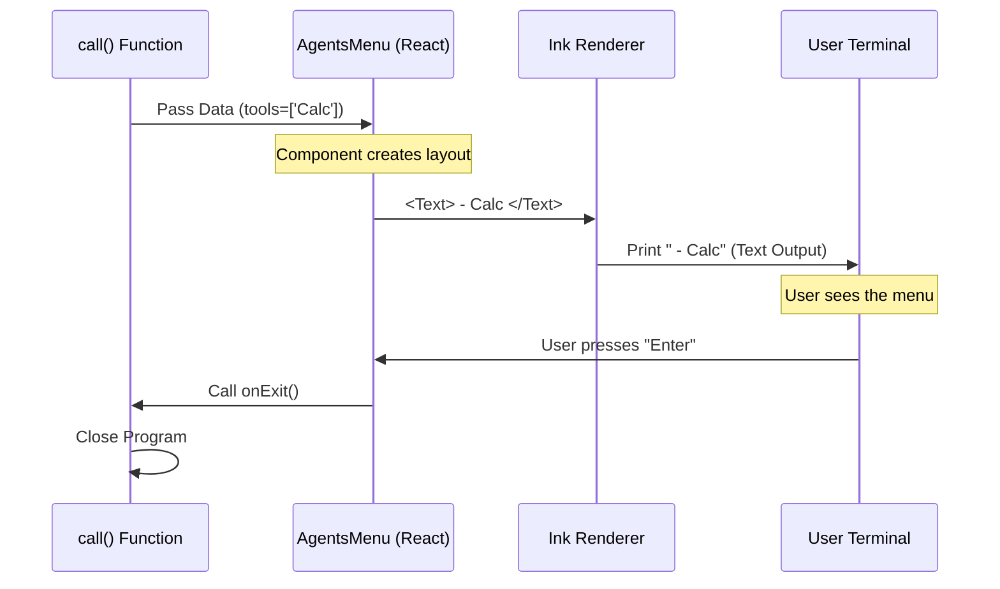

# Chapter 5: React Component Integration

Welcome to the final chapter of our tutorial series!

In the previous chapter, [Chapter 4: Context-Aware State Injection](04_context_aware_state_injection.md), we acted as the "Head Chef." We used our security badge (Context) to enter the pantry and gather the ingredients (Tools) needed for our feature.

But right now, those ingredients are just sitting in a pile in the computer's memory. The user can't see them.

It is time to plate the dish. It is time to build the User Interface (UI).

## The Problem: Screenwriter vs. Set Designer

When building software, it is easy to make a mess by mixing **Logic** (Data) and **Presentation** (Visuals).

Imagine a movie set:
*   **The Screenwriter** (Logic) decides *who* is in the scene and *what* they are saying.
*   **The Set Designer** (Presentation) decides what the furniture looks like, the lighting, and where the actors stand.

If the Screenwriter starts painting the walls, or the Set Designer starts rewriting lines, the movie becomes a disaster.

## The Solution: The React Component

In our project, we keep these roles strictly separate:

1.  **The Logic (Screenwriter):** This is the `call` function in `agents.tsx`. It prepares the data.
2.  **The Presentation (Set Designer):** This is the **React Component** (e.g., `AgentsMenu`). It receives data and draws it to the screen.

**React Component Integration** is simply the handshake between these two.

## The Use Case

We have a list of tools (e.g., "Calculator", "Weather") that we fetched in the last chapter. We want to display them as a selectable menu in the terminal.

If the user presses "Enter" on "Exit", we want the program to close.

## Concept 1: The Handoff (Props)

How does the Screenwriter give instructions to the Set Designer? Through a delivery box called **Props** (Properties).

In our `agents.tsx` file, the `call` function finishes its job by "returning" a React component.

```typescript
// agents.tsx
// 1. We import the visual component
import { AgentsMenu } from '../../components/agents/AgentsMenu.js';

export async function call(onDone, context) {
  // ... (Assume we already fetched 'tools' in the previous chapter)

  // 2. We hand off the data (tools) and the control (onDone)
  return <AgentsMenu tools={tools} onExit={onDone} />;
}
```

**Explanation:**
*   `<AgentsMenu />`: This tells the system "Render the AgentsMenu component."
*   `tools={tools}`: We pass the list of tools inside a prop named `tools`.
*   `onExit={onDone}`: We pass the "Self Destruct Button" (the function that closes the app) inside a prop named `onExit`.

## Concept 2: The Visual Component

Now, let's switch roles. We are now the Set Designer. We are writing `AgentsMenu.tsx`.

We don't care where the tools came from. We don't care about database permissions. We just look inside the "Props Box" and display what we find.

```typescript
// components/agents/AgentsMenu.tsx
import * as React from 'react';
import { Text, Box } from 'ink'; // 'ink' allows React in the terminal

// We define what we expect to receive
export function AgentsMenu({ tools, onExit }) {
  
  return (
    <Box flexDirection="column">
      <Text>Available Tools:</Text>
      
      {/* Loop through tools and show their names */}
      {tools.map(tool => (
        <Text key={tool.name}> - {tool.name}</Text>
      ))}
    </Box>
  );
}
```

**Explanation:**
*   `{ tools, onExit }`: We unpack our props.
*   `<Box>` and `<Text>`: These are special components from a library called **Ink**. They work just like `<div>` and `<span>` in web development, but they render text in the terminal!
*   `tools.map(...)`: We create a line of text for every tool we were given.

## Concept 3: Wiring the "Exit" Button

The most important part of integration is handling user action. When the user interacts with the UI, the UI needs to tell the Logic.

```typescript
// components/agents/AgentsMenu.tsx (Simplified)

export function AgentsMenu({ tools, onExit }) {
  // Imagine a key press handler here...
  
  const handleUserSelection = () => {
    // The user chose 'Exit', so we press the button passed from Logic
    onExit(); 
  };

  return <Text>Press Enter to Exit</Text>;
}
```

**Explanation:**
The `AgentsMenu` component *cannot* close the application itself. It doesn't know how. It simply calls `onExit()`, effectively saying to the Logic: *"Hey, the user is done now. Do whatever you need to do to close up."*

## Under the Hood: Rendering in the Terminal

You might be wondering: *"Wait, React is for websites. How does this work in a black-and-white terminal window?"*

We use a powerful library called **Ink**.

1.  **Logic:** Your code runs.
2.  **React:** Builds a "Virtual DOM" (a map of what the UI should look like).
3.  **Ink:** Translates that map into ANSI text strings (special characters that terminals understand).
4.  **Terminal:** Displays the result.

### The Render Sequence



## Why this Architecture is Great

By separating the **Integration** (`agents.tsx`) from the **Component** (`AgentsMenu.tsx`), we gain superpowers:

1.  **Reusability:** We can use `AgentsMenu` in other parts of the app. We just pass it a different list of tools!
2.  **Simplicity:** The logic file stays small. It just fetches data and passes it on.
3.  **Design Freedom:** We can completely redesign the menu (change colors, layout) without ever touching the complex logic code.

## Series Conclusion

Congratulations! You have completed the **Agents** architecture tutorial.

Let's look back at the journey of a single command:

1.  **[Command Registry Definition](01_command_registry_definition.md):** We added "agents" to the menu so the system knew it existed.
2.  **[Lazy Module Loading](02_lazy_module_loading.md):** We ensured the code only loaded when the user asked for it, keeping startup fast.
3.  **[Local JSX Execution Handler](03_local_jsx_execution_handler.md):** We met the "Head Chef" (`call` function) who coordinates the process.
4.  **[Context-Aware State Injection](04_context_aware_state_injection.md):** We used our ID Badge (Context) to safely get permissions and data.
5.  **[React Component Integration](05_react_component_integration.md):** (This chapter) We handed that data to a visual component to render the final UI.

You now understand the full lifecycle of a modern CLI command. You have moved from a simple text command to a fully interactive, data-driven application.

Happy Coding!

---

Generated by [Code IQ](https://github.com/adityasoni99/Code-IQ)