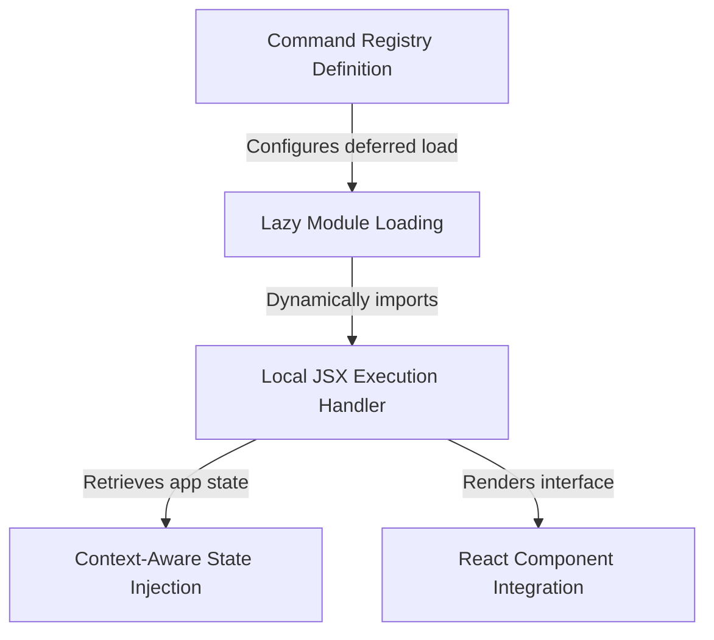

# Tutorial: agents

This project defines a modular **command** feature named "agents" that enables users to manage agent configurations. It utilizes a *lazy loading* strategy to defer code execution until requested, ensuring the application starts quickly. When activated, the system securely retrieves **application state** and permissions to dynamically render a *React user interface* for interaction.

## Chapters

1. [Command Registry Definition](01_command_registry_definition.md)
2. [Lazy Module Loading](02_lazy_module_loading.md)
3. [Local JSX Execution Handler](03_local_jsx_execution_handler.md)
4. [Context-Aware State Injection](04_context_aware_state_injection.md)
5. [React Component Integration](05_react_component_integration.md)

---

Generated by [Code IQ](https://github.com/adityasoni99/Code-IQ)