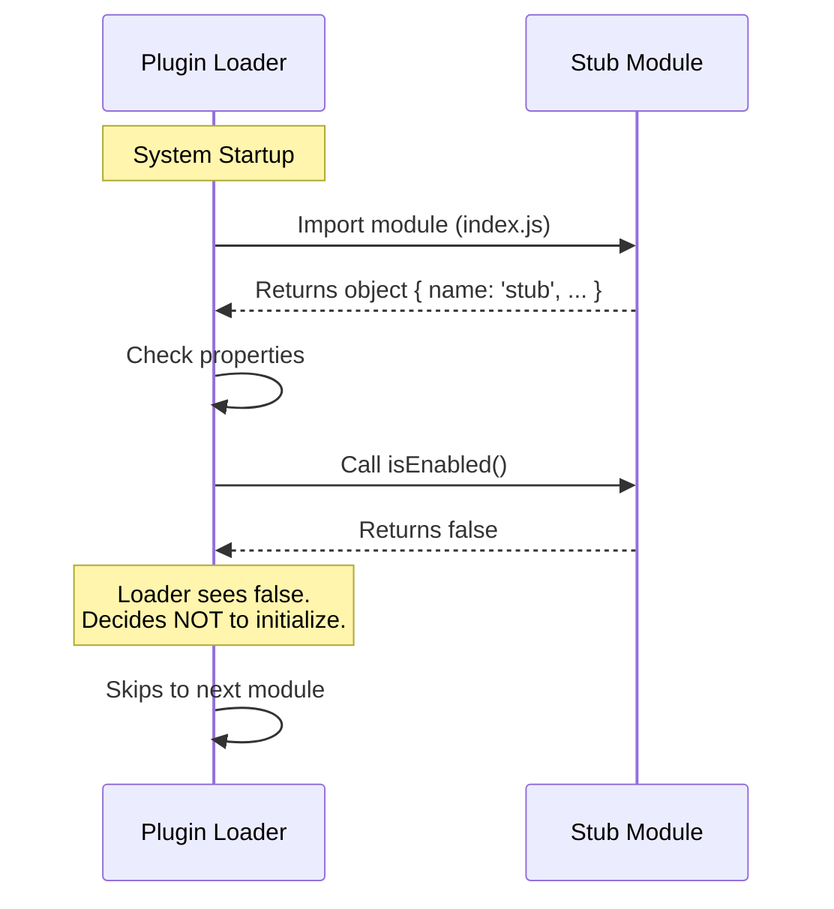

# Chapter 1: Stub Module Definition

Welcome to the `ant-trace` tutorial! If you are new to system design or plugin architecture, you are in the right place.

## The Motivation: The "Prop Book"

Imagine you are designing a set for a movie scene taking place in a library. You need the shelves to look full of books. However, the actors will never open 99% of them.

Do you buy thousands of real novels? No. You buy **prop books**. They have a spine and a cover, so they fit perfectly on the shelf and look correct, but if you open them, they are empty or solid cardboard.

In software, specifically in `ant-trace`, we face a similar situation. Sometimes our system expects a component or a plugin to exist in a specific file location to satisfy the "build" process (putting the shelves together). However, we don't actually want that component to do anything right now, or the logic isn't written yet.

This is where the **Stub Module Definition** comes in.

### The Use Case

Let's say our system automatically tries to load every file inside a `plugins/` folder.
1.  If we simply delete a file, the system might crash because it can't find it.
2.  If we leave the file empty, the system might crash because it expects valid code.
3.  We need a "fake" module that says, "I exist, but please ignore me."

## How to Define a Stub

To create this "prop book," we create a JavaScript file that exports a standard object. It satisfies the system's interface requirements but explicitly turns itself off.

Here is the entire implementation of a Stub Module:

```javascript
// --- File: index.js ---
export default { 
  isEnabled: () => false, 
  isHidden: true, 
  name: 'stub' 
};
```

### Breaking It Down

Let's look at the specific properties that make this a "Stub":

1.  **`name: 'stub'`**: This identifies the module. We call it `'stub'` so developers immediately know this is a placeholder.
2.  **`isEnabled: () => false`**: This is a function that returns `false`. When the system asks, "Should I run you?", this function answers "No."
3.  **`isHidden: true`**: This is a flag. It tells the user interface (if there is one) not to show this module in lists or menus.

**What happens at runtime?**
*   **Input:** The system loads this file.
*   **Output:** The system sees that `isEnabled` is false, so it moves on to the next plugin without crashing and without running any logic.

## Under the Hood: The Loading Process

To understand how the system interacts with this stub, let's look at the flow.

Imagine a "Plugin Loader" is walking through the file system. It picks up our Stub Module and inspects it.

### Sequence Diagram



### Implementation Details

The implementation is incredibly lightweight. The goal is to be as "cheap" as possible. We don't want to waste computer memory on a component that isn't doing anything.

Because the code is so simple, we can combine the definition into a single export statement.

```javascript
// A function returning false prevents initialization
const disableHook = () => false;

export default { 
  isEnabled: disableHook, // The system calls this first
  isHidden: true,         // Hides from UI
  name: 'stub'            // Identity
};
```

> **Beginner Note:** In the code above, `disableHook` is just a helper name I gave to `() => false` to make it easier to read. The system sees `isEnabled` returns `false` and immediately stops caring about this module.

## Conclusion

You have just learned how to create a **Stub Module Definition**. It is a safe, polite way to tell your system, "I am here so you don't crash, but please don't ask me to do any work."

This concept is crucial because it allows us to manage which features are active without breaking the structure of our application.

In the next chapter, we will learn how to take this concept further. Instead of just hard-coding `false`, what if we want to change visibility dynamically based on settings?

[Next Chapter: Feature Visibility Control](02_feature_visibility_control.md)

---

Generated by [Code IQ](https://github.com/adityasoni99/Code-IQ)