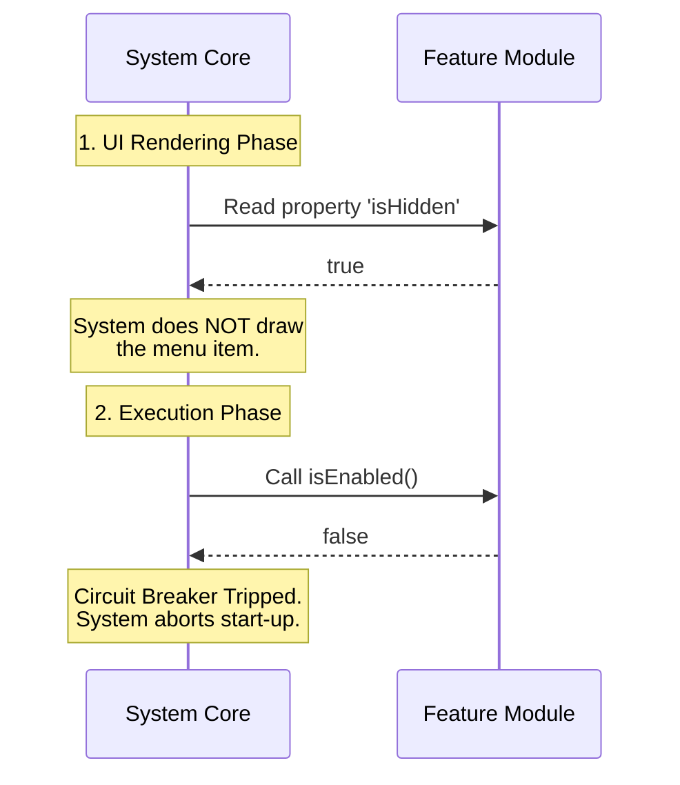

# Chapter 2: Feature Visibility Control

Welcome back to the `ant-trace` tutorial.

In [Chapter 1: Stub Module Definition](01_stub_module_definition.md), we discussed the concept of a "Prop Book"—a file that exists just to satisfy the system, but acts empty. We hard-coded it to say "I am disabled."

But what if you bought a real lamp, plugged it into the wall, but you don't want it turned on yet? You don't throw the lamp away; you just flip the switch to **Off**.

This brings us to **Feature Visibility Control**.

## The Motivation: The Circuit Breaker

Imagine you are building a new feature for your software, like a "Dark Mode" or an "Experimental Dashboard."

1.  **The Code Exists:** The logic is written and the files are in the right folders.
2.  **The Risk:** It might have bugs, or it might confuse new users.
3.  **The Solution:** You need a **Circuit Breaker**.

You want the code to be physically present in the application (wired in), but you want to stop the flow of electricity (execution) and hide the switch from the user (UI presence) until you are ready.

This allows you to ship code safely without exposing it to everyone immediately.

## Key Concepts

To control a module, `ant-trace` uses two specific properties. Think of these as the questions the system asks your module before interacting with it.

1.  **`isEnabled`**: The Operational Switch.
    *   *System asks:* "Should I run your logic?"
    *   *Analogy:* Is the electricity flowing?
2.  **`isHidden`**: The Visual Cloak.
    *   *System asks:* "Should I show your icon/name in the menu?"
    *   *Analogy:* Is the lamp hidden in the closet?

## How to Control Visibility

Let's look at how we solve the use case of a "Beta Feature" that we want to keep installed but disabled.

Instead of hard-coding `false` (like we did in the Stub), we can make these properties dynamic.

### The Implementation

Here is a module that acts as a controlled feature:

```javascript
// --- File: beta-feature.js ---

// Imagine this comes from a settings file
const config = { featureActive: false }; 

export default {
  name: 'experimental-dashboard',
  
  // Dynamic Check: Returns the value of featureActive
  isEnabled: () => config.featureActive, 
  
  // If active, show it. If inactive, hide it.
  isHidden: !config.featureActive 
};
```

### Breaking It Down

1.  **`const config`**: This represents a setting. In a real app, this might come from a database or a user preference file. Currently, it is `false`.
2.  **`isEnabled: () => config.featureActive`**: Notice this is a **function** (an arrow function). Every time the system checks, this function runs. It looks at `config.featureActive`.
    *   *Result:* Returns `false`. The system stops.
3.  **`isHidden: !config.featureActive`**: The `!` symbol means "NOT".
    *   If active is `false`, hidden becomes `true`.

**What happens at runtime?**
*   **Input:** The system loads the module. The config is set to `false`.
*   **Output:** The module is loaded into memory, but it does **not start**, and it does **not appear** in the menu. It is invisible but ready.

## Under the Hood: The Control Flow

How does `ant-trace` respect these settings? It performs a "Gatekeeper" check.

Before the system allows any data to flow into your module or draws it on the screen, it runs a specific sequence.

### Sequence Diagram



### Internal Implementation Details

To understand exactly how the system enforces this, let's look at a simplified version of the **System Core** code. This is the code that *imports* your module.

The system uses a technique called **Guard Clauses**.

```javascript
// --- File: system-core.js (Simplified) ---

function initializeModule(module) {
  // 1. Check the Circuit Breaker
  if (module.isEnabled() === false) {
    console.log(`Skipping ${module.name}: Disabled`);
    return; // STOP HERE. Do not proceed.
  }

  // 2. If we survived the check, run the logic
  console.log(`Starting ${module.name}...`);
  // module.start() ...
}
```

> **Beginner Note:** The `return` keyword inside the `if` statement is powerful. It tells the function to stop working immediately. Because `isEnabled()` returned false, the code simply never reaches step 2. The electricity is cut off.

## Conclusion

You have learned about **Feature Visibility Control**.

While [Chapter 1](01_stub_module_definition.md) taught us how to make a dummy placeholder, this chapter taught us how to make a real, functioning module that can be toggled On or Off. By using `isEnabled` and `isHidden`, you act as the electrician, deciding exactly which parts of your system are live and which are dormant.

This completes the introductory section on Module definitions. You now know how to define Stubs and Controlled Features!

---

Generated by [Code IQ](https://github.com/adityasoni99/Code-IQ)