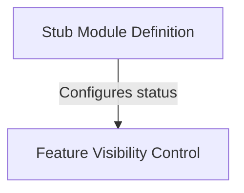

# Tutorial: ant-trace

This component acts as a **placeholder** or *stub* within the `ant-trace` system. It defines a module structure that is intentionally **disabled** and *hidden*, ensuring the application builds correctly without activating this specific feature.

## Chapters

1. [Stub Module Definition](01_stub_module_definition.md)
2. [Feature Visibility Control](02_feature_visibility_control.md)

---

Generated by [Code IQ](https://github.com/adityasoni99/Code-IQ)