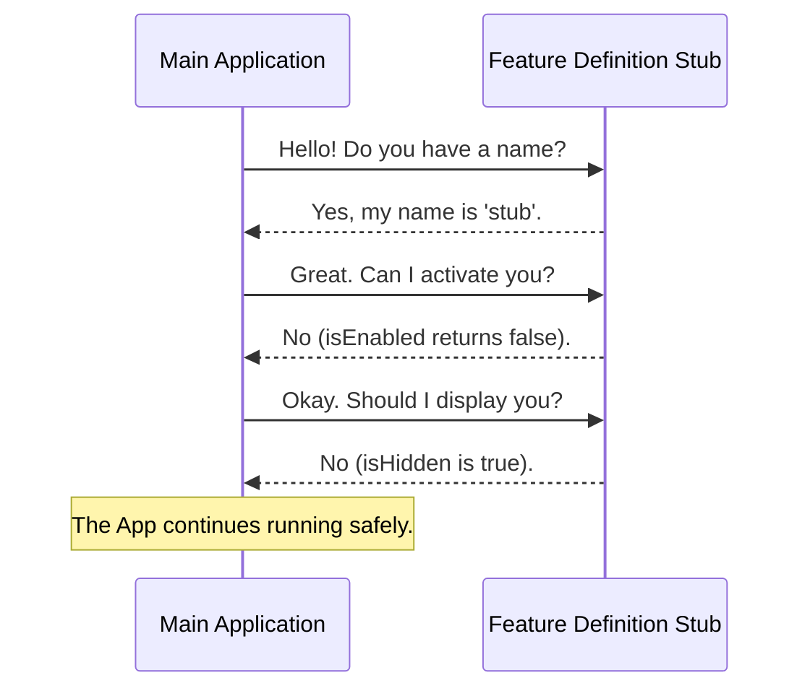

# Chapter 1: Feature Definition Stub

Welcome to the **autofix-pr** project! This tutorial will guide you through building a robust feature system. We are starting from the very beginning.

## Why do we need a Stub?

Imagine you are filming a movie. You need a scene in a futuristic kitchen, but the actual high-tech refrigerator hasn't arrived yet. To keep filming, the set designers put a cardboard box there. It holds the **space**, it has a **label**, but it doesn't actually **cool food**.

In programming, this concept is called a **Stub**.

When building an application, you often want to register a new feature (like a "Dark Mode" button or a "User Profile" widget) so the system knows it exists, even if the code to make it work isn't written yet. The **Feature Definition Stub** is that "cardboard box." It represents a contract—a promise that a feature is there—without doing any real work or breaking the app.

### The Central Use Case

You are starting a new module. You want to ensure your application can load this module safely without crashing, even though the logic inside it is empty. We need to create a **safe default state**.

## Implementing the Stub

Let's look at the "structural contract" (the interface) required for any feature in our system. To exist, a feature needs three things:
1.  **Identity:** A name.
2.  **Logic Switch:** A way to say if it works.
3.  **Visual State:** A way to say if it should be seen.

Here is the code to create your first Feature Definition Stub.

### The Code

```javascript
// File: index.js
export default {
  isEnabled: () => false,
  isHidden: true,
  name: 'stub'
};
```

**What is happening here?**

*   `export default { ... }`: We are packaging this information so other files can read it.
*   `isEnabled`: This is a function that returns `false`. It effectively turns the feature "Off".
*   `isHidden`: This is set to `true`. It ensures the feature is invisible in the user interface.
*   `name`: This is set to `'stub'`. It acts as a placeholder ID.

## How it Works Under the Hood

When your application starts, it scans for features. Because our stub follows the rules (it has the expected properties), the application accepts it happily.

Here is a visual representation of how the Main Application interacts with your new Stub:



### Deep Dive: The Properties

Let's break down the implementation details. While this chapter focuses on the Stub as a whole, each property maps to a core concept we will explore deeper in future chapters.

#### 1. The Logic Switch (`isEnabled`)

```javascript
// A function that strictly returns false
isEnabled: () => false,
```

This is the most critical safety mechanism. By returning `false`, we ensure that even if the application accidentally tries to run this feature, nothing happens. This concept is explored fully in [Activation Control](03_activation_control.md).

#### 2. The Visibility Cloak (`isHidden`)

```javascript
// A simple boolean property
isHidden: true,
```

This acts as a "dummy prop" on our movie set. The object exists in the code, but the user cannot see it on the screen. This allows us to deploy code without confusing users. We will learn how to manage this in [Visibility State](04_visibility_state.md).

#### 3. The Identity (`name`)

```javascript
// A string identifier
name: 'stub'
```

Every feature needs a unique ID so the system can track it. Right now, we are just calling it `'stub'`, but usually, this would be something unique like `'user-profile'`. We will define proper naming conventions in [Component Identity](02_component_identity.md).

## Conclusion

Congratulations! You have created your first **Feature Definition Stub**.

You now have a safe, crash-proof placeholder in your application. It doesn't do anything yet, but it successfully tells the system, *"I am here, I am turned off, and I am invisible."*

In the next chapter, we will replace the generic `'stub'` name with a real identifier to give our feature a true purpose.

[Next Chapter: Component Identity](02_component_identity.md)

---

Generated by [Code IQ](https://github.com/adityasoni99/Code-IQ)