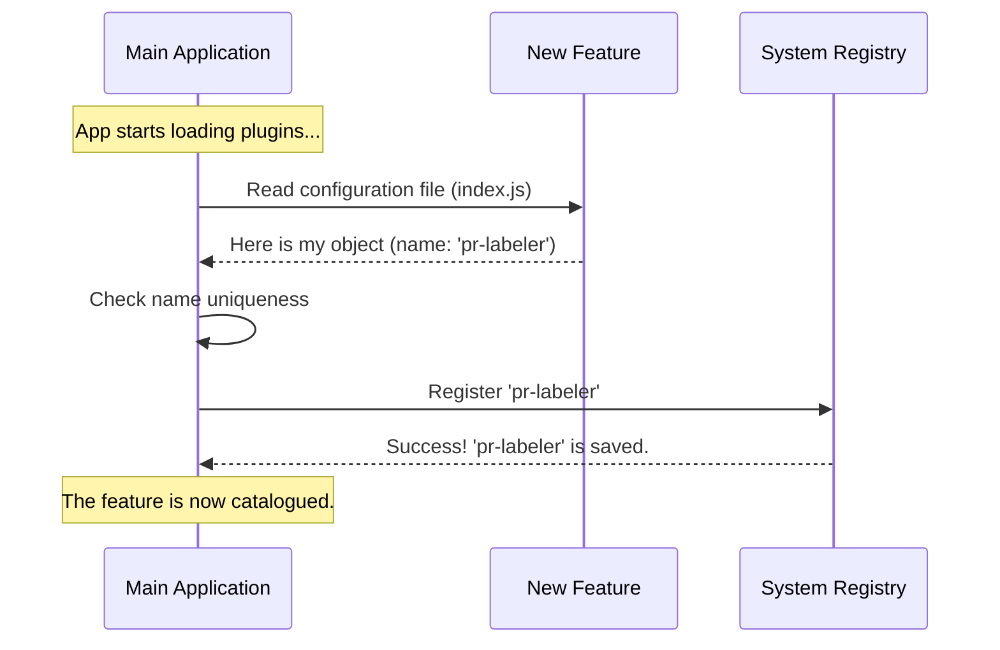

# Chapter 2: Component Identity

Welcome back!

In [Chapter 1: Feature Definition Stub](01_feature_definition_stub.md), we built a "cardboard box" for our feature. We created a safe placeholder that prevented the application from crashing. However, we gave it a very generic name: `'stub'`.

If every feature in our application was named `'stub'`, the system would be chaos. It would be like a classroom where every student is named "Student." When the teacher calls on "Student," everyone stands up!

In this chapter, we will solve this by implementing **Component Identity**.

## The Central Use Case

Imagine you are building the **autofix-pr** system. You have two distinct ideas you want to implement:
1.  **PR Labeler:** Automatically adds labels to Pull Requests.
2.  **Spell Checker:** Fixes typos in comments.

The Main Application has a **Registry**—a guest list of all the plugins installed. To successfully load both the Labeler and the Spell Checker, the Registry needs to distinguish between them.

We need to replace the generic "stub" nametag with a unique ID so the main application can catalogue, retrieve, and manage each feature individually.

## Giving Your Feature a Name

The concept is simple: **Component Identity** provides a unique string label for your module.

### The Code

Let's modify the stub we created in the previous chapter. We are going to change the `name` property to something specific.

```javascript
// File: index.js
export default {
  isEnabled: () => false,
  isHidden: true,
  // We change 'stub' to a unique ID
  name: 'pr-labeler' 
};
```

**What changed?**
*   We changed `name: 'stub'` to `name: 'pr-labeler'`.

That's it! By changing that one string, you have transformed a generic placeholder into a distinct entity within the system.

### Naming Conventions
To keep things clean, beginners should follow these simple naming rules:
1.  **Lower case:** Use `pr-labeler`, not `PR-Labeler`.
2.  **Kebab-case:** Use dashes to separate words (`my-feature-name`), not spaces.
3.  **Unique:** Ensure no other feature has this name.

## How it Works Under the Hood

When the Main Application starts up, it acts like a receptionist at a conference. It looks at every feature file and asks, "Who are you?"

If two features say "I am 'stub'", the receptionist gets confused and might throw an error. By providing a unique identity, you ensure your feature gets its own spot in the system's memory.

Here is what happens during the registration process:



### Deep Dive: Why is Identity Critical?

The `name` property is the foundation for everything else we will build.

#### 1. Targeting for Logic
In the next chapter, [Chapter 3: Activation Control](03_activation_control.md), we will discuss how to turn features on and off. The system uses the **Identity** to look up settings.
*   *System Logic:* "Check the database. Is the feature named `'pr-labeler'` allowed to run?"

#### 2. Targeting for UI
In [Chapter 4: Visibility State](04_visibility_state.md), we will discuss showing things to the user. The system uses the **Identity** to find visual preferences.
*   *System Logic:* "Does the user want to hide the widget named `'pr-labeler'`?"

Without a unique `name`, the system cannot ask these questions specifically about *your* code.

## Internal Implementation Details

Let's look at how a very simple Main Application might use your Identity property.

```javascript
// Example: Inside the Main Application (system-core.js)
const registry = {};

function registerFeature(feature) {
  const id = feature.name; // Reads 'pr-labeler'

  // Safety Check: Does this name already exist?
  if (registry[id]) {
    console.error("Error: Duplicate feature name detected!");
    return;
  }

  // Catalogue the feature
  registry[id] = feature;
  console.log("Registered: " + id);
}
```

**Explanation:**
1.  The app extracts `feature.name`.
2.  It checks if that key already exists in the `registry` object.
3.  If it is new, it saves your entire feature object (including the logic and visibility settings) into the registry using your Name as the key.

## Conclusion

You have successfully graduated your feature from a generic "Stub" to a uniquely identified Component!

*   **You learned:** That the `name` property is like a unique ID badge or passport.
*   **You implemented:** A unique string identifier (`'pr-labeler'`) in your export object.
*   **You understood:** That the Main Application uses this name to save your feature into a Registry without getting it mixed up with others.

Now that the system knows **who** your feature is, it is time to tell the system **if** it is allowed to run.

[Next Chapter: Activation Control](03_activation_control.md)

---

Generated by [Code IQ](https://github.com/adityasoni99/Code-IQ)