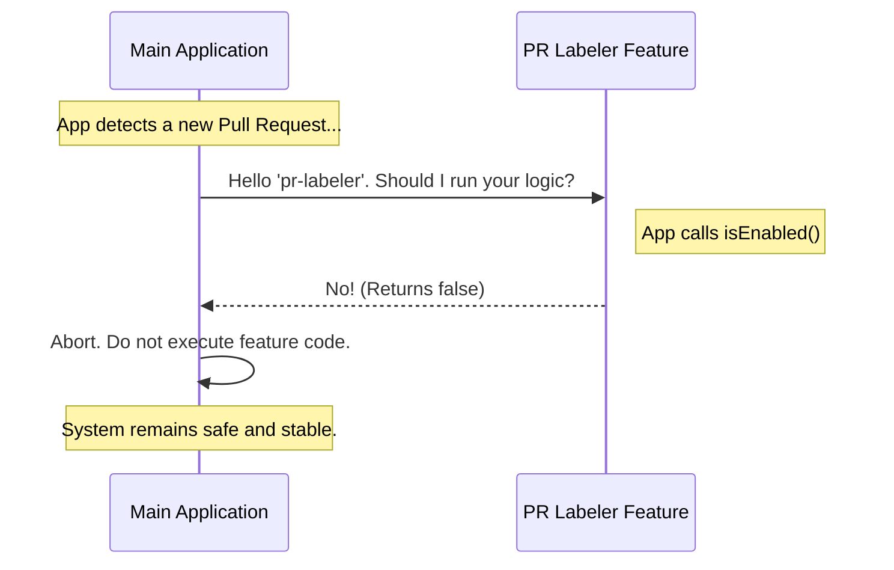

# Chapter 3: Activation Control

Welcome to the third chapter of our tutorial!

In the previous chapter, [Chapter 2: Component Identity](02_component_identity.md), we gave our feature a unique name (`'pr-labeler'`). The system now knows **who** the feature is.

Now, we need to answer the next most important question: **Is this feature allowed to do any work?**

## The Central Use Case

Imagine you have just installed a new high-tech dishwasher in your kitchen. It is plugged in, and it has a name tag. However, before you trust it to wash your expensive crystal glasses, you want to make sure it doesn't accidentally turn on while you are still reading the manual.

You need a **Master Switch**.

In software, when we are building a new feature (like our PR Labeler), the code might be incomplete or buggy. We want to deploy the code to the repository, but we want to ensure it is **strictly deactivated** by default. We want a guarantee that no matter what happens, the logic for this feature will not execute.

This is the concept of **Activation Control**.

## The Logic Switch (`isEnabled`)

To solve this, we define a specific property in our feature object called `isEnabled`.

Think of `isEnabled` as a security guard standing at the door of your feature. Before the Main Application allows any code to run, it asks the guard: "Are we open for business?"

### The Code

Let's look at our `index.js` file again. We are focusing on the `isEnabled` property.

```javascript
// File: index.js
export default {
  name: 'pr-labeler', 
  
  // The Activation Control Switch
  isEnabled: () => false,

  isHidden: true
};
```

**What is happening here?**

*   `isEnabled`: This is the name of our switch.
*   `() => false`: This is a small function (an arrow function).
*   **The Result:** Whenever the application runs this function, it immediately shouts **"FALSE"** (No).

By hard-coding this to return `false`, we are essentially taping the switch to the "Off" position.

## Why use a Function?

You might ask, * "Why not just write `isEnabled: false`? Why do we need a function `() => false`?"*

That is a great question!

Right now, we are beginners, so we just want it "Off." But in the future, you might want the switch to be smart. You might want logic like:
*   "Enable only on Mondays."
*   "Enable only for Admin users."

By using a function now, we leave space for that complex logic later without changing how the Main Application talks to our feature.

## How it Works Under the Hood

Let's visualize the "Safety Gate" process. When the application runs, it loops through every feature. It performs a check *before* it attempts to do any real work.

### The Flow



### Internal Implementation Details

To understand how the system enforces this, let's look at a simplified version of the code running inside the Main Application (the engine that runs your plugin).

The engine uses a standard `if` statement to act as a gatekeeper.

```javascript
// Inside the System Engine (simplified)
function executeFeature(feature) {
  
  // 1. The Safety Check
  const canRun = feature.isEnabled();

  // 2. If false, STOP immediately
  if (canRun === false) {
    console.log("Feature is disabled. Skipping.");
    return; 
  }

  // 3. Only run this if true
  console.log("Running feature logic...");
}
```

**Breakdown:**
1.  The system calls your function: `feature.isEnabled()`.
2.  Because you wrote `() => false`, `canRun` becomes `false`.
3.  The `if` statement sees `false` and hits `return`. This stops the function immediately.
4.  The "Running feature logic..." part is never reached.

## Comparison: Logic vs. Visibility

It is easy to confuse **Activation Control** (Chapter 3) with **Visibility State** (Chapter 4).

*   **Activation Control (`isEnabled`):** Can the code run? Does the engine work? (The backend).
*   **Visibility State (`isHidden`):** Can the user see the button? (The frontend).

In this chapter, we ensured the *engine* is off. Even if the user could somehow see a button and click it, the internal logic would refuse to run because `isEnabled` says "No".

## Conclusion

You have now mastered **Activation Control**.

By adding `isEnabled: () => false` to your feature, you have created a fail-safe environment. You can now write code, make mistakes, and build out your logic, knowing that the "Master Switch" is keeping the rest of the application safe from your work-in-progress.

Your feature has a name, and it is safely turned off. But wait—is it invisible? Or is there a "broken" button floating around on the screen?

In the next chapter, we will handle the visual side of things.

[Next Chapter: Visibility State](04_visibility_state.md)

---

Generated by [Code IQ](https://github.com/adityasoni99/Code-IQ)