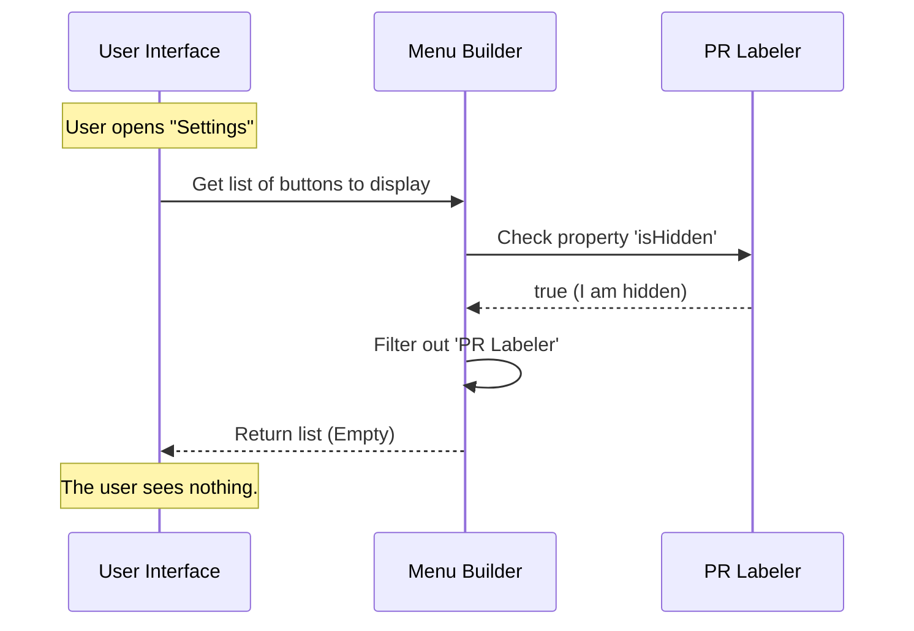

# Chapter 4: Visibility State

Welcome to the final chapter of this tutorial series!

In the previous chapter, [Activation Control](03_activation_control.md), we created a safety switch for our feature. We ensured that even if our code is loaded, the logic inside it refuses to run (by returning `false`).

However, we have a lingering problem. Imagine walking into a restaurant. You see a menu item called "Super Secret Pizza," but when you try to order it, the waiter says, "Sorry, that doesn't actually exist yet." It’s frustrating, right?

Even if a feature is disabled safely, we usually don't want a "broken" or unresponsive button appearing in the user's menu. We need to hide it completely.

This brings us to **Visibility State**.

## The Central Use Case

You are working on the **PR Labeler** feature.
1.  **Identity:** The system knows who it is ([Component Identity](02_component_identity.md)).
2.  **Activation:** The logic is turned off safely ([Activation Control](03_activation_control.md)).

But, your application currently has a generic "Settings" menu that lists every feature it finds. You want to deploy your code to the server so your team can see it, but you don't want regular users to see a "PR Labeler" button in their settings menu yet because it doesn't work.

You need an **Invisibility Cloak**.

## Implementing Visibility

To hide a feature, we use the `isHidden` property. This property acts as a filter for the User Interface (UI).

### The Code

Let's look at our `index.js` file one last time.

```javascript
// File: index.js
export default {
  name: 'pr-labeler', 
  isEnabled: () => false,

  // The Visibility State
  isHidden: true
};
```

**What is happening here?**

*   `isHidden: true`: This simple boolean (true/false) value tells the UI rendering engine: *"Do not draw me."*

By setting this to `true`, the feature effectively vanishes from the screen, even though the code is fully loaded in the background.

## Concept: Logic vs. Visuals

It is very common for beginners to confuse **Activation** (Chapter 3) and **Visibility** (Chapter 4). Let's use an analogy of a **Lamp** to separate them.

1.  **Activation (`isEnabled`):** Is the lamp plugged into the wall? If it's unplugged (`false`), no electricity flows.
2.  **Visibility (`isHidden`):** Is the lamp stored in the closet? If it's in the closet (`true`), you can't see it to try and turn it on.

### Common Combinations

*   **Enabled & Visible:** A finished feature ready for users.
*   **Disabled & Hidden:** A new feature currently being built (This is our current state).
*   **Enabled & Hidden:** A background task (like an auto-saver) that works but has no menu button.

## How it Works Under the Hood

When your application prepares to draw the screen (like the Settings Menu), it looks at the list of all registered features. It acts like a bouncer at a club, checking the guest list.

If a feature has `isHidden: true`, the bouncer stops it at the door. It never makes it onto the visual list.



## Internal Implementation Details

How does the code actually hide the item? Let's look at a simplified version of the code that builds the application menu.

Usually, this involves a concept called **Filtering**.

```javascript
// Inside the UI Menu Component
function getVisibleMenuOptions(allFeatures) {
  
  // The Filter Method
  const visibleFeatures = allFeatures.filter(feature => {
    // If isHidden is true, we return false to exclude it
    return feature.isHidden === false; 
  });

  return visibleFeatures;
}
```

**Breakdown:**
1.  The system takes `allFeatures` (which includes our PR Labeler).
2.  It runs a `filter`. This is a loop that asks a question for every item.
3.  The question is: "Is `isHidden` false?"
4.  Since our feature has `isHidden: true`, the answer is **No**.
5.  Our feature is tossed out of the `visibleFeatures` list.
6.  The menu is drawn using only the items that remained.

## Changing the State

When you finish building your feature and it is ready for the world, you simply flip the switch.

1.  Change `isEnabled` to `() => true` (Turn the engine on).
2.  Change `isHidden` to `false` (Remove the invisibility cloak).

```javascript
// A Ready-To-Launch Feature
export default {
  name: 'pr-labeler',
  isEnabled: () => true, // Engine ON
  isHidden: false        // Visible ON
};
```

## Conclusion

Congratulations! You have completed the **Feature Definition** tutorial series.

You have learned how to build a robust foundation for any new feature in the `autofix-pr` project. Let's recap your journey:

1.  **[Feature Definition Stub](01_feature_definition_stub.md):** You created a safe "cardboard box" placeholder.
2.  **[Component Identity](02_component_identity.md):** You gave the feature a unique name (`'pr-labeler'`) so the system can track it.
3.  **[Activation Control](03_activation_control.md):** You ensured the internal logic is turned off by default to prevent crashes.
4.  **[Visibility State](04_visibility_state.md):** You learned how to hide the feature from the user interface until it is finished.

You now possess a "Safe Stub." You can commit this file to your codebase, and it will sit there silently, safe and invisible, waiting for you to write the actual logic inside it.

Happy Coding!

---

Generated by [Code IQ](https://github.com/adityasoni99/Code-IQ)