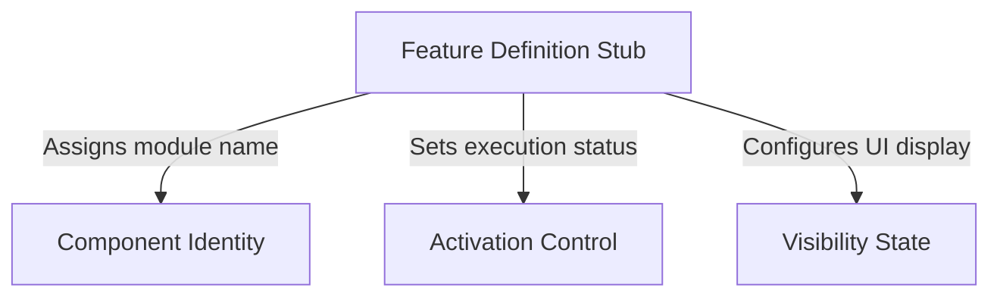

# Tutorial: autofix-pr

This code defines a **placeholder** (or *stub*) module for the `autofix-pr` application. It establishes a structural contract that tells the system the feature exists and has a specific **identity**, but ensures it remains **inactive** and **hidden** from the user interface until it is ready for real implementation.

## Chapters

1. [Feature Definition Stub](01_feature_definition_stub.md)
2. [Component Identity](02_component_identity.md)
3. [Activation Control](03_activation_control.md)
4. [Visibility State](04_visibility_state.md)

---

Generated by [Code IQ](https://github.com/adityasoni99/Code-IQ)