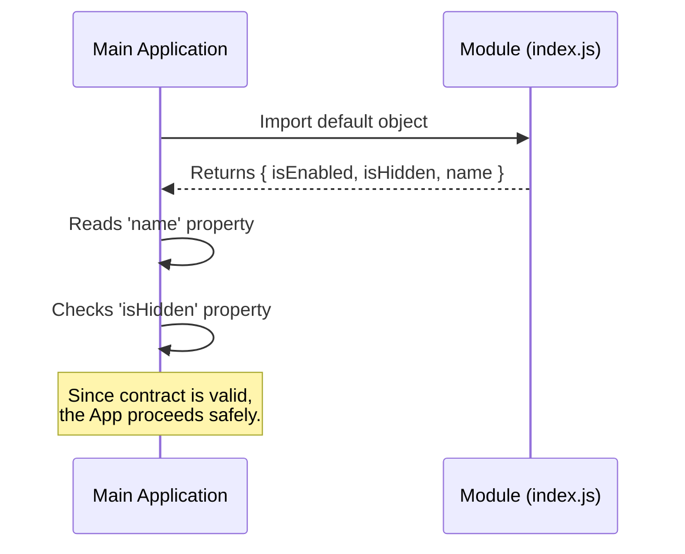

# Chapter 1: Configuration Contract

Welcome to the `backfill-sessions` project! If you are new to coding or system architecture, you are in the right place. We are going to build this understanding step-by-step.

## Why do we need a Contract?

Imagine you are running a government processing agency. Every day, thousands of people send you information about their businesses.

If everyone sent you this information on random scraps of paper—some writing their name at the bottom, some on the back, and some forgetting it entirely—your office would be chaos. You wouldn't know where to look for the data you need.

**The Solution? A Standardized Tax Form.**

By forcing everyone to fill out the *same* form with the *same* boxes in the *same* layout, you know exactly where to look.

In programming, we call this a **Contract**.

The **Configuration Contract** ensures that every module (or feature) in our application looks exactly the same to the main system. It forces every file to export a specific object with specific keys. This way, the application can blindly trust that the data it needs will always be there.

## The Use Case: The "Stub" Feature

Let's look at a central use case. We want to create a placeholder feature (we'll call it a "stub") that exists in our system but doesn't actually do anything yet.

To make sure the main application accepts this "stub" without crashing, we need to sign the **Configuration Contract**.

We need to provide three specific pieces of information:
1.  **Name**: What do we call this?
2.  **Visibility**: Should users see it in the menu?
3.  **Status**: Is the code actually turned on?

## How to Sign the Contract

In our project, "signing the contract" means exporting a specific JavaScript object. Here is the code that fulfills our requirement.

### The Code

```javascript
// index.js
export default {
  isEnabled: () => false, 
  isHidden: true, 
  name: 'stub' 
};
```

### Explanation
*   **`export default { ... }`**: This is us handing over our "form" to the application.
*   **`isEnabled`**: A function that tells the app if this feature is active. (See [Activation Control (Feature Flagging)](03_activation_control__feature_flagging_.md)).
*   **`isHidden`**: A simple true/false setting. If `true`, the UI won't show it. (See [Visibility State Management](04_visibility_state_management.md)).
*   **`name`**: A string text string identifying the module. (See [Module Identity](02_module_identity.md)).

By simply including these three keys, you have fulfilled the Configuration Contract.

## Under the Hood: How it Works

What actually happens when the application reads this file? It doesn't guess; it expects this exact shape.

### The Process (Analogy)

1.  **The Application (Agency)** calls for the module.
2.  **The Module (You)** hands over the object (The Form).
3.  **The Application** reads the `name` box.
4.  **The Application** checks the `isEnabled` box to decide if it should run the code.

### Sequence Diagram

Here is a diagram showing how the main application talks to our module code:



### Implementation Logic

While the code above showed *how to write* the configuration, here is a simplified look at how the system *checks* the configuration. This logic ensures the contract is respected.

```javascript
// system-loader.js (Hypothetical System Code)
import featureModule from './index.js';

// 1. We expect the module to be an object
const config = featureModule;

// 2. We try to read the specific contract keys
const moduleName = config.name;
const isVisible = !config.isHidden;

console.log(`Loaded module: ${moduleName}`);
```

If we had forgotten the `name` key in our `index.js`, `moduleName` would be undefined, and the system might throw an error. Because we followed the contract, the system runs smoothly.

## What's Next?

You have successfully defined the shape of your module! You've learned that by agreeing to a standardized structure (the **Configuration Contract**), we make it safe and easy for the application to manage different features.

However, each of those keys (`name`, `isEnabled`, `isHidden`) has its own special purpose and power. In the next chapter, we will focus specifically on the first requirement: identifying who we are.

[Next Chapter: Module Identity](02_module_identity.md)

---

Generated by [Code IQ](https://github.com/adityasoni99/Code-IQ)