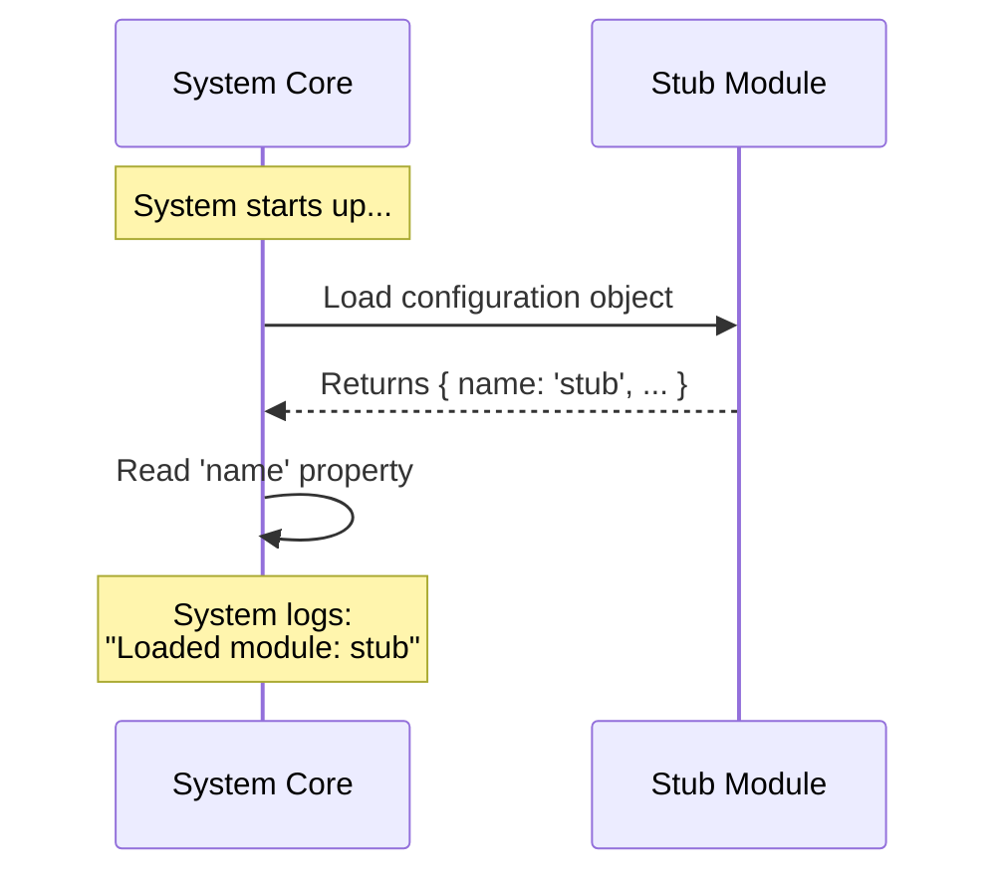

# Chapter 2: Module Identity

Welcome back! In the previous chapter, [Configuration Contract](01_configuration_contract.md), we learned that our application requires every feature to follow a strict structure (a "contract").

Now, we are going to focus on the most fundamental part of that contract: **Identity**.

## The Problem: "Who are you?"

Imagine a large office building with hundreds of employees. If a security guard sees someone walking down the hall, they need a quick way to identify that person.

It doesn't matter yet if that person is a Manager, an Intern, or on vacation. The first step is simply knowing **who they are**.

Without identification, the system (the security guard) cannot:
1.  Log who entered the building.
2.  Report errors ("Hey, *Anonymous* broke the coffee machine!").
3.  Organize features into lists.

**The Solution: The ID Badge**

In our project, **Module Identity** is like a standardized ID badge. It is a simple text string attached to your code that tells the rest of the system exactly what this component is called.

## The Use Case: System Logging

Let's look at our central use case. When our application starts up, we want it to print a list of all loaded features to the console.

To do this, the system needs to ask our "stub" feature for its name.

### Implementing Module Identity

To give your module an identity, you simply add a `name` property to the object you export.

Here is the code for our `index.js` file:

```javascript
// index.js
export default {
  // We define the identity here
  name: 'stub',

  // Other parts of the contract (covered in later chapters)
  isEnabled: () => false,
  isHidden: true
};
```

### Explanation

*   **`name`**: This is the key property.
*   **`'stub'`**: This is the value (the ID). It is a "string" (text wrapped in quotes).
*   **Simplicity**: It doesn't perform any logic or calculation. It is just a static label.

By adding this one line, you have given your code a voice to say, "I am the stub module."

## Under the Hood: How it Works

How does the main application use this name? It uses it to reference your code without needing to know *how* your code works.

### The Process (Analogy)

1.  **The System** collects all the files in the folder.
2.  **The System** picks up your file and looks at the ID Badge (`name`).
3.  **The System** writes that name into a registry (a list of known features).

### Sequence Diagram

Here is a visual representation of the system introducing itself to the module:



### Internal Implementation

Let's look at a simplified version of the code the **System** runs to read your identity.

```javascript
// system-logger.js
import feature from './index.js';

// 1. Access the identity property
const moduleID = feature.name;

// 2. Use the identity for logging
console.log('Successfully loaded: ' + moduleID);

// Output: Successfully loaded: stub
```

If we had not provided the `name: 'stub'` in our file, `moduleID` would be undefined, and the log would say "Successfully loaded: undefined," which is very confusing for developers!

## Why is this powerful?

Because we used a standard property (`name`), the system can handle **any** module the same way.

Whether the module is named `'stub'`, `'user-profile'`, or `'checkout-cart'`, the system code (`feature.name`) never changes. This allows the application to grow from 1 feature to 100 features without rewriting the core logic.

## What's Next?

We now have a module that follows the rules and wears a name badge. The system knows *who* it is.

However, just because we have an ID badge doesn't mean we are allowed to work yet. The security guard knows our name, but now he needs to check if our badge is "Active" or "Inactive."

In the next chapter, we will learn how to control whether our code actually runs using logic functions.

[Next Chapter: Activation Control (Feature Flagging)](03_activation_control__feature_flagging_.md)

---

Generated by [Code IQ](https://github.com/adityasoni99/Code-IQ)