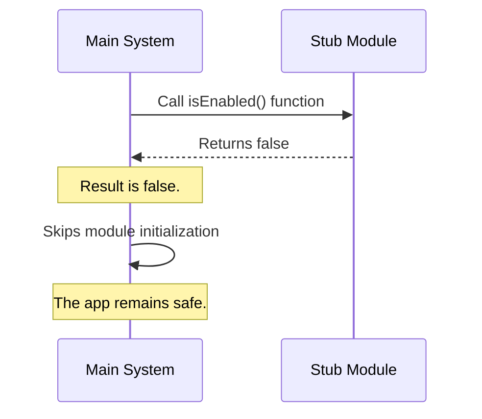

# Chapter 3: Activation Control (Feature Flagging)

Welcome back! In the previous chapter, [Module Identity](02_module_identity.md), we gave our code a name tag so the system could identify it.

Now that the system knows *who* our module is, we face a critical safety question: **Should this module be allowed to run?**

## The Problem: Half-Finished Code

Imagine you are renovating a house. You have installed the wiring for a new chandelier, but you haven't bought the lightbulbs yet.

If you connect that wiring to the power grid immediately, you might cause sparks or a fire. You want the wiring to exist in the wall, but you want the electricity to stay disconnected until you are ready.

**The Solution: The Master Switch**

In programming, we call this **Activation Control** or **Feature Flagging**. It acts like a switch on a fuse box. Even though the code (the wiring) exists and is connected to the application (the house), the system won't "power it up" unless this specific switch is flipped to "On."

## The Use Case: The "Stub"

We are building a "stub" feature. This is a placeholder file. It contains no real logic yet.

If the application tries to run this empty feature, it might crash or behave strangely. Therefore, we need to create a **Safety Lock**. We want to deploy the file, but we want the system to completely ignore its logic at runtime.

## Implementing Activation Control

To control the power, we use the `isEnabled` property in our [Configuration Contract](01_configuration_contract.md).

Here is the code for our `index.js` file:

```javascript
// index.js
export default {
  name: 'stub',

  // This is our Master Switch
  isEnabled: () => false,

  isHidden: true
};
```

### Explanation

*   **`isEnabled`**: This is the key. Notice it is not just a value (like `true` or `false`). It is a **function** (`() => ...`).
*   **`return false`**: This function returns `false`. This means "The switch is OFF."
*   **Why a function?**: Why didn't we just write `isEnabled: false`?
    *   By using a function, we gain flexibility. Right now, it simply returns `false`.
    *   In the future, we could write code inside this function to say: *"Return true only if the date is after January 1st"* or *"Return true only if the user is an Admin."*

By writing `() => false`, we are hard-coding the switch to the "Off" position.

## Under the Hood: How it Works

How does the main application respect this switch? It asks for permission before doing any heavy lifting.

### The Process (Analogy)

1.  **The Application** looks at the module.
2.  **The Application** asks, "Are you enabled?" (It calls the function).
3.  **The Module** replies, "No."
4.  **The Application** immediately stops interacting with that module's logic. It treats the code as if it doesn't exist.

### Sequence Diagram

Here is what happens when the system tries to load our disabled stub:



### Internal Implementation

Here is a simplified look at the system code that enforces this check. This is what protects the application from running unfinished code.

```javascript
// system-core.js
import feature from './index.js';

// 1. Check the Master Switch
const active = feature.isEnabled();

// 2. Only run code if the switch is ON
if (active) {
  console.log("Starting feature...");
  // ... run complex logic here ...
} else {
  console.log("Skipping disabled feature.");
}
```

Because our `stub` returns `false`, the code inside the `if` block **never runs**. We can safely write anything inside our module, knowing the system won't touch it.

## Why is this powerful?

This concept allows "Continuous Integration." You can write code for a huge new feature, merge it into the main project, and even deploy it to your users, all while keeping `isEnabled` returning `false`.

The code is there, waiting. When launch day comes, you change one line: `isEnabled: () => true`, and the feature instantly comes alive.

## What's Next?

We have named our module (Chapter 2) and we have ensured it is safely turned off (Chapter 3). The code won't run.

However, even if a machine is unplugged, you might still see it sitting in the room. Does "Disabled" mean "Invisible"? Not necessarily.

In the next chapter, we will control whether the user can actually *see* the feature in the menu, regardless of whether it works or not.

[Next Chapter: Visibility State Management](04_visibility_state_management.md)

---

Generated by [Code IQ](https://github.com/adityasoni99/Code-IQ)