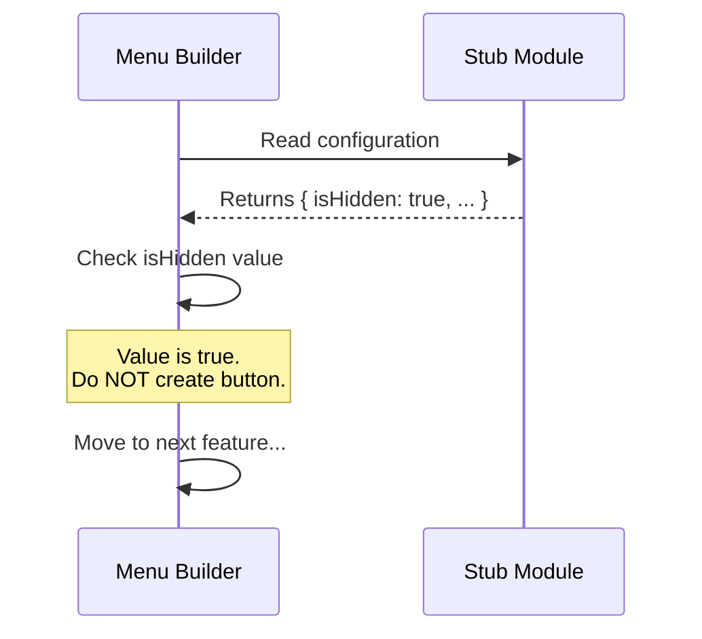

# Chapter 4: Visibility State Management

Welcome back! In the previous chapter, [Activation Control (Feature Flagging)](03_activation_control__feature_flagging_.md), we learned how to turn the power off for our feature using a "Master Switch" (`isEnabled`).

We have ensured that our "stub" feature won't run any unfinished code. But we have a remaining problem: **Just because a machine is unplugged, doesn't mean it is invisible.**

If we have a "Stub" button in our main menu, but clicking it does nothing (because it is disabled), users will be confused. They will click it and think the application is broken.

## The Problem: The Theater Curtain

Think of your application like a theater stage.
*   **The Code** is the set of actors and props.
*   **The User** is the audience.

Sometimes, you need to change the set or put actors in place *before* the show starts. If the audience watches you moving props around, it ruins the magic.

**The Solution: The Curtain (`isHidden`)**

**Visibility State Management** acts as that curtain. It allows the feature to exist on the "stage" (in the code), but prevents the "audience" (the user) from seeing it.

## The Use Case: Hiding the Work-in-Progress

We are building a "stub" feature. It is currently empty and disabled.
*   We want the code to be there (so developers can work on it).
*   We do **not** want a button to appear in the navigation bar yet.

To achieve this, we will use the `isHidden` property from our [Configuration Contract](01_configuration_contract.md).

## Implementing Visibility Control

To pull the curtain down, we set `isHidden` to `true` in our module's configuration file.

Here is the code for `index.js`:

```javascript
// index.js
export default {
  name: 'stub',
  isEnabled: () => false, // The power is off

  // The curtain is down
  isHidden: true
};
```

### Explanation

*   **`isHidden`**: This is the property that controls visual rendering.
*   **`true`**: By setting this to true, we are saying, "Yes, please hide this."
*   **Simplicity**: Unlike `isEnabled` (which was a function), `isHidden` is usually a simple Yes/No value (a boolean).

By adding this line, you tell the User Interface (UI) to completely ignore this module when drawing menus or lists.

## Under the Hood: How it Works

How does the application know to hide the button? The system's "Menu Builder" checks this property before drawing anything on the screen.

### The Process (Analogy)

1.  **The Menu Builder** grabs the list of all features.
2.  It picks up our "stub" feature.
3.  It asks, "Is the curtain down?" (`isHidden`).
4.  The feature says, "Yes, I am hidden."
5.  **The Menu Builder** tosses it aside and moves to the next feature. It never draws a button for the stub.

### Sequence Diagram

Here is a diagram showing how the UI interacts with our configuration:



### Internal Implementation

Let's look at a simplified version of the code that builds the navigation menu. This logic ensures that hidden features stay hidden.

```javascript
// ui-menu-builder.js
import allFeatures from './feature-loader.js';

const menuList = [];

for (const feature of allFeatures) {
  // 1. Check if the curtain is down
  if (feature.isHidden) {
    // 2. If hidden, skip this iteration immediately
    continue;
  }

  // 3. Only reach here if isHidden is false
  menuList.push(feature.name);
}

console.log("Menu items:", menuList);
```

Because our stub has `isHidden: true`, the code hits the `continue` statement. It skips the `menuList.push` line. As a result, the user never sees the option.

## `isHidden` vs `isEnabled`: What's the difference?

Beginners often ask: *"If I disabled the feature in the last chapter, why do I need to hide it too?"*

These two concepts control different things. This allows for powerful combinations:

1.  **Work in Progress (Our case):**
    *   `isEnabled: false` (Don't run)
    *   `isHidden: true` (Don't show)
    *   *Result:* Complete ghost mode.

2.  **Coming Soon Teaser:**
    *   `isEnabled: false` (Don't run)
    *   `isHidden: false` (Show it)
    *   *Result:* The button appears in the menu, but it might be "greyed out" or show a "Coming Soon" popup when clicked.

3.  **Beta Testing / Admin Only:**
    *   `isEnabled: true` (It works)
    *   `isHidden: true` (Don't show in menu)
    *   *Result:* The feature works, but you have to know the secret URL to get to it. Regular users won't stumble upon it in the menu.

## Conclusion

You have now mastered the art of the "Theater Curtain."
*   We used [Module Identity](02_module_identity.md) to name the feature.
*   We used [Activation Control](03_activation_control__feature_flagging_.md) to stop it from running.
*   We used **Visibility State Management** to stop it from appearing in the UI.

Our feature is now fully defined, safe, and hidden. But if we ever *do* decide to turn it on, what happens? Right now, it's just an empty shell.

In the next chapter, we will learn how to create a "fake" version of the feature logic so we can test the system connections without writing the actual complex business logic.

[Next Chapter: Feature Stubbing](05_feature_stubbing.md)

---

Generated by [Code IQ](https://github.com/adityasoni99/Code-IQ)