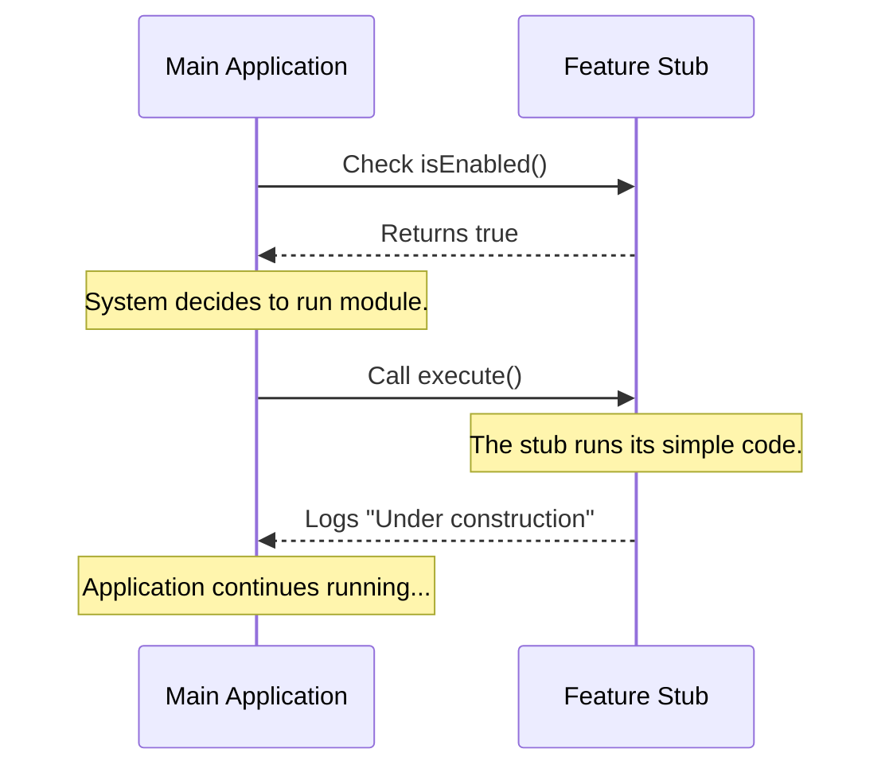

# Chapter 5: Feature Stubbing

Welcome to the final chapter of our beginner series!

In the previous chapter, [Visibility State Management](04_visibility_state_management.md), we learned how to hide our feature from the user menu using the "Theater Curtain" method (`isHidden`).

We now have a feature that is named, configured, disabled, and hidden. It is safe. But currently, it is useless.

What happens if you want to test the connection between the Main Application and your new module, but you haven't written the complex code yet?

## The Problem: The Missing Piece

Imagine you are building a movie set for a Western film. You need a "Saloon" building.

Building a real Saloon with a working bar, kitchen, and upstairs rooms takes months. But the Director needs to start filming the street scene *today*.

**The Solution? A Prop Facade.**

You build the *front* of the building. It has a door. It has a sign. To the camera, it looks 100% real. But if you open the door, there is nothing behind it—just empty space.

In programming, we call this **Feature Stubbing**.

## The Use Case: The "Under Construction" Feature

We want to finalize our "stub" module so the Main Application can actually "run" it without crashing, even though the real work isn't done.

We need to provide a function that *looks* like real logic but performs a very simple, safe action—like printing a message.

## How to Create a Stub

To create a stub, we fulfill the functional part of the [Configuration Contract](01_configuration_contract.md). In our project, the system expects a function called `execute`.

Here is the code for our final `index.js`. We will temporarily turn the feature **ON** so we can see the stub work.

### The Code

```javascript
// index.js
export default {
  name: 'stub',
  isEnabled: () => true, // Switched ON for testing
  isHidden: false,       // Curtain UP for testing

  // This is the Stub
  execute: () => {
    console.log("🚧 This feature is under construction 🚧");
  }
};
```

### Explanation

*   **`execute`**: This is the specific command the Main Application looks for when it wants to run a feature.
*   **`() => { ... }`**: This is the function body.
*   **`console.log(...)`**: instead of calculating taxes or processing video (complex logic), we simply print text.

This satisfies the system. The system asks, "Do you have an `execute` function?" We say, "Yes." The system runs it, and everything stays stable.

## Under the Hood: How it Works

Why does the system accept this "fake" code?

Because the Main Application acts like a generic remote control. It doesn't know *what* the channel is; it just knows how to press the "Play" button.

### The Process (Analogy)

1.  **The Application** checks if the feature is enabled (See [Activation Control (Feature Flagging)](03_activation_control__feature_flagging_.md)).
2.  If yes, the **Application** presses the "Play" button (calls `.execute()`).
3.  **The Module** receives the signal.
4.  **The Module** runs whatever code is inside `execute`.

It does not matter if the code inside is 1 line or 1,000,000 lines. The connection is the same.

### Sequence Diagram

Here is a diagram showing the Main Application interacting with our Stub.



### Internal Implementation

Here is a simplified look at the system code that runs your feature. This code demonstrates why Stubbing prevents crashes.

```javascript
// system-runner.js
import feature from './index.js';

// 1. Check if we should run it
if (feature.isEnabled()) {
  
  // 2. Try to run the logic
  // If we didn't provide 'execute', this line would crash!
  feature.execute(); 

}
```

If we had created the file but *forgot* to add the `execute` function (the Stub), the application would try to press a button that doesn't exist. This would cause a crash (specifically, `TypeError: feature.execute is not a function`).

By providing the Stub, we ensure the "button" exists, even if it doesn't do much yet.

## Why is Feature Stubbing important?

1.  **Placeholder Development:** You can set up the file structure for 50 different features in one day using Stubs, and fill in the real code over the next year.
2.  **Teamwork:** One developer can work on the Main Application (calling `execute`), while another works on the Module (writing `execute`), without blocking each other.
3.  **Error Prevention:** It prevents the "Red Screen of Death" caused by missing functions.

## Conclusion

Congratulations! You have completed the `backfill-sessions` beginner tutorial.

Let's review what we built:
1.  **Contract:** We agreed on a standard file shape ([Chapter 1](01_configuration_contract.md)).
2.  **Identity:** We gave the module a name ([Chapter 2](02_module_identity.md)).
3.  **Activation:** We installed a safety switch ([Chapter 3](03_activation_control__feature_flagging_.md)).
4.  **Visibility:** We learned to hide the button ([Chapter 4](04_visibility_state_management.md)).
5.  **Stubbing:** We built a placeholder facade so the app runs smoothly (This Chapter).

You now understand the architecture of a scalable, modular application. You have created a perfect "empty container" that is ready to be filled with real logic whenever you are ready.

Happy coding!

---

Generated by [Code IQ](https://github.com/adityasoni99/Code-IQ)