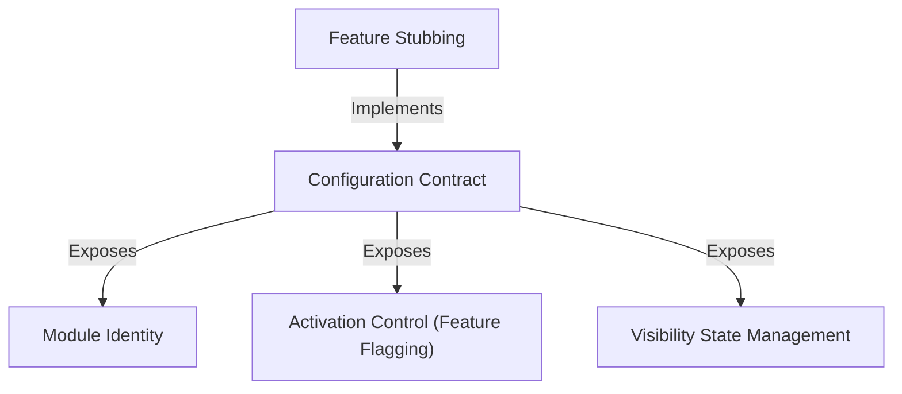

# Tutorial: backfill-sessions

This project establishes a standardized structure for modules, specifically demonstrating **Feature Stubbing** for components that are currently placeholders. It relies on a strict *Configuration Contract* that groups together **Module Identity**, **Visibility State**, and **Activation Control**, ensuring that incomplete features can be safely identified, hidden, and disabled within the system.

## Chapters

1. [Configuration Contract](01_configuration_contract.md)
2. [Module Identity](02_module_identity.md)
3. [Activation Control (Feature Flagging)](03_activation_control__feature_flagging_.md)
4. [Visibility State Management](04_visibility_state_management.md)
5. [Feature Stubbing](05_feature_stubbing.md)

---

Generated by [Code IQ](https://github.com/adityasoni99/Code-IQ)