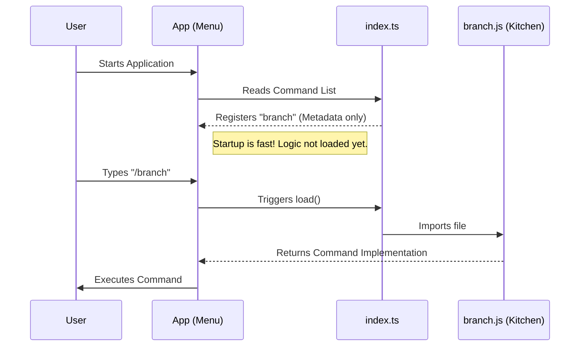

# Chapter 1: CLI Command Registration

Welcome to the **Branch** project! In this first chapter, we are going to learn how to teach our application a new trick. specifically, how to tell the Command Line Interface (CLI) that a command called `branch` exists.

## The Problem: The Restaurant Menu

Imagine you are building a CLI application that acts like a helpful robot. You want to be able to type `/branch` to tell the robot to save your current conversation path.

But right now, the robot doesn't know what `/branch` means. If you type it, the robot will just be confused.

We need a way to list our command in the application's "system" so the user can see it and use it. However, we also want our application to start up extremely fast. We don't want to load all the heavy code for every single command right when the app starts—that would be like a chef cooking every dish on the menu before anyone walks into the restaurant!

**The Solution:** We create a **Command Registration** file. This acts like a **menu**. It tells the system:
1.  "I have a command called 'branch'."
2.  "Here is what it does (description)."
3.  "Only go get the actual code (the recipe) if the user orders it."

## Defining the Command

Let's look at how we define this "menu item" in our code. We do this in a file named `index.ts`.

### Step 1: Basic Information
First, we define the basic identity of our command: its name, a helpful description, and a hint about what arguments it takes.

```typescript
const branch = {
  type: 'local-jsx',
  name: 'branch',
  description: 'Create a branch of the current conversation',
  argumentHint: '[name]',
  // ... more properties later
}
```

**Explanation:**
*   **name**: This is what the user types (e.g., `/branch`).
*   **description**: This shows up when the user asks for "help", telling them what this command does.
*   **argumentHint**: This tells the user they can optionally provide a name, like `/branch my-experiment`.

### Step 2: Lazy Loading (The Chef's Trick)
This is the most important part for performance. Instead of putting the actual logic here, we point to where it lives.

```typescript
// Inside the branch object...
load: () => import('./branch.js'),
```

**Explanation:**
*   **load**: This is a function that runs *only* when the user actually types `/branch`.
*   **import('./branch.js')**: This tells the system to go find the heavy code file (`branch.js`) and load it now. This keeps the application startup lightning fast because we aren't loading code we aren't using yet.

### Step 3: Conditional Aliases
Sometimes, we want a command to answer to multiple names. For example, maybe we want `/fork` to do the same thing as `/branch`.

```typescript
import { feature } from 'bun:bundle'

// Inside the branch object...
// If a specific subagent feature is ON, use no aliases.
// Otherwise, allow 'fork' to trigger this command.
aliases: feature('FORK_SUBAGENT') ? [] : ['fork'],
```

**Explanation:**
*   **aliases**: A list of other names for the command.
*   **Logic**: We check if a feature flag is enabled. If `/fork` is already being used by a "Subagent", we don't use it here. If not, we claim it!

## Putting It All Together

Here is the complete registration block. We add `satisfies Command` at the end. This is a Typescript helper that acts like a spellchecker, ensuring our object has all the required fields (name, description, etc.).

```typescript
import type { Command } from '../../commands.js'

const branch = {
  // ... properties we defined above
  name: 'branch',
  load: () => import('./branch.js'),
} satisfies Command

export default branch
```

## Internal Implementation: How It Works

To help you understand what happens under the hood when you run the app, let's visualize the flow.

1.  The User starts the App.
2.  The App reads the "Menu" (`index.ts`). It sees `branch` exists but **does not** load the heavy code yet.
3.  The User types `/branch`.
4.  The App looks at the menu, sees the `load` function, and executes it.
5.  The `branch.js` file is imported, and the command runs.



## Summary

In this chapter, we learned how to register a command in the CLI without slowing down our application.
*   We defined the **interface** (Name, Description).
*   We used **Lazy Loading** so the code is only loaded when needed.
*   We set up **Aliases** to make the command flexible.

Now that our application knows the command exists and knows how to load it, we need to define what actually happens when that code runs!

In the next chapter, we will look at the code inside `branch.js` to see how the application handles splitting the conversation history.

[Next Chapter: Conversation Forking Logic](02_conversation_forking_logic.md)

---

Generated by [Code IQ](https://github.com/adityasoni99/Code-IQ)