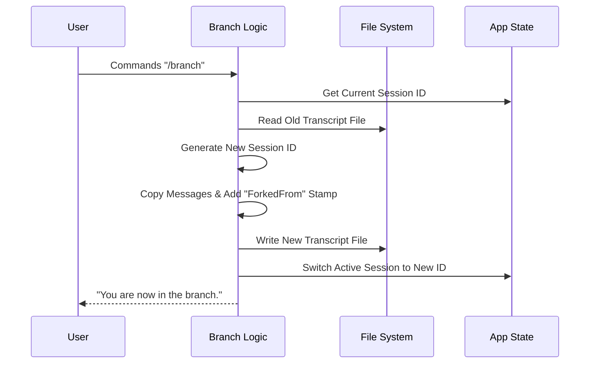

# Chapter 2: Conversation Forking Logic

Welcome back! In [Chapter 1: CLI Command Registration](01_cli_command_registration.md), we learned how to add the `/branch` command to our application's "menu".

Now, we are going to cook the meal. We will explore the logic that runs when the user actually orders that command. We call this **Conversation Forking**.

## The Motivation: The "Save Game" Point

Imagine you are playing a difficult video game. You are about to fight a boss. What do you do? You create a **Save Point**. If you lose, you reload the save. If you win, you continue.

Coding with an AI is similar.
1.  You have a working piece of code.
2.  You want to try a risky refactor or a completely new feature.
3.  If you just keep chatting, you might mess up the context, and it's hard to "undo" the conversation history.

**The Solution:** You type `/branch`. This acts like "Save As..." in a text editor. It takes your current conversation history, copies it, and moves you into a *new* timeline. The original conversation stays safe and untouched.

## Core Concepts

Before we look at the code, let's understand the three ingredients needed to fork a conversation:

1.  **Session ID**: Every conversation has a unique ID (like a passport number). To create a branch, we need to generate a *new* ID.
2.  **Transcript**: This is the log of every message sent between you and the AI. We need to read the old log and write it to a new file.
3.  **Lineage**: To keep things organized, we want to stamp the new conversation with a note saying, "I was born from Session X."

## How It Works: The High-Level Flow

When you run `/branch`, the application performs a specific sequence of events.



## Internal Implementation

Let's look at the code inside `branch.ts`. We will break the `createFork` function down into small, digestible pieces.

### Step 1: Preparation

First, we need to figure out who we are (Current ID) and who we want to be (New ID).

```typescript
// Inside createFork function...
const forkSessionId = randomUUID() // Generate a brand new ID
const originalSessionId = getSessionId() // Get the ID we are copying from

// Calculate file paths
const forkSessionPath = getTranscriptPathForSession(forkSessionId)
const currentTranscriptPath = getTranscriptPath()
```

**Explanation:**
*   `randomUUID()` creates a unique string like `a1b2-c3d4...`. This determines the identity of our new timeline.
*   We prepare the file paths so we know where to read from and where to write to.

### Step 2: Reading the History

Next, we read the existing conversation into memory.

```typescript
// Read the raw text of the current conversation
const transcriptContent = await readFile(currentTranscriptPath)

// Parse the text into a list of objects (messages)
const entries = parseJSONL(transcriptContent)
```

**Explanation:**
*   The transcript is stored as a JSONL file (JSON Lines).
*   We read the file and convert it into a JavaScript array called `entries`. Now we have the entire history in memory.

### Step 3: Stamping the Lineage (The Logic Core)

This is the most critical part. We don't just copy the messages; we modify them slightly. We want to update the `sessionId` on every message to match our *new* fork, and we want to add a `forkedFrom` property.

```typescript
for (const entry of entries) {
  // Create a copy of the message (forkedEntry)
  const forkedEntry = {
    ...entry,
    sessionId: forkSessionId, // Switch to the NEW ID
    forkedFrom: {             // The "Passport Stamp"
      sessionId: originalSessionId,
      messageUuid: entry.uuid,
    },
  }
  // Add to our list of lines to write
  lines.push(jsonStringify(forkedEntry))
}
```

**Explanation:**
*   We loop through every message in the history.
*   `...entry`: We copy all existing data (text, author, timestamp).
*   `sessionId`: We overwrite the old ID with the new `forkSessionId`. Now this message belongs to the new timeline.
*   `forkedFrom`: We add metadata linking back to the parent. This allows us to trace the family tree of conversations later.

### Step 4: Writing the New File

Finally, we save this new timeline to the disk.

```typescript
// Write the new list of lines to a new file
await writeFile(forkSessionPath, lines.join('\n') + '\n', {
  encoding: 'utf8',
  mode: 0o600, // Secure read/write permissions
})

return { sessionId: forkSessionId, forkPath: forkSessionPath }
```

**Explanation:**
*   We take our processed lines, join them with newlines, and write them to `forkSessionPath`.
*   The user is now ready to switch to this file!

## Solving Name Collisions

What if you branch a conversation that is already a branch? We want the names to be friendly, like "My Project (Branch)" and "My Project (Branch 2)".

We use a helper function `getUniqueForkName` to handle this logic.

```typescript
async function getUniqueForkName(baseName: string): Promise<string> {
  const candidate = `${baseName} (Branch)`
  
  // Check if "My Project (Branch)" already exists
  const exists = await searchSessionsByCustomTitle(candidate, { exact: true })
  
  if (!exists) return candidate
  
  // If it exists, we start counting: Branch 2, Branch 3...
  // (Logic continues to loop until a free number is found)
}
```

**Explanation:**
*   This ensures we never accidentally overwrite an existing branch or create confusing duplicate names. It automatically increments a number counter for us.

## How to Use This Abstraction

Now that we understand the logic, here is how the main command handler uses it to solve our "Save Point" problem.

```typescript
export async function call(onDone, context, args) {
  // 1. Run the heavy logic we defined above
  const result = await createFork(args) // args is the optional custom name

  // 2. Generate a unique name for the user to see
  const title = await getUniqueForkName(result.title)

  // 3. Switch the active application context to the new session
  await context.resume(result.sessionId, /* ... */)

  // 4. Tell the user
  onDone(`Branched conversation. You are now in "${title}".`)
}
```

**What happens for the user:**
1.  User types: `/branch Experiment A`
2.  System creates a new file.
3.  System calculates the name "Experiment A (Branch)".
4.  System seamlessly reloads the app context into this new file.
5.  User continues typing, safe in the knowledge that the original chat is untouched.

## Summary

In this chapter, we explored the **Conversation Forking Logic**. We learned:
*   **Why we fork:** To experiment safely without losing context.
*   **How we fork:** By reading the transcript, generating a new Session ID, stamping the messages with lineage data, and writing a new file.
*   **Safety:** We use collision detection to ensure every branch has a unique name.

However, we simply glossed over *how* exactly these files are structured and saved. We mentioned "JSONL" and "Transcript Paths," but we didn't explain the underlying system that manages these files on your hard drive.

In the next chapter, we will dive deep into how the application permanently stores your conversations.

[Next Chapter: Transcript Persistence Model](03_transcript_persistence_model.md)

---

Generated by [Code IQ](https://github.com/adityasoni99/Code-IQ)