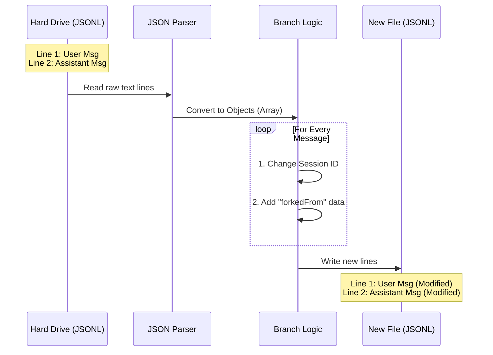

# Chapter 3: Transcript Persistence Model

Welcome back! In [Chapter 2: Conversation Forking Logic](02_conversation_forking_logic.md), we learned the logic behind creating a new timeline. We talked about "reading the transcript" and "writing a new file."

But what exactly **is** that file?

In this chapter, we explore the **Transcript Persistence Model**. This is the system's long-term memory. It explains how your conversation is saved to your hard drive so that if you close the application (or crash it), your chat history isn't lost forever.

## The Motivation: The Ship's Logbook

Imagine a captain of a ship. They don't write a brand new book every time something happens. instead, they add a new entry to the bottom of the current page.

**Event 1:** "Left port at 8 AM."
**Event 2:** "Spotted a whale."
**Event 3:** "Dropped anchor."

This is how our application saves data.

### The Problem with Standard JSON
Standard JSON files usually look like a big list: `[Item A, Item B, Item C]`.
To add `Item D`, the computer has to:
1.  Read the whole list.
2.  Add the item.
3.  Rewrite the *entire* list back to the file.

As your conversation gets long, this gets slow and dangerous. If the computer crashes while rewriting the file, you lose *everything*.

### The Solution: JSON Lines (JSONL)
We use a format called **JSONL**. It is very simple: **One Line = One Event**.

To add a message, we simply append one line of text to the end of the file. It is fast, safe, and efficient.

## The Data Structure

Let's look at what these lines actually contain. The system uses a specific "shape" (or Type) for these messages.

In our code, we use a type called `TranscriptMessage`.

### 1. The Anatomy of a Message
Here is what a single line in our logbook looks like when formatted nicely:

```json
{
  "type": "message",
  "role": "user",
  "content": "Hello, how does this work?",
  "uuid": "550e8400-e29b...",
  "sessionId": "session-123",
  "timestamp": 1678900000
}
```

**Explanation:**
*   **role**: Who is talking? (User or Assistant).
*   **content**: What did they say?
*   **uuid**: A unique ID for this specific message.
*   **sessionId**: Which conversation does this belong to?

### 2. The Anatomy of a Fork
When we use the `/branch` command, we take a message like the one above and add a "sticky note" to it. This note says: "I came from an older session."

In the code, this structure is defined as:

```typescript
type TranscriptEntry = TranscriptMessage & {
  // The "Sticky Note"
  forkedFrom?: {
    sessionId: string  // The ID of the parent conversation
    messageUuid: UUID  // The ID of the specific message we copied
  }
}
```

## How It Works: The Flow

When you run `/branch`, the application acts like a historian copying old records into a new book.



## Internal Implementation

Let's look at how `branch.ts` interacts with this model.

### Step 1: Parsing the Logbook
We don't read the file manually; we use a helper called `parseJSONL`. This takes the raw text from the disk and turns it into usable JavaScript objects.

```typescript
// Read the raw file from the disk
const transcriptContent = await readFile(currentTranscriptPath)

// Convert raw lines into an array of objects
// We use the <Entry> generic to tell Typescript what shape to expect
const entries = parseJSONL<Entry>(transcriptContent)
```

**Beginner Note:** `parseJSONL` splits the file by newlines (`\n`) and runs `JSON.parse()` on every line. If a line is broken, it skips it safely.

### Step 2: Filtering the History
Sometimes a logbook has "scratchpad" notes we don't need to copy. The system filters these out to ensure the new branch is clean.

```typescript
// Only keep "TranscriptMessage" types
// And ignore "sidechains" (temporary thinking scratchpads)
const mainConversationEntries = entries.filter(
  (entry): entry is TranscriptMessage =>
    isTranscriptMessage(entry) && !entry.isSidechain,
)
```

**Explanation:**
*   `isTranscriptMessage`: A check to make sure this is a chat message, not a system error log.
*   `!entry.isSidechain`: We don't copy temporary "thought loops" the AI might have had. We only want the main chat.

### Step 3: Serializing (Preparing to Write)
After we modify the messages (changing their IDs), we need to turn them back into text strings to write them to the new file.

```typescript
const lines: string[] = []

for (const entry of mainConversationEntries) {
    // ... logic to update IDs happens here ...

    // Convert the object back into a text string
    lines.push(jsonStringify(forkedEntry))
}
```

**Explanation:**
*   `jsonStringify`: This is a safe version of `JSON.stringify`. It turns our JavaScript object back into a text string like `{"role": "user"...}`.

### Step 4: Saving to Disk
Finally, we write the new logbook. We join all the lines with a newline character (`\n`).

```typescript
// Join lines with "Enter" key and write to the new path
await writeFile(forkSessionPath, lines.join('\n') + '\n', {
  encoding: 'utf8',
  mode: 0o600, // Security: Only the owner can read this file
})
```

**Explanation:**
*   `lines.join('\n')`: Stacks our JSON pancakes on top of each other.
*   `mode: 0o600`: This is a permission setting. It ensures that other users on your computer cannot read your private AI conversations.

## Summary

In this chapter, we learned about the **Transcript Persistence Model**.

*   **The Format:** We use **JSONL** (JSON Lines) because it is like a ship's logbook—easy to append to and safe against crashes.
*   **The Structure:** Each line is a `TranscriptMessage` containing the role, content, and IDs.
*   **The Transformation:** When branching, we parse these lines, modify their metadata (adding `forkedFrom`), and write them to a new file.

We have successfully covered how the text of the conversation is saved. But a conversation is more than just text! What about the complex data, like the results of tools the AI used, or hidden state?

In the next chapter, we will look at how we preserve the *context* of the conversation, not just the words.

[Next Chapter: State & Metadata Preservation](04_state___metadata_preservation.md)

---

Generated by [Code IQ](https://github.com/adityasoni99/Code-IQ)