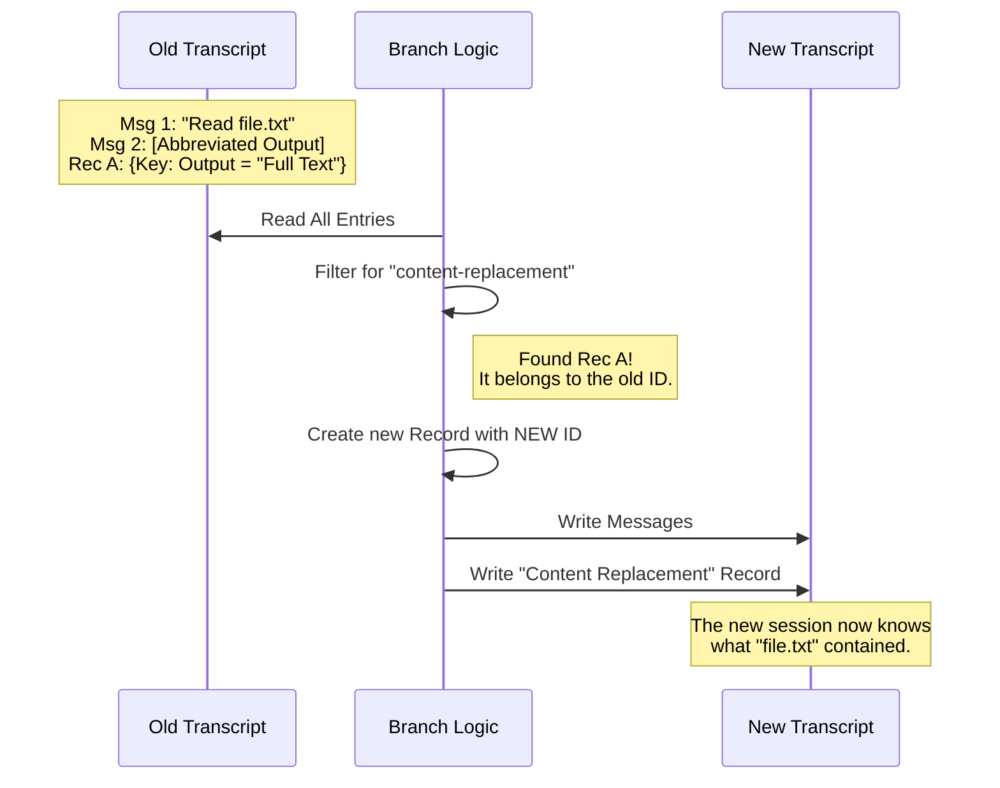

# Chapter 4: State & Metadata Preservation

Welcome back! In [Chapter 3: Transcript Persistence Model](03_transcript_persistence_model.md), we learned how to copy the raw text of a conversation into a new file using JSONL.

However, a conversation with an AI is more than just text bubbles. In this chapter, we will learn about **State & Metadata Preservation**.

## The Problem: The "Moving Office" Analogy

Imagine you are moving your business to a new office.
1.  **The Messages:** These are the files on your desk. You pack them up and move them.
2.  **The Metadata:** This is the filing cabinet index. It tells you that "Document A" is actually stored in "Warehouse B".

If you move the files but lose the index, you might look at a document that says "See Reference X," but you won't know where Reference X is!

**In our Application:**
Sometimes, the AI reads a huge file (like a 10,000-line error log). To save money and speed, we don't paste that whole log into every single future message. Instead, we "abbreviate" it or "freeze" it, keeping a reference to the full text in the background.

If we create a **Branch** but forget to copy these background references, the new session will have "amnesia." It will see the abbreviation but won't recall what the data actually was.

## Core Concept: Content Replacement

We call this system **Content Replacement**. It is a way of tracking large tool outputs that were abbreviated to save space.

When we fork a conversation, we must ensure these "memories" are copied over to the new Session ID.

## How It Works: The Flow

We need to scan the old file not just for messages, but for these special "replacement" records.



## Internal Implementation

Let's look at how we handle this in the code. We are still working inside `branch.ts`.

### Step 1: Hunting for Treasure
First, we look through the list of entries we parsed from the file. We are looking for objects with the type `content-replacement`.

```typescript
// Filter entries to find "content-replacement" types
const contentReplacementRecords = entries
  .filter(entry => 
    entry.type === 'content-replacement' &&
    entry.sessionId === originalSessionId, // Only from the parent session
  )
  // Combine them into a single list
  .flatMap(entry => entry.replacements)
```

**Explanation:**
*   `entries`: This is the raw list of everything in the old file.
*   `.filter`: We ignore normal chat messages here. We only want the special records.
*   `.flatMap`: Sometimes there are multiple replacement records. We flatten them into one simple list of "memories" to carry over.

### Step 2: Re-Packaging the Memories
Now that we have the list of memories, we need to package them up for the *new* session.

Why? Because the old records are stamped with the *old* Session ID. If we don't update them, the new session (which has a new ID) will ignore them.

```typescript
// If we found any memories, prepare them for the new file
if (contentReplacementRecords.length > 0) {
  const forkedReplacementEntry = {
    type: 'content-replacement',
    sessionId: forkSessionId, // <--- CRITICAL: The New ID
    replacements: contentReplacementRecords,
  }
  
  // Add this special line to our list of lines to write
  lines.push(jsonStringify(forkedReplacementEntry))
}
```

**Explanation:**
*   We create a new object of type `content-replacement`.
*   We attach the `forkSessionId` (the ID of our new branch).
*   We attach the `replacements` (the actual data we found in Step 1).
*   We turn it into a string and add it to the file buffer, just like a chat message.

### Step 3: Why This Matters (The Consequence)

If we skipped this code block:
1.  You run `/branch`.
2.  You ask the AI: "Can you fix the bug in that file you just read?"
3.  The AI looks at its history. It sees a note saying `[File Content Omitted]`.
4.  It looks for the "content replacement" record to fill in the blank.
5.  **It finds nothing.**
6.  The AI says: "I don't know what file you are talking about. Please show it to me again."

By adding these few lines of code, we preserve the AI's "short-term memory" across different branches.

## Summary

In this chapter, we learned that a conversation is more than just words on a screen.
*   **Hidden State:** Applications often store metadata (like abbreviated file contents) in the background.
*   **Preservation:** When we branch, we must identify, copy, and re-stamp this metadata with the new Session ID.
*   **Result:** The AI maintains full context, preventing hallucinations or data loss.

Now we have a perfectly preserved conversation with a new ID and full memory. But... what do we call it? "Session a1b2-c3d4" is not a very pretty name.

In the next chapter, we will learn how to give our new branch a human-readable name automatically.

[Next Chapter: Dynamic Session Naming](05_dynamic_session_naming.md)

---

Generated by [Code IQ](https://github.com/adityasoni99/Code-IQ)