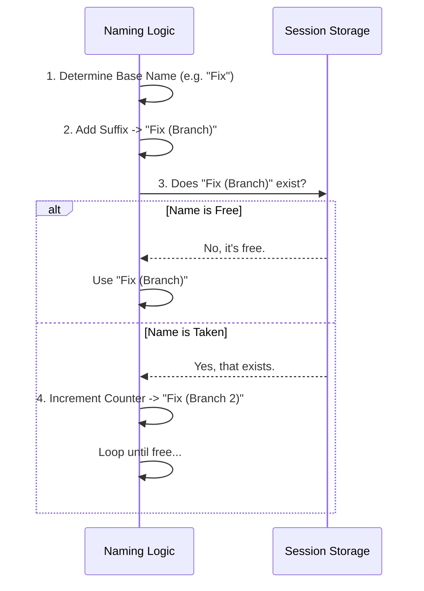

# Chapter 5: Dynamic Session Naming

Welcome to the final chapter of our series!

In [Chapter 4: State & Metadata Preservation](04_state___metadata_preservation.md), we ensured that when we fork a conversation, we preserve all the complex "hidden" data and tool outputs. We have a perfect digital clone of the conversation history.

However, we are left with one human problem: **What do we call this new file?**

In this chapter, we will explore **Dynamic Session Naming**. We will learn how the system automatically generates readable, unique titles for your branches (like "React Fix (Branch 2)") so you never have to worry about accidentally overwriting your work.

## The Motivation: The "New Folder" Problem

Imagine you are on your computer's desktop. You right-click and create a "New Folder."
What happens if you do it again?
The operating system doesn't scream at you or crash. It simply names the second one "New Folder (2)."

**The Problem:**
1.  **Lazy Naming:** Users often don't want to type a specific name like `/branch fix-login-bug-v2`. They just want to type `/branch` and keep working.
2.  **Collisions:** If you branch "Project A" twice, you don't want the second branch to overwrite the first one.
3.  **Readability:** The system uses IDs like `a1b2-c3d4` internally. These are great for computers, but terrible for humans. You want to see "Project A (Branch)," not "Session a1b2."

**The Solution:**
We create a utility that acts like the Operating System. It looks at the existing files, spots duplicates, and automatically appends a counter (1, 2, 3...) to ensure every branch has a unique identity.

## Core Concepts

There are three steps to generating a good name.

### 1. Deriving the Base Name
If the user provides a name (e.g., `/branch MyTest`), we use that.
But if they leave it blank, we look at the **First Prompt** of the conversation. We take the first few words of the very first message you sent (e.g., "Write a poem about cats") and use that as the title.

### 2. The Branch Suffix
To distinguish the copy from the original, we always append a suffix.
*   Original: `Write a poem`
*   Fork: `Write a poem (Branch)`

### 3. Collision Detection
Before saving, we check our database of sessions.
*   Does "Write a poem (Branch)" exist?
*   **No:** Use it.
*   **Yes:** Try "Write a poem (Branch 2)".
*   **Still Yes:** Try "Write a poem (Branch 3)".

## How It Works: The High-Level Flow

Here is what happens when the naming utility runs:



## Internal Implementation

Let's look at the code inside `branch.ts` to see how this is implemented.

### Step 1: Guessing the Title (`deriveFirstPrompt`)
First, we need a fallback name if the user didn't provide one. We look at the first message in the chat history.

```typescript
export function deriveFirstPrompt(firstUserMessage): string {
  // 1. Get the text content of the message
  const content = firstUserMessage?.message?.content
  
  if (!content) return 'Branched conversation'

  // 2. Clean it up: Remove extra spaces and newlines
  // 3. Cut it off at 100 characters so the title isn't huge
  return content.replace(/\s+/g, ' ').trim().slice(0, 100) 
}
```

**Explanation:**
*   **`firstUserMessage`**: The very first thing you typed in the chat.
*   **`replace(/\s+/g, ' ')`**: If you pasted a 50-line error log, this squashes all those newlines into single spaces so the title fits on one line.

### Step 2: Handling Collisions (`getUniqueForkName`)
This is the "smart" part of the system. It ensures we never overwrite data.

First, we check the most obvious name:

```typescript
async function getUniqueForkName(baseName: string): Promise<string> {
  const candidateName = `${baseName} (Branch)`

  // Check the storage: Is this name taken exactly?
  const exists = await searchSessionsByCustomTitle(candidateName, { exact: true })

  // If nobody is using it, we take it!
  if (exists.length === 0) {
    return candidateName
  }
  
  // ... otherwise, we need to count.
}
```

### Step 3: The Counting Loop
If the basic name is taken, we look for existing numbered branches to find the next available slot.

```typescript
// ... inside getUniqueForkName

// Find all existing sessions that look like "Name (Branch X)"
const existingForks = await searchSessionsByCustomTitle(`${baseName} (Branch`)

// Create a list of numbers that are already taken
const usedNumbers = new Set<number>() 

// (Complex logic here extracts numbers like 2, 3, 4 from the names)
// ...

// Find the first free number
let nextNumber = 2
while (usedNumbers.has(nextNumber)) {
  nextNumber++ // If 2 is taken, try 3...
}

return `${baseName} (Branch ${nextNumber})`
```

**Explanation:**
*   **`searchSessionsByCustomTitle`**: This searches our persistent storage (which we discussed in [Chapter 3: Transcript Persistence Model](03_transcript_persistence_model.md)).
*   **`while` loop**: This keeps counting up until it finds a number that isn't in the `usedNumbers` list.

### Step 4: Saving the Result
Finally, back in the main command function, we save this new title to the session metadata.

```typescript
// 1. Get the base name (User input OR first prompt)
const baseName = customTitle ?? firstPrompt

// 2. Calculate the unique name (e.g., "Project (Branch 2)")
const effectiveTitle = await getUniqueForkName(baseName)

// 3. Save it permanently to disk
await saveCustomTitle(sessionId, effectiveTitle, forkPath)
```

**Beginner Note:** `saveCustomTitle` writes a small metadata file next to the transcript so the application remembers "Session 550e84..." is actually named "Project (Branch 2)".

## Conclusion

Congratulations! You have completed the **Branch** project tutorial.

In this series, we have built a complete feature from scratch:
1.  **[Command Registration](01_cli_command_registration.md):** We taught the CLI to recognize `/branch`.
2.  **[Forking Logic](02_conversation_forking_logic.md):** We learned how to manipulate Session IDs to create new timelines.
3.  **[Persistence](03_transcript_persistence_model.md):** We explored the JSONL file format for safe data storage.
4.  **[State Preservation](04_state___metadata_preservation.md):** We ensured hidden tool outputs were carried over.
5.  **Dynamic Naming:** We gave our branches human-readable, unique names.

You now understand the full lifecycle of a complex CLI feature, from the user typing a command to the bits being written on the hard drive. Happy coding!

---

Generated by [Code IQ](https://github.com/adityasoni99/Code-IQ)