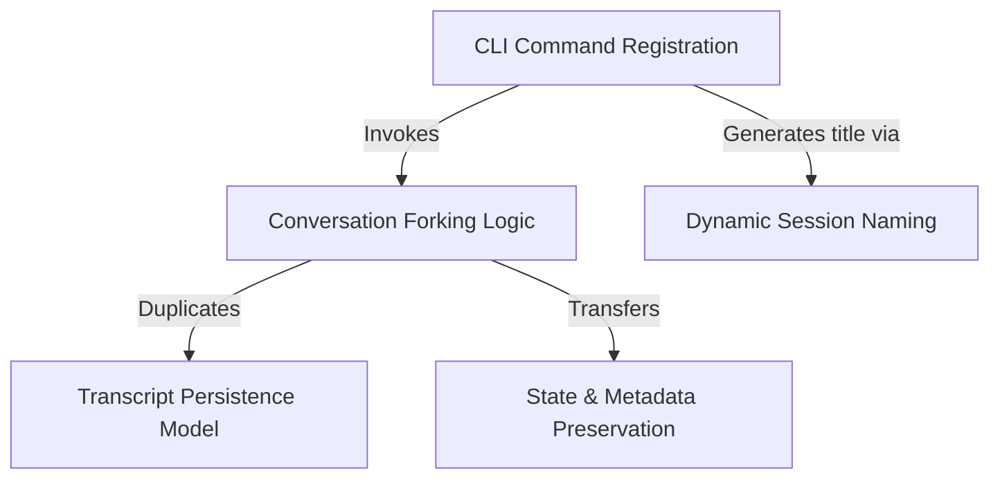

# Tutorial: branch

This project enables users to **branch** an active chat session into a new, divergent timeline. It allows for *risk-free experimentation* by duplicating the conversation history and internal state (such as tool outputs) into a separate file, ensuring the **original session** remains untouched while the user explores a new direction in the copy.

## Chapters

1. [CLI Command Registration](01_cli_command_registration.md)
2. [Conversation Forking Logic](02_conversation_forking_logic.md)
3. [Transcript Persistence Model](03_transcript_persistence_model.md)
4. [State & Metadata Preservation](04_state___metadata_preservation.md)
5. [Dynamic Session Naming](05_dynamic_session_naming.md)

---

Generated by [Code IQ](https://github.com/adityasoni99/Code-IQ)