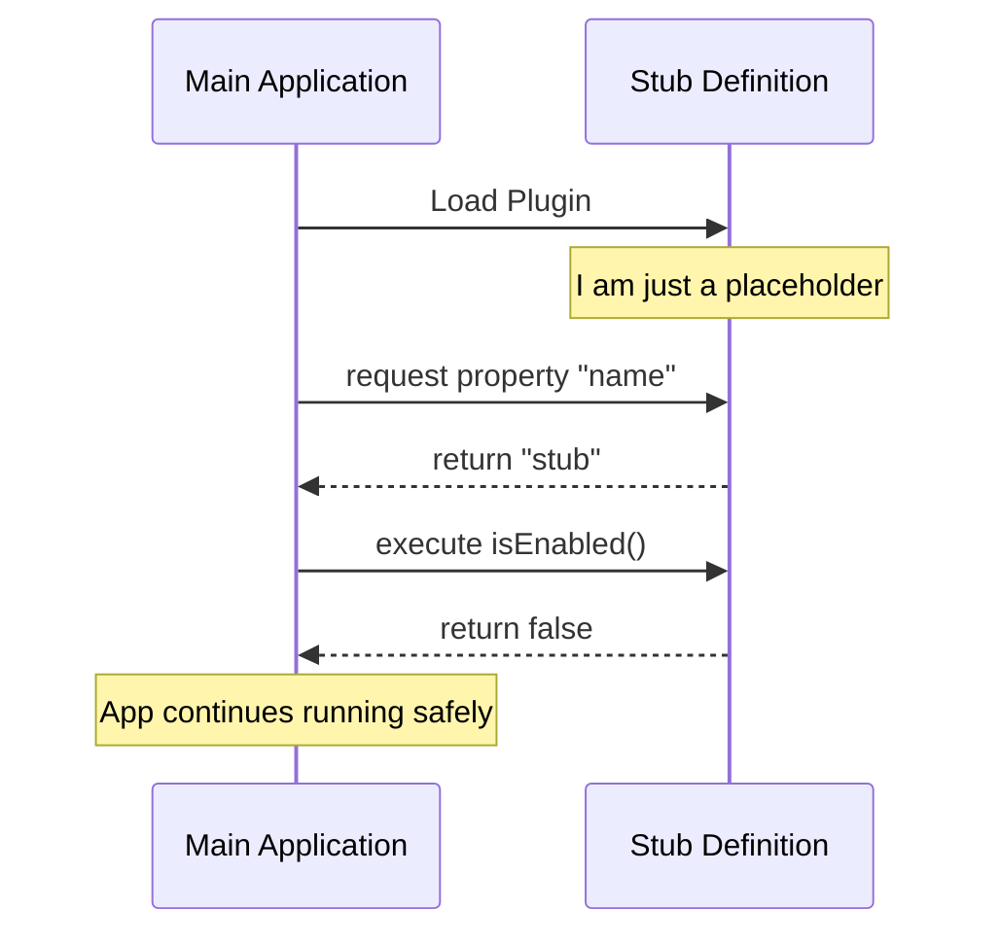

# Chapter 1: Stub Definition

Welcome to the **break-cache** project! 

In this first chapter, we are going to explore the foundation of our plugin: the **Stub Definition**. Before we add complex logic or fancy features, we need to make sure our code sits safely inside the main application without breaking anything.

## Why do we need a Stub?

Imagine you are building a new store in a shopping mall. You've rented the space, and the mall directory needs to list your shop. However, you aren't ready to sell products yet. 

Do you leave a gaping hole in the wall? No. You put up a nice **"Coming Soon"** sign. 

In software, a **Stub** acts like that sign. It is a "dummy" object that fits into the system. It tells the main application, "I am here, I follow the rules, but I'm not doing any active work right now."

### The Use Case

Let's say our main application loads a list of plugins. The application expects **every** plugin to answer three specific questions:
1. What is your name?
2. Are you turned on?
3. Should I show you in the menu?

If a plugin fails to answer these questions, the application might crash (throw an error). Our goal is to create a safe, default object that answers these questions politely so the app keeps running smoothly.

## Creating the Stub

Let's look at how we define this stub in code. We are going to create a simple Javascript object that satisfies the application's requirements without actually doing any heavy lifting.

### The Code

Here is the code for our `index.js` file. This is the entry point of our package.

```javascript
// File: index.js
export default { 
  isEnabled: () => false, 
  isHidden: true, 
  name: 'stub' 
};
```

**What just happened?**
1.  **`export default`**: We are exporting a single object that the main app can import.
2.  **`name: 'stub'`**: We identify ourselves. This acts like an ID card.
3.  **`isEnabled: ...`** and **`isHidden: ...`**: These are the default answers we give to the application.

### Understanding the Input and Output

Even though this is a static object, let's imagine how the Main Application interacts with it.

**Example Scenario:**
The Main Application loops through all plugins and checks them.

```javascript
// Imagine this is the Main App code checking our stub
import myPlugin from './index.js';

// Question 1: What is your name?
console.log(myPlugin.name); 
// Output: 'stub'
```

**What happened:** The app successfully read our name. It knows who we are.

```javascript
// Question 2: Are you enabled?
const active = myPlugin.isEnabled();

console.log(active);
// Output: false
```

**What happened:** We told the app, "No, I am not active." This is the safe default state. We aren't running any logic yet.

## Internal Implementation: Under the Hood

To understand how this stub fits into the bigger picture, let's visualize the conversation between the **Main App** and our **Stub**.

### The Flow of Control

When the system starts, it "plugs in" our code. It performs a safety check.



### Deep Dive: Properties

Let's break down the implementation details of the object properties defined in `index.js`.

#### 1. The Identity
```javascript
name: 'stub'
```
This is a simple string. It prevents the system from labeling our plugin as `undefined`. It identifies the nature of this object—it is explicitly a stub.

#### 2. The Behavior Flag
```javascript
isEnabled: () => false
```
This is a **function** that returns a boolean. We use a function here (instead of just `false`) because in the future, we might want to calculate this based on settings. For now, we hard-code it to `false` to ensure the plugin starts in a safe, "off" mode.

We will expand on how to make this dynamic in [Chapter 2: Feature State Control](02_feature_state_control.md).

#### 3. The Visibility Flag
```javascript
isHidden: true
```
This is a simple boolean property. It tells the User Interface (UI) not to render any buttons or menus for this plugin. Since it is a stub, there is nothing for the user to interact with.

We will learn how to configure this in [Chapter 3: Visibility Configuration](03_visibility_configuration.md).

## Conclusion

In this chapter, we learned that a **Stub Definition** is crucial for system stability. It acts like a "dummy plug" or a "Coming Soon" sign—it occupies the space and follows the rules (the interface) so the main application doesn't crash, but it doesn't perform any logic yet.

Now that we have a safe placeholder, we need to learn how to control when our plugin actually turns **on**.

[Next Chapter: Feature State Control](02_feature_state_control.md)

---

Generated by [Code IQ](https://github.com/adityasoni99/Code-IQ)