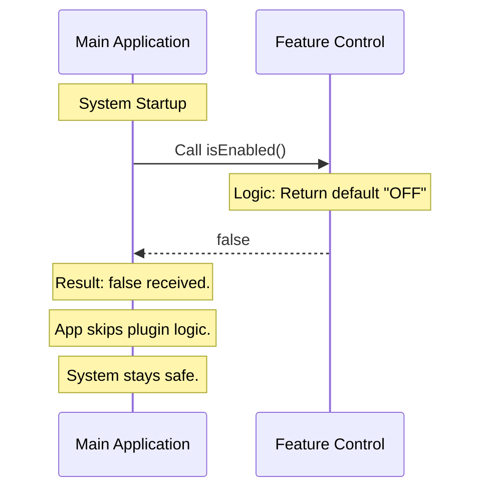

# Chapter 2: Feature State Control

Welcome back! In [Chapter 1: Stub Definition](01_stub_definition.md), we built a "Stub"—a safe placeholder object that identifies our plugin to the main application.

However, a placeholder shouldn't actually *do* anything yet. In this chapter, we are going to focus on **Feature State Control**. We will learn how to explicitly tell the system, "I am here, but I am turned off."

## The Master Circuit Breaker

Imagine you have a powerful electric saw in your workshop. It is plugged into the wall, but there is a safety trigger on the handle. Unless you press that trigger, the blade won't spin.

The `isEnabled` method is that safety trigger.

### The Problem

If our plugin is loaded by the main application, the application might try to execute our code immediately. If our code isn't ready or is buggy, we could crash the whole system.

We need a way to keep the plugin "plugged in" (loaded) but "powered down" (inert).

### The Solution

We use a method called `isEnabled`. By forcing this method to return `false`, we create a **Master Circuit Breaker**. It guarantees that no matter what else is in the file, the electricity (logic) stops here.

## Using the Abstraction

Let's look at how we implement this control switch in our code. We are modifying the `isEnabled` property of our default object.

### The Code

We define `isEnabled` as a function that immediately returns `false`.

```javascript
// File: index.js
export default {
  // ... other properties ...
  
  // The Safety Switch
  isEnabled: () => false,
  
  // ... other properties ...
};
```

**Beginner Explanation:**
1.  **`isEnabled`**: This is the name of the switch the application looks for.
2.  **`() => false`**: This is a small arrow function (a mini-command). It takes no input (`()`) and immediately sends back `false`. It's like a guard at the door who tells everyone "Closed."

### Input and Output

Let's simulate what happens when the Main Application tries to use our plugin.

**Example Input:**
The application calls our function.

```javascript
// The Main App checks the switch
const shouldRun = myPlugin.isEnabled();
```

**Example Output:**
The variable `shouldRun` becomes `false`.

**Result:**
Because the result is `false`, the Main Application decides **not** to initialize our features. It sees the plugin, nods, and moves on to the next one without running any dangerous code.

## Internal Implementation: Under the Hood

How does this flow work logically? Let's visualize the "handshake" between the Application and our Feature State Control.

### The Flow of Control

The application performs a "Pulse Check" before running anything.



### Deep Dive: Why a Function?

You might wonder: *Why don't we just set `isEnabled: false`? Why make it a function?*

This is a very important design choice.

#### 1. Future Proofing
Right now, we are hard-coding it to `false` because we are building a stub. However, in the future, we might want to turn the plugin on **only** on Tuesdays, or **only** for Admin users.

If `isEnabled` is just a boolean variable, it is static (frozen).
If `isEnabled` is a **function**, it can run logic to decide the answer later!

#### 2. The Code Logic
Here is how the implementation works conceptually:

```javascript
// Conceptual logic inside our plugin
isEnabled: function() {
    // We could check settings here...
    // We could check user permissions here...
    
    // But for now, we enforce a HARD STOP.
    return false; 
}
```

By defining it as a function `() => false` now, we satisfy the system's requirement for a function, ensuring we don't have to rewrite the structure of our object later when we want to make it smart.

## Conclusion

In this chapter, we established **Feature State Control**. We learned that the `isEnabled` method acts like a safety switch or a circuit breaker. By returning `false`, we ensure that our plugin remains inert and harmless, even though it is loaded into the system.

Now that our machinery is safe and turned off, we need to ensure the user doesn't see any confusing buttons or menus for this disabled feature.

[Next Chapter: Visibility Configuration](03_visibility_configuration.md)

---

Generated by [Code IQ](https://github.com/adityasoni99/Code-IQ)