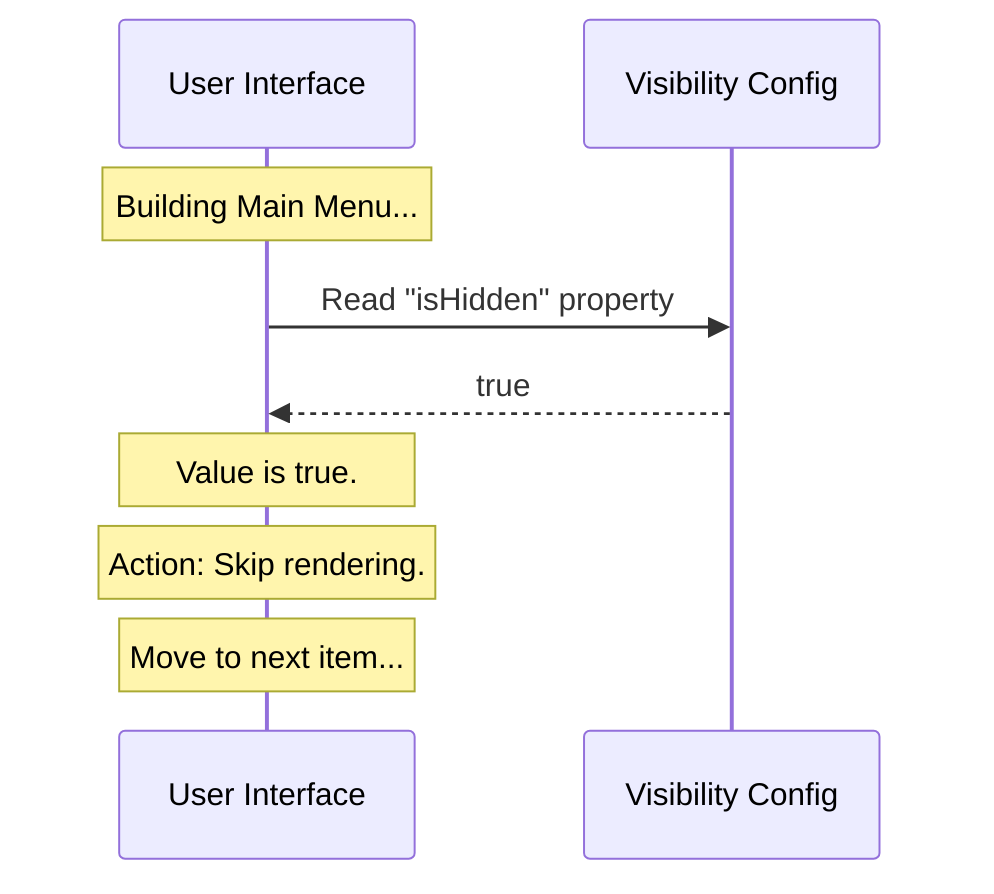

# Chapter 3: Visibility Configuration

Welcome to the third chapter! 

In [Chapter 2: Feature State Control](02_feature_state_control.md), we learned how to use the `isEnabled` switch to safely turn off our plugin's logic. We essentially cut the power to our machine so it doesn't cause accidents.

However, just because a machine is turned off doesn't mean it is invisible. Imagine you have a broken vending machine in a hallway. You unplugged it (Safety), but people keep walking up to it and trying to put coins in (Confusion).

In this chapter, we will solve this by using **Visibility Configuration**. We are going to put a "curtain" over our plugin so users don't see it until it is ready.

## The Problem: UI Clutter

When the Main Application runs, it usually draws a menu, a sidebar, or a list of tools for the user. If our plugin is installed but not ready to be used, we don't want it to show up in that list. 

If it shows up, users might click it, get frustrated that nothing happens, or get confused by an empty screen. We want to keep the interface clean.

### The Solution: The Invisibility Cloak

We use a property called `isHidden`. This simple setting tells the User Interface (UI), "Pretend I am not here."

Think of it like a **"Hidden File"** on your computer. The file exists on the hard drive, and the computer knows it is there, but when you open your folder, you don't see it. This keeps your folder tidy.

## Using the Configuration

Let's apply this to our code. We are going to modify the `isHidden` property in our default object.

### The Code

We set this property to `true` to hide the plugin.

```javascript
// File: index.js
export default {
  // ... other properties ...

  // The Invisibility Cloak
  isHidden: true,
  
  // ... other properties ...
};
```

**Beginner Explanation:**
1.  **`isHidden`**: This is the label the User Interface looks for.
2.  **`true`**: This value confirms that, yes, we want to be hidden. If we set this to `false`, the plugin would appear in menus.

### Input and Output

Let's see how the Main Application uses this information to build the user's screen.

**Example Input:**
The Main Application is building the "Tools Menu." It looks at our plugin.

```javascript
// Main App checking if it should draw a button
if (myPlugin.isHidden === true) {
  // Do NOT draw the button
} else {
  // Draw the button
}
```

**Example Output:**
Because our code says `isHidden: true`, the condition is met.

**Result:**
The application skips our plugin entirely when drawing the menu. The user sees a clean list of working tools, unaware that our "stub" is sitting quietly in the background.

## Internal Implementation: Under the Hood

How does the system decide what to show? Let's visualize the decision-making process of the User Interface.

### The Flow of Visibility

The UI acts like a bouncer at a club. It checks the list before letting anyone onto the dance floor (the screen).



### Deep Dive: Hidden vs. Disabled

It is important to understand the difference between the concept in this chapter and the one in [Chapter 2: Feature State Control](02_feature_state_control.md).

*   **`isEnabled` (Chapter 2):** Controls **Functionality**. (Is the engine running?)
*   **`isHidden` (Chapter 3):** Controls **Display**. (Is the car in the showroom?)

#### Why keep them separate?

You might wonder, "If it is disabled, shouldn't it automatically be hidden?" 

Not always! Here is why we keep them separate in the code:

1.  **Coming Soon Mode:** You might want a feature to be Visible (`isHidden: false`) but Disabled (`isEnabled: false`). This lets you show a greyed-out button that says "feature coming soon," letting users know an update is on the way.
2.  **Background Processes:** You might want a plugin that is Enabled (`isEnabled: true`) but Hidden (`isHidden: true`). This could be a utility that runs silently in the background (like an auto-saver) without needing a menu button.

By explicitly defining `isHidden: true` in our stub, we are choosing the safest combination: **Disabled AND Hidden**.

## Conclusion

In this chapter, we finalized our **Stub Definition**. We learned how to use `isHidden` to keep our work-in-progress code out of the user's sight.

We now have a complete picture of a safe plugin:
1.  It has a **Name** so the system can track it ([Chapter 1](01_stub_definition.md)).
2.  It is **Disabled** so it doesn't run dangerous code ([Chapter 2](02_feature_state_control.md)).
3.  It is **Hidden** so it doesn't confuse the user ([Chapter 3](03_visibility_configuration.md)).

You have successfully built the foundation of the `break-cache` project. Your plugin is now installed, safe, and ready for you to start building real features in the future!

---

Generated by [Code IQ](https://github.com/adityasoni99/Code-IQ)