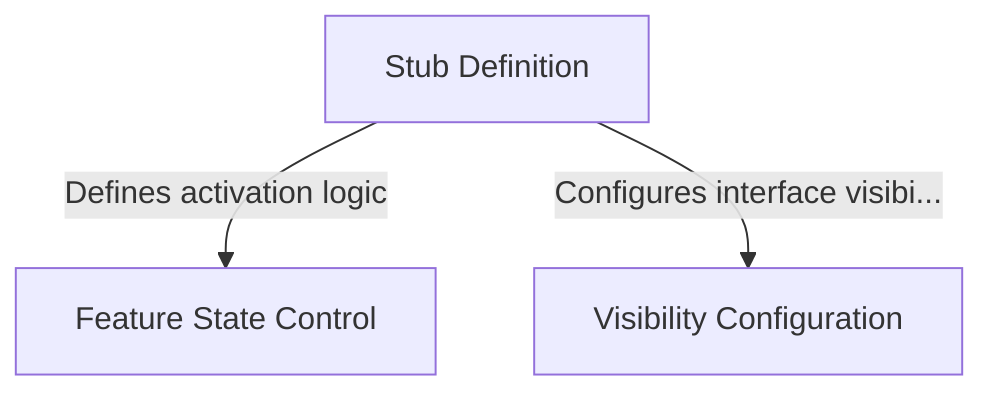

# Tutorial: break-cache

This project serves as a **placeholder** component that is technically present but functionally *inert*. It provides a basic structure that is explicitly **disabled** and **hidden**, ensuring it does not appear in menus or perform any actions until it is updated with real logic.

## Chapters

1. [Stub Definition](01_stub_definition.md)
2. [Feature State Control](02_feature_state_control.md)
3. [Visibility Configuration](03_visibility_configuration.md)

---

Generated by [Code IQ](https://github.com/adityasoni99/Code-IQ)