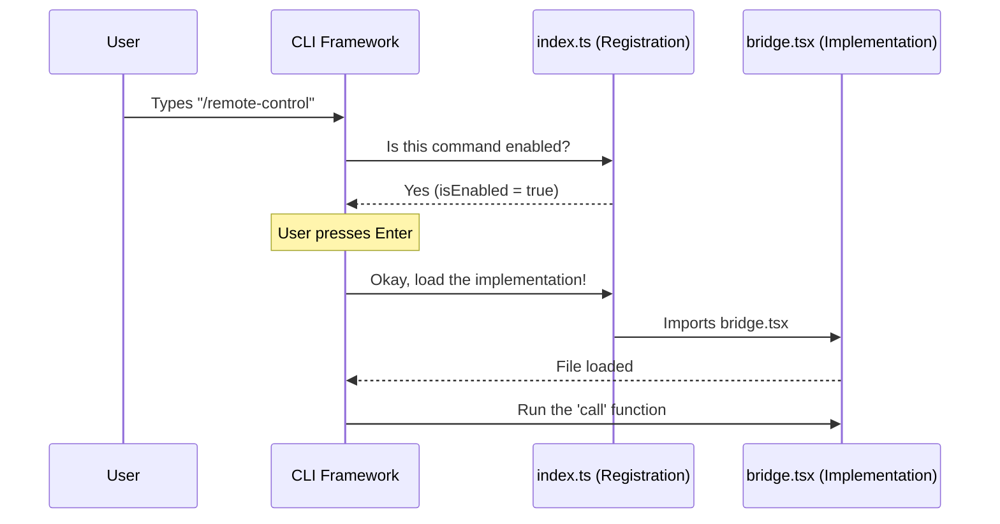

# Chapter 1: CLI Command Registration

Welcome to the **Bridge** project tutorial! In this first chapter, we will learn how to introduce a new feature to a Command Line Interface (CLI) application.

Imagine a large restaurant menu. It lists hundreds of dishes. Does the chef cook every single dish the moment the restaurant opens? No! That would be a waste of resources. Instead, the menu simply **registers** what is available. The cooking only starts when you actually order something.

**CLI Command Registration** works the same way. We need to tell the terminal: *"Hey, if the user types `/remote-control`, here is what you should do."*

### The Use Case
We want a user to be able to type a command to start a "Remote Control" session.

**User Input:**
```bash
/remote-control
```
**OR (using an alias):**
```bash
/rc
```

**System Output:**
The system should verify the command exists, load the necessary code, and start the feature.

---

### Key Concepts

To make this work, we use a file (usually `index.ts`) that acts as the "Menu Entry." It handles three main jobs:

1.  **Identity:** What is the command called?
2.  **Visibility:** Should this command appear in the list? (e.g., is it a beta feature?)
3.  **Lazy Loading:** Don't load the heavy code until the user actually runs the command.

---

### 1. Defining Identity and Metadata

First, we define what the command looks like to the system. This includes its name, shortcuts (aliases), and a helpful description.

```typescript
// From file: index.ts
const bridge = {
  type: 'local-jsx', 
  name: 'remote-control',
  aliases: ['rc'],
  description: 'Connect this terminal for remote-control sessions',
  argumentHint: '[name]',
  // ... more properties below
}
```
**Explanation:**
*   `name`: The primary command (`/remote-control`).
*   `aliases`: Shortcuts (`/rc`).
*   `description`: What shows up when the user asks for help.

### 2. Controlling Visibility (The Bouncer)

Sometimes, features are only for specific users or environments. We don't want to show a command if it won't work. We use a function called `isEnabled` to check "Feature Flags."

```typescript
// From file: index.ts
import { feature } from 'bun:bundle'
import { isBridgeEnabled } from '../../bridge/bridgeEnabled.js'

function isEnabled(): boolean {
  // 1. Check if the global 'BRIDGE_MODE' flag is on
  if (!feature('BRIDGE_MODE')) {
    return false
  }
  // 2. Run specific checks (like version compatibility)
  return isBridgeEnabled()
}
```

**Explanation:**
*   This function acts like a bouncer at a club.
*   If `BRIDGE_MODE` is off, the command effectively doesn't exist.
*   The CLI uses this to decide whether to show the command in the autocomplete list.

### 3. Lazy Loading (The "Just-in-Time" Delivery)

This is the most important part for performance. The logic for the Bridge is complex and heavy. We don't want to load that code every time the user opens the terminal—only when they ask for it.

```typescript
// From file: index.ts
const bridge = {
  // ... previous properties ...
  isEnabled, // Link the bouncer function we wrote above
  
  // Only import the heavy 'bridge.js' file when run!
  load: () => import('./bridge.js'),
} satisfies Command

export default bridge
```

**Explanation:**
*   `load`: This is a function that returns a Promise.
*   `import('./bridge.js')`: This tells the system, "Go find `bridge.js` and read it into memory NOW."
*   Before this line runs, `bridge.js` (and all its complex logic) takes up zero memory.

---

### Under the Hood: The Flow

How does the CLI Framework use this registration object? Let's visualize the conversation between the User, the CLI Framework, and our files.



### The Implementation Entry Point

Once the CLI follows the `load` instruction in `index.ts`, it opens `bridge.tsx`. It looks for a specific function exported as `call`. This is where the actual code begins to execute.

```typescript
// From file: bridge.tsx
import * as React from 'react';

// The CLI calls this function after loading the file
export async function call(onDone, context, args) {
  const name = args.trim() || undefined;
  
  // Render the BridgeToggle component (The actual UI)
  return <BridgeToggle onDone={onDone} name={name} />;
}
```

**Explanation:**
*   `export async function call`: This is the standard entry point the CLI looks for.
*   `args`: Arguments typed by the user (e.g., if they typed `/remote-control my-session`).
*   `<BridgeToggle />`: This is a React component that starts the logic. We will cover this component in the next chapter.

---

### Summary

In this chapter, we learned how to register a command without slowing down our application.
1.  **Registration (`index.ts`)**: Acts as the menu. It defines the name, alias, and visibility.
2.  **Lazy Loading**: Ensures the heavy code is only touched when the command is used.
3.  **Entry Point (`call` in `bridge.tsx`)**: Where the registration hands off control to the actual logic.

Now that our command is registered and the `call` function has launched `<BridgeToggle />`, we need to manage the connection state.

[Next Chapter: Bridge State Controller](02_bridge_state_controller.md)

---

Generated by [Code IQ](https://github.com/adityasoni99/Code-IQ)