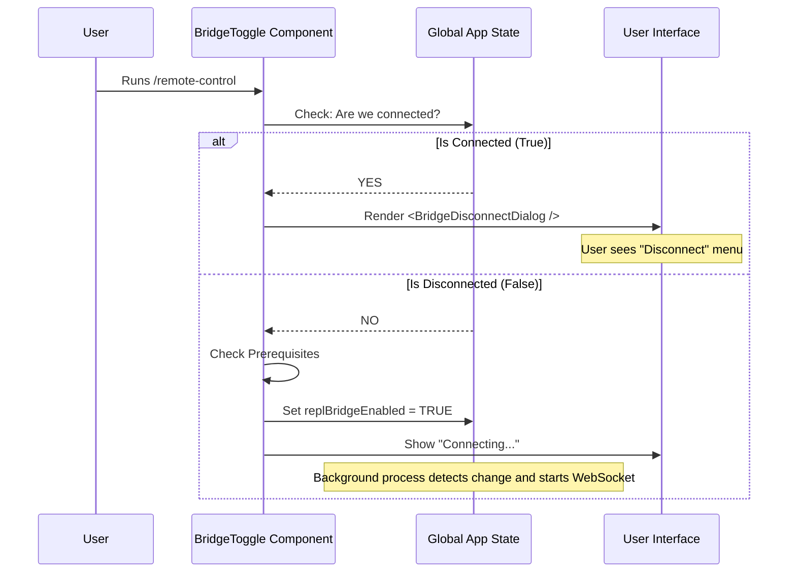

# Chapter 2: Bridge State Controller

Welcome back! In the previous chapter, [CLI Command Registration](01_cli_command_registration.md), we learned how to teach the terminal to recognize the `/remote-control` command.

Now that the command exists, what happens when the user actually presses **Enter**?

This brings us to the **Bridge State Controller**. Think of this component as a **Smart Light Switch**.
*   If the light is **OFF**, pressing the switch turns it on (starts the connection).
*   If the light is **ON**, pressing the switch opens a menu to let you turn it off (disconnect).

This chapter explains how the `BridgeToggle` component acts as this central decision-maker.

---

### The Goal: One Command, Two Behaviors

We want a simplified user experience. We don't want separate commands like `/connect` and `/disconnect`. We want a single entry point: `/remote-control`.

**The Logic Flow:**
1.  **Check Status:** Is the remote control session running?
2.  **Scenario A (Not Running):** Check safety rules, then start the engine.
3.  **Scenario B (Already Running):** Show a menu to manage the session (e.g., Disconnect).

---

### 1. listening to the Global State

To make a decision, our controller first needs to know the current situation. It does this by "hooking" into the application's global state.

```tsx
// Inside BridgeToggle component
import { useAppState } from '../../state/AppState.js';

function BridgeToggle({ onDone, name }) {
  // Ask the global state: "Are we currently connected?"
  const connected = useAppState(s => s.replBridgeConnected);
  const enabled = useAppState(s => s.replBridgeEnabled);
  
  // ... logic continues
}
```

**Explanation:**
*   `useAppState`: This is a tool that lets us peek at the application's memory.
*   `replBridgeConnected`: A boolean (true/false) telling us if the internet connection is active.
*   `replBridgeEnabled`: A boolean telling us if the user *wants* it to be active.

---

### 2. The "Traffic Cop" Logic

Now that we know the state, we can direct the traffic. This happens inside a React `useEffect`, which runs immediately when the command starts.

Here is the decision logic simplified:

```typescript
// Inside the useEffect hook
if (connected || enabled) {
  // SCENARIO B: We are already running!
  // Show the menu to let the user disconnect.
  setShowDisconnectDialog(true);
  return; 
}

// SCENARIO A: We are offline.
// Start the connection process.
connectBridge();
```

**Explanation:**
*   The component checks the variables we fetched in step 1.
*   **If true:** It updates a local piece of state (`setShowDisconnectDialog`) to show the UI.
*   **If false:** It proceeds to the connection logic.

---

### 3. Scenario A: Initiating the Connection

If the bridge is off, we need to turn it on. But before we just flip the switch, we perform a safety check (Prerequisites), and *then* update the global state.

```typescript
const connectBridge = async () => {
  // 1. Run Safety Checks (covered in Chapter 3)
  const error = await checkBridgePrerequisites();
  if (error) {
    onDone(error); // Stop if checks fail
    return;
  }

  // 2. Update Global State to "ON"
  setAppState(prev => ({ 
    ...prev, 
    replBridgeEnabled: true 
  }));
  
  // 3. Tell the user we are working
  onDone("Remote Control connecting…");
};
```

**Explanation:**
*   `checkBridgePrerequisites()`: Ensures the user is logged in and allowed to use this feature.
*   `setAppState`: This is the most critical line. By setting `replBridgeEnabled: true`, we trigger the background machinery (covered in [Global State Integration](04_global_state_integration.md)) to actually open the websocket connection.

---

### 4. Scenario B: Managing an Active Session

If the bridge is already on, we render a "Disconnect Dialog" instead of trying to connect again.

```tsx
// Inside BridgeToggle return statement
if (showDisconnectDialog) {
  // Render the interactive menu
  return <BridgeDisconnectDialog onDone={onDone} />;
}

// Otherwise render nothing (logic handled in background)
return null;
```

**Explanation:**
*   This returns a UI component called `BridgeDisconnectDialog`.
*   We will cover the visuals of this dialog in [Interactive Session Dialog](05_interactive_session_dialog.md).

---

### Under the Hood: The Flow

Let's visualize exactly what happens when `BridgeToggle` is called.



### Summary

The **Bridge State Controller** (`BridgeToggle`) is the brain of the command. It doesn't handle the raw websocket data itself, nor does it draw the pretty QR codes immediately. Its job is simple:

1.  Check if the bridge is **On** or **Off**.
2.  If **Off**: Verify requirements and flip the global switch to "On".
3.  If **On**: Show the disconnect menu.

In the code above, you saw a function called `checkBridgePrerequisites()`. Before we allow the connection to start, we must ensure the environment is valid.

[Next Chapter: Prerequisite Verification](03_prerequisite_verification.md)

---

Generated by [Code IQ](https://github.com/adityasoni99/Code-IQ)