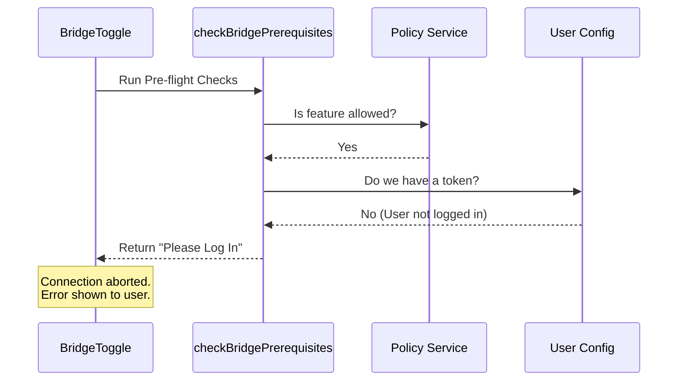

# Chapter 3: Prerequisite Verification

Welcome to Chapter 3!

In the previous chapter, [Bridge State Controller](02_bridge_state_controller.md), we built the "Light Switch" for our feature. We learned how to handle the user's intent to turn the bridge **ON**.

However, before we flip the switch and start sending data across the internet, we need to pause. Just because a user *wants* to connect, doesn't mean they *can*.

This brings us to **Prerequisite Verification**.

### The Concept: The Pre-flight Check

Imagine a pilot sitting in a cockpit. Before they start the engines, they go through a checklist.
1.  Is there fuel?
2.  Are the doors closed?
3.  Is the radio working?

If any of these answers is "No," the plane stays on the ground.

The `checkBridgePrerequisites` function is our pre-flight checklist. It ensures the environment is safe and ready before we attempt a complex connection.

### The Use Case

**Scenario:** A user installs the CLI tool but their company has a strict security policy that blocks remote control features.

**Without Verification:**
The app tries to connect. The server rejects it. The app crashes or shows a confusing "Error 403 Forbidden" message. The user is frustrated.

**With Verification:**
The app runs a check *locally* first. It sees the policy and immediately tells the user: *"Remote Control is disabled by your organization's policy."*

---

### Key Concepts

This feature relies on a pattern called **"Early Return."** We assume everything is fine, but we run a gauntlet of checks. If any check fails, we stop immediately and return an error message.

The function signature looks like this:

```typescript
// Returns a string (Error Message) OR null (Success)
async function checkBridgePrerequisites(): Promise<string | null> {
    // ... checks go here
}
```

If the function returns `null`, it means "No errors found, proceed to takeoff."

---

### Step 1: Policy Limits (The "Rules")

The first thing we check is if the user is even allowed to use this feature. Large organizations often manage what features their employees can use via central policies.

```typescript
// From file: bridge.tsx

// 1. Wait for policies to download
await waitForPolicyLimitsToLoad();

// 2. Ask: Is 'allow_remote_control' permitted?
if (!isPolicyAllowed('allow_remote_control')) {
  // STOP! Return the error message.
  return "Remote Control is disabled by your organization's policy.";
}
```

**Explanation:**
*   `waitForPolicyLimitsToLoad()`: Ensures we have the latest rules from the server.
*   `isPolicyAllowed`: A helper that looks at the rules configuration.
*   If allowed is `false`, we return the string explaining why.

### Step 2: Version Compatibility (The "Gear")

Software changes fast. The CLI on your computer communicates with a server in the cloud. If your CLI is too old, it might not speak the same language as the server.

```typescript
// From file: bridge.tsx

// Check which version logic to use (v1 or v2)
const useV2 = isEnvLessBridgeEnabled(); 

// Run the specific version check
const versionError = useV2 
  ? await checkEnvLessBridgeMinVersion() 
  : checkBridgeMinVersion();

if (versionError) {
  return versionError; // e.g., "Please upgrade your CLI"
}
```

**Explanation:**
*   The bridge has two modes (v1 and v2). We determine which one is active.
*   We call a version checker function.
*   If the version is too old, `versionError` will contain a message like "Update required." If it's fine, it returns `undefined`.

### Step 3: Authentication (The "ID Card")

Finally, you cannot control a session remotely if we don't know who you are. We check if the user is logged in.

```typescript
// From file: bridge.tsx

import { getBridgeAccessToken } from '../../bridge/bridgeConfig.js';

// Check if we have a valid login token
if (!getBridgeAccessToken()) {
  // Return a standard "Please Log In" message
  return BRIDGE_LOGIN_INSTRUCTION;
}

// If we reached here, ALL checks passed!
return null;
```

**Explanation:**
*   `getBridgeAccessToken()`: Looks for a saved credential/token.
*   If no token exists, we return instructions on how to log in.
*   **Crucially**, if we pass this line, we return `null`. This is the "All Systems Go" signal.

---

### Under the Hood: The Flow

Let's look at how the **Bridge State Controller** (from the previous chapter) interacts with these checks.



### Integration in the Controller

In [Chapter 2](02_bridge_state_controller.md), we saw the `useEffect` hook in `BridgeToggle`. Now we can fully understand this snippet:

```typescript
// Inside BridgeToggle.tsx

const error = await checkBridgePrerequisites();

if (error) {
  // 1. Log that the check failed
  logEvent("tengu_bridge_command", { action: "preflight_failed" });
  
  // 2. Show the error to the user and STOP
  onDone(error, { display: "system" });
  return;
}

// 3. If error is null, we proceed to connect...
```

**Explanation:**
*   We `await` the result of our checklist.
*   We check `if (error)`. If it is a string, it counts as "truthy."
*   We use `onDone(error)` to print the message to the terminal and exit the command lifecycle.
*   The connection logic (setting `replBridgeEnabled: true`) is **never reached** if a check fails.

---

### Summary

In this chapter, we learned how to build a security and compatibility gatekeeper.
1.  **The Pattern:** Run checks sequentially and return the first error found ("Early Return").
2.  **The Checks:** We verify **Policies**, **Software Versions**, and **Authentication**.
3.  **The Result:** We return `null` only if the path is clear.

Now that our "Pre-flight Check" has passed and returned `null`, we are cleared for takeoff. We can safely update the global state to enable the bridge. But how does changing a simple boolean variable actually start a WebSocket connection?

[Next Chapter: Global State Integration](04_global_state_integration.md)

---

Generated by [Code IQ](https://github.com/adityasoni99/Code-IQ)