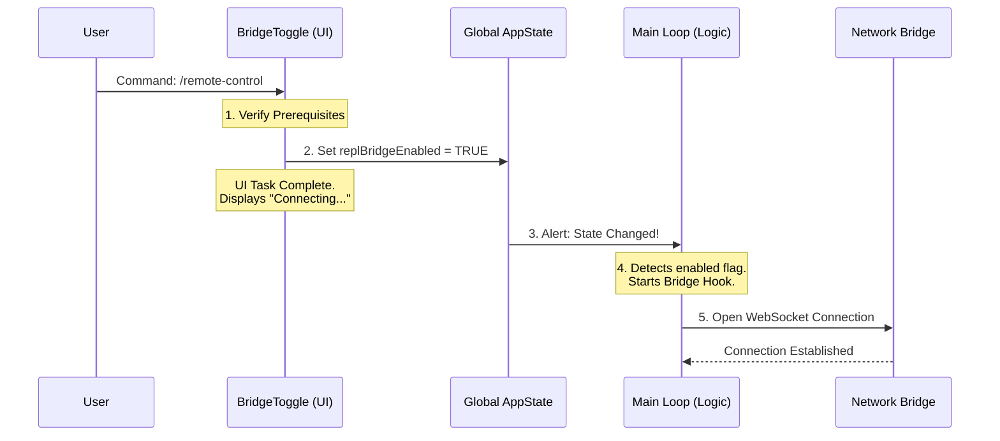

# Chapter 4: Global State Integration

Welcome to Chapter 4!

In the previous chapter, [Prerequisite Verification](03_prerequisite_verification.md), we ensured our environment was safe and ready to connect. We ran our "pre-flight checks," and everything passed.

Now, we need to actually start the engine.

You might be tempted to write code like `WebSocket.connect()` right inside our `BridgeToggle` button. **We strictly avoid this.**

Why? Because a UI component (a button) shouldn't manage a complex, long-running network connection. If the user navigates away from the button, the connection might die!

Instead, we use **Global State Integration**.

---

### The Concept: The Thermostat

Think of your application like a house with a heating system.
1.  **The UI (BridgeToggle)** is the **Thermostat** on the wall.
2.  **The Logic (Bridge Service)** is the **Furnace** in the basement.

When you want heat, you don't run to the basement and light a fire manually. You simply walk to the thermostat and flip a switch to "ON." The furnace detects this signal and starts itself.

In our project, the `AppState` is the wiring that connects the Thermostat to the Furnace.

---

### Step 1: flipping the Switch

In [Chapter 2](02_bridge_state_controller.md), we looked at the `BridgeToggle` component. Its main job, after passing security checks, is simply to update the global state.

It does not know *how* to connect. It only knows that the user *wants* to connect.

```typescript
// From file: bridge.tsx
const setAppState = useSetAppState();

// ... inside the connection function
setAppState(prev => {
  // We keep existing state, but flip the switch
  return {
    ...prev,
    replBridgeEnabled: true, // <--- THE TRIGGER
    replBridgeExplicit: true,
    replBridgeInitialName: name
  };
});
```

**Explanation:**
*   `useSetAppState`: A hook that gives us permission to write to the global "whiteboard."
*   `replBridgeEnabled: true`: This is the equivalent of setting the thermostat to 72°F. We are signaling our intent.

---

### Step 2: The Reactivity Chain

In React (the framework powering our CLI UI), when Global State changes, any component "listening" to that state wakes up.

Somewhere else in our application (specifically in the main `REPL.tsx` file), there is a background process listening for this specific flag.

**The code flow works like this:**

1.  User runs `/remote-control`.
2.  `BridgeToggle` runs checks and sets `replBridgeEnabled = true`.
3.  `BridgeToggle` finishes its job and displays "Connecting..."
4.  The **Global State** updates.
5.  The **REPL** sees the update and initializes the actual networking code.

### Step 3: Decoupling UI from Logic

This separation is crucial for stability.

*   **The UI** is temporary. It appears when you type the command and disappears when you press Enter.
*   **The Connection** must be permanent. It needs to stay alive while you use other commands.

By pushing the logic into the Global State, the connection survives even after the `BridgeToggle` component is removed from the screen.

---

### Under the Hood: The Flow

Let's visualize how a simple boolean flag travels through the system to start a complex WebSocket connection.



### The Implementation Details

While `bridge.tsx` (the file we have been studying) triggers the change, it helps to know what happens on the receiving end.

The main application loop uses a hook called `useReplBridge`. It acts as the "Furnace" from our analogy.

```typescript
// Conceptual example from REPL.tsx

function REPL() {
  // Listen to the flag
  const bridgeEnabled = useAppState(s => s.replBridgeEnabled);

  // This hook watches the flag. 
  // If true, it starts the heavy networking.
  useReplBridge(bridgeEnabled); 
  
  // ... rest of the application
}
```

**Explanation:**
*   The `REPL` component is always running.
*   It passes the `bridgeEnabled` flag into `useReplBridge`.
*   If that flag turns `true`, the hook spins up the WebSocket, handles authentication, and manages data transfer.
*   If the user runs the command again to disconnect, `bridge.tsx` sets the flag to `false`, and `useReplBridge` automatically cuts the connection.

---

### Summary

In this chapter, we learned about **Global State Integration**.

1.  **Decoupling:** We separated the "Intent" (UI) from the "Action" (Networking).
2.  **The Trigger:** We used `setAppState` to flip the `replBridgeEnabled` flag.
3.  **Persistence:** By using global state, our connection stays alive even when the command UI finishes.

Now the bridge is enabled, the WebSocket is connecting in the background, and the data is flowing. But the user still needs to see what's happening! If the bridge is active, we need to show them the connection details (like a QR code) or give them a way to disconnect.

[Next Chapter: Interactive Session Dialog](05_interactive_session_dialog.md)

---

Generated by [Code IQ](https://github.com/adityasoni99/Code-IQ)