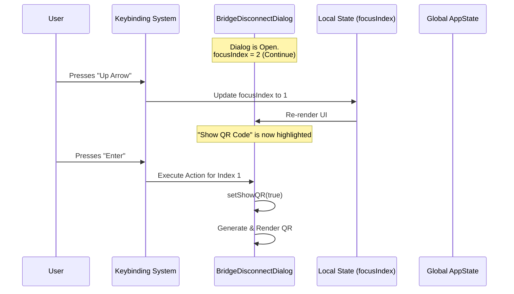

# Chapter 5: Interactive Session Dialog

Welcome to the final chapter of the Bridge tutorial!

In the previous chapter, [Global State Integration](04_global_state_integration.md), we successfully decoupled the UI from the Logic. We learned how to flip a switch in the global state to start the "Furnace" (the WebSocket connection) in the background.

But now we have a new situation.

### The Use Case
Imagine the user has successfully connected. The bridge is running. Hours pass. The user types `/remote-control` again.

**What should happen?**
1.  Should it try to connect again? **No**, it's already connected.
2.  Should it do nothing? **No**, the user is asking for control.
3.  **Yes:** It should show a **Control Panel**.

We need a menu that allows the user to:
*   **Disconnect** the session.
*   **Show the QR Code** again (in case they lost the link).
*   **Continue** working (close the menu).

This chapter covers the **Interactive Session Dialog**, built using the `BridgeDisconnectDialog` component.

---

### Key Concepts

Terminal interfaces are unique. You can't usually "click" buttons with a mouse. We have to build our own navigation system using the keyboard.

We will focus on three main mechanics:
1.  **State-Based Navigation:** Tracking which button is "highlighted."
2.  **Keyboard Traps:** Capturing specific keys (Up, Down, Enter).
3.  **Action Execution:** Modifying the global state to stop the session.

---

### 1. The Visual Layout (The Menu)

First, let's look at what we are rendering. We use a component library designed for the terminal (Ink). We render a list of items, but only **one** item looks "focused" (highlighted) at a time.

We use a simple integer state variable, `focusIndex`, to track where the user is looking.

```tsx
// From file: bridge.tsx
function BridgeDisconnectDialog({ onDone }) {
  // 0 = Disconnect, 1 = QR Code, 2 = Continue
  const [focusIndex, setFocusIndex] = useState(2); 

  // Check if "Disconnect" is the focused item
  const isDisconnectFocused = focusIndex === 0;

  // Render the list
  return (
    <Box flexDirection="column">
      <ListItem isFocused={isDisconnectFocused}>
        <Text>Disconnect this session</Text>
      </ListItem>
      {/* ... other list items ... */}
    </Box>
  );
}
```

**Explanation:**
*   `focusIndex`: A number (0, 1, or 2).
*   `isFocused`: A prop we pass to `ListItem`. If `true`, the component renders a visual indicator (like a color change or a `>` arrow) to show it is selected.

### 2. The Keyboard Hook (The Remote Control)

Since there is no mouse, we need to listen for keystrokes. We use a custom hook called `useKeybindings`.

This hook maps specific "Intentions" (like "select:next") to specific JavaScript functions.

```typescript
// From file: bridge.tsx

// Define the number of items in our menu
const ITEM_COUNT = 3;

useKeybindings(
  {
    // When the user presses the Down Arrow or Tab
    'select:next': () => {
        setFocusIndex(i => (i + 1) % ITEM_COUNT)
    },
    
    // When the user presses the Up Arrow
    'select:previous': () => {
        setFocusIndex(i => (i - 1 + ITEM_COUNT) % ITEM_COUNT)
    },
    // ... handling Enter key below
  }
);
```

**Explanation:**
*   **Modulo Operator (`%`)**: This math trick creates a "loop."
    *   If index is 2 and we add 1, it becomes 3. `3 % 3 = 0`. The cursor loops back to the top!
*   `useKeybindings`: This hook intercepts user input so it doesn't just print characters to the screen.

### 3. Handling the "Enter" Key

When the user presses **Enter**, we check `focusIndex` to see which button they "pressed."

```typescript
// Inside useKeybindings map:

'select:accept': () => {
  if (focusIndex === 0) {
    handleDisconnect(); // User selected "Disconnect"
  } else if (focusIndex === 1) {
    handleShowQR();     // User selected "Show QR"
  } else {
    handleContinue();   // User selected "Continue"
  }
}
```

**Explanation:**
*   This is the equivalent of an `onClick` handler in web development.
*   It routes the action based on the current state of the UI.

### 4. Executing Disconnect

If the user chooses to disconnect, we simply reverse the logic we learned in [Chapter 4: Global State Integration](04_global_state_integration.md).

Instead of turning the global switch **ON**, we turn it **OFF**.

```typescript
// From file: bridge.tsx

function handleDisconnect() {
  setAppState(prev => ({
    ...prev,
    replBridgeEnabled: false, // <--- The Kill Switch
    replBridgeExplicit: false
  }));

  // Tell the CLI command lifecycle we are finished
  onDone("Remote Control disconnected.");
}
```

**Explanation:**
*   `replBridgeEnabled: false`: The moment this state updates, the background logic (the "Furnace") detects the change and immediately cuts the WebSocket connection.
*   `onDone`: This closes the interactive dialog UI and returns the user to the standard command prompt.

---

### Under the Hood: The Flow

Let's visualize the "Game Loop" of this interactive dialog.



### Dynamic Content: The QR Code

One of the options is to show a QR code. This is useful if the user closed the terminal window on their phone and needs to scan again.

We generate this efficiently using a `useEffect`. We don't want to regenerate the heavy QR pixel data every single millisecond, only when requested.

```typescript
// From file: bridge.tsx

const [showQR, setShowQR] = useState(false);
const [qrText, setQrText] = useState('');

useEffect(() => {
  if (showQR && displayUrl) {
    // Convert the URL string into a QR block text
    qrToString(displayUrl, { type: 'utf8' })
      .then(generatedQR => setQrText(generatedQR));
  }
}, [showQR, displayUrl]);
```

**Explanation:**
*   We use a library `qrToString` to turn a URL (like `https://...`) into a block of text that looks like a barcode.
*   We save this text to state (`qrText`) and render it inside a `<Box>` if `showQR` is true.

---

### Summary and Conclusion

Congratulations! You have navigated the entire architecture of a complex CLI feature.

Let's review the journey of the **Bridge**:

1.  **[CLI Command Registration](01_cli_command_registration.md)**: We taught the CLI to recognize `/remote-control`.
2.  **[Bridge State Controller](02_bridge_state_controller.md)**: We built a smart toggle that decides whether to connect or show a menu.
3.  **[Prerequisite Verification](03_prerequisite_verification.md)**: We ensured the user was safe and allowed to connect (Security).
4.  **[Global State Integration](04_global_state_integration.md)**: We started the background networking engine by flipping a global switch.
5.  **Interactive Session Dialog (This Chapter)**: We built a keyboard-driven UI to manage the active connection.

You now understand how to build a feature that is **lazy-loaded**, **secure**, **state-driven**, and **interactive**. These patterns form the backbone of high-quality CLI applications.

**Project Complete.**

---

Generated by [Code IQ](https://github.com/adityasoni99/Code-IQ)